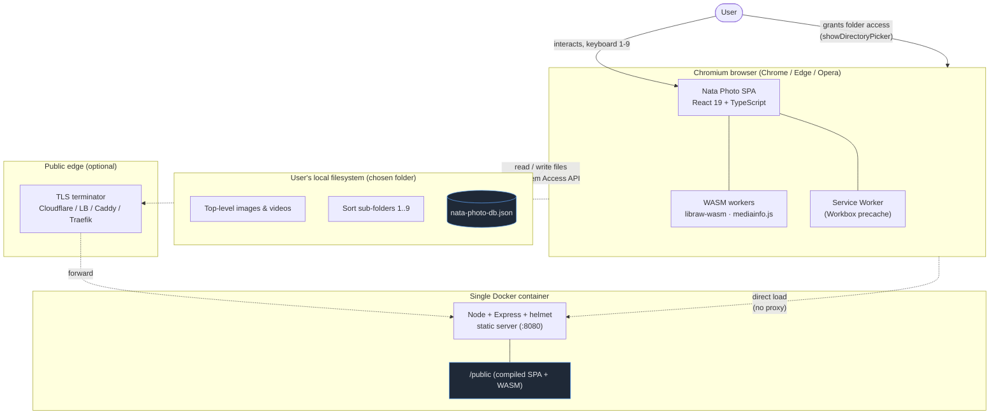
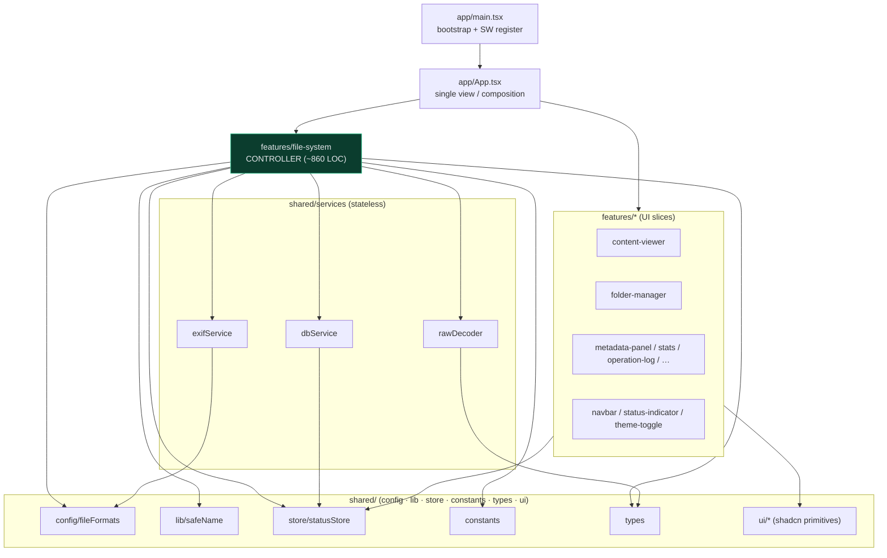
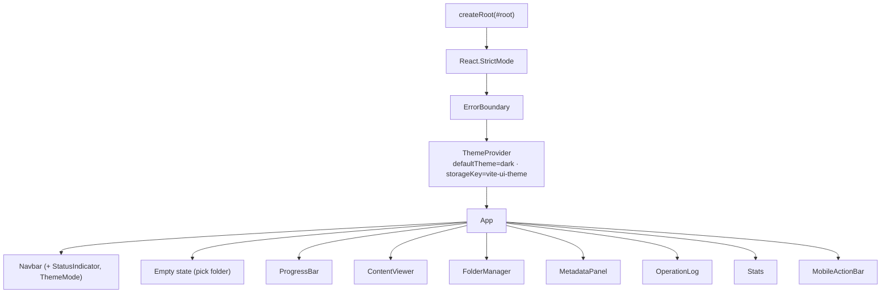
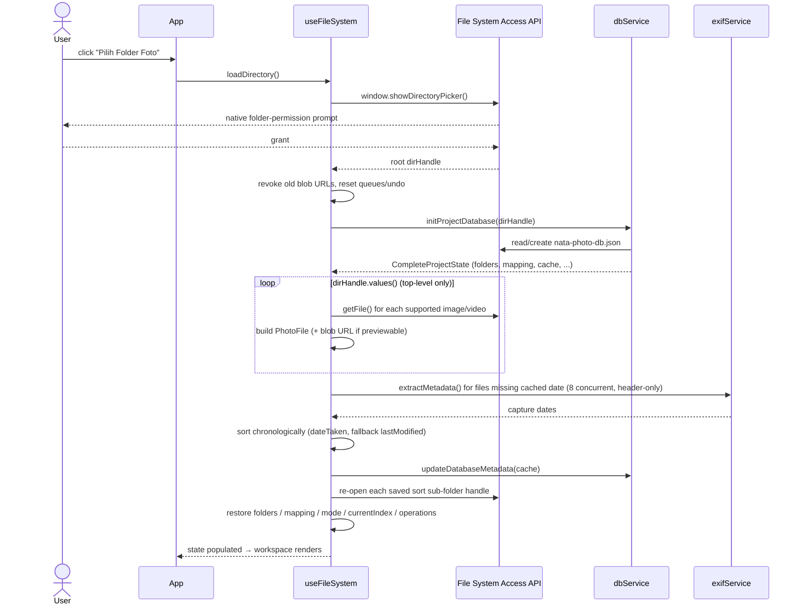
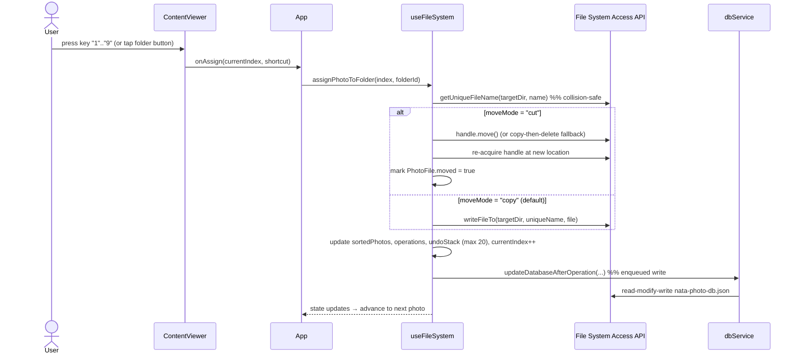
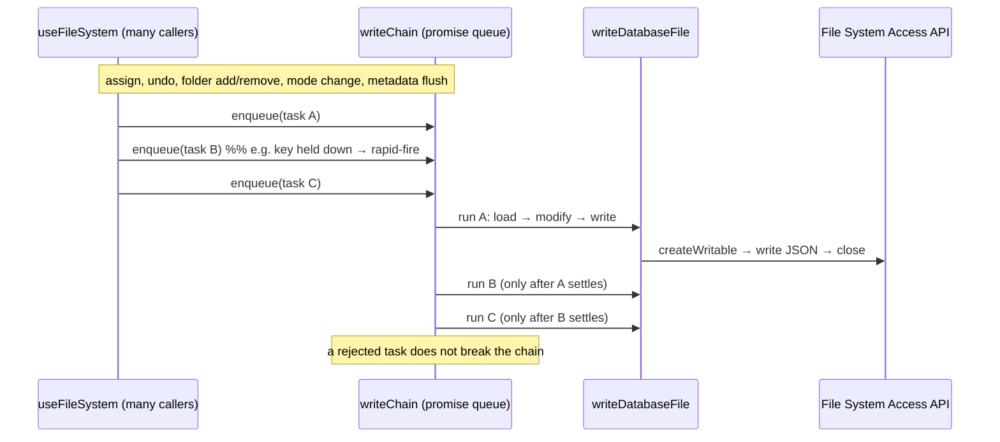
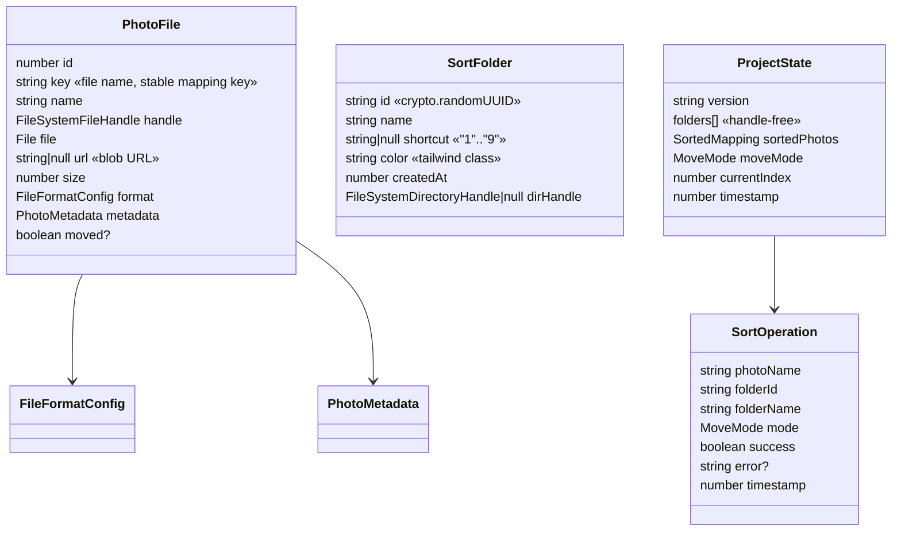
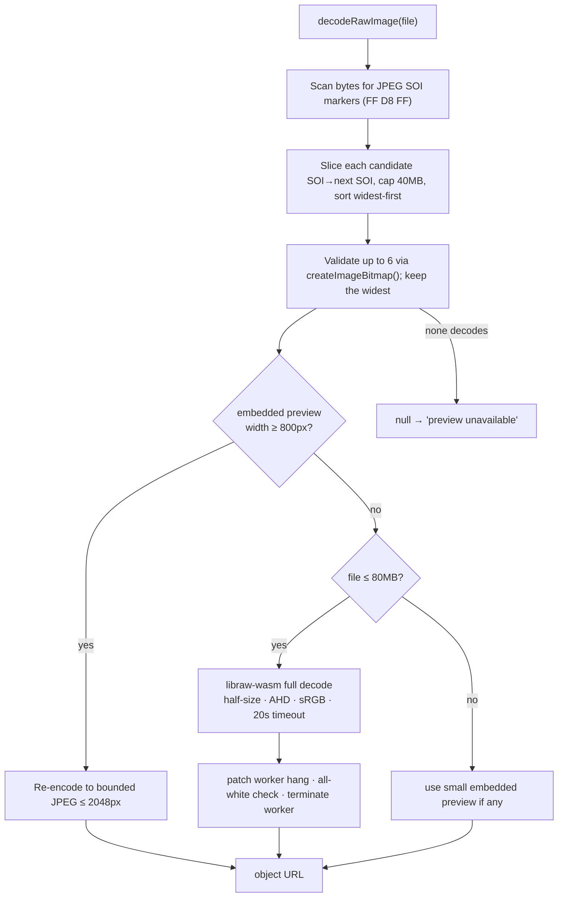
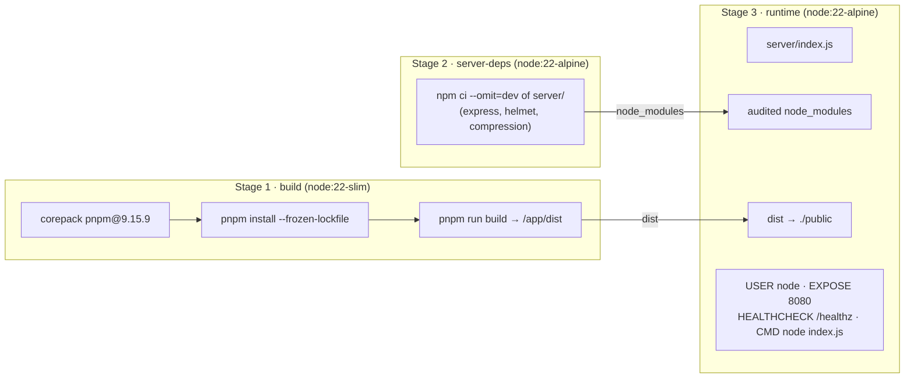
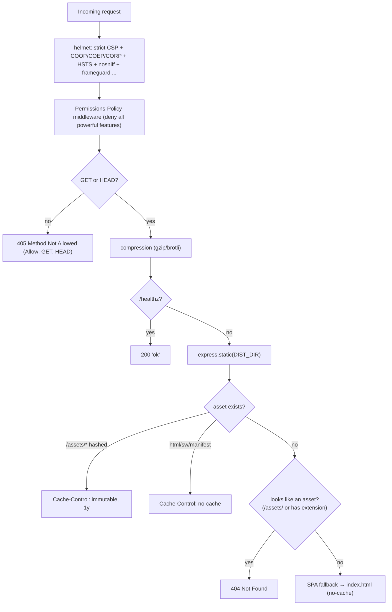

# System Architecture

The end-to-end design of **Nata Photo** — a 100% client-side photo & video sorter that runs entirely in a Chromium browser, backed by a single hardened static-file container for delivery.

Version 2.0.1 · Last updated 2026-07-14 · Status: Living document

> **Guiding principles.** This document and the codebase follow six code principles — **Clean Code**, **YAGNI**, **DRY**, **KISS**, **Semantic** naming/HTML, and **A11y** (accessibility). The architecture embodies them as a single-view, backend-free design (YAGNI/KISS), one controller hook plus one status store with no duplicated state (DRY), and clear module boundaries with meaningful names (Clean Code/Semantic). Full definitions: **[PRINCIPLES.md](PRINCIPLES.md)**.

---

## 1. Overview & guiding principles

Nata Photo is a **single-page application (SPA)** that reads, previews, orders, and re-files the user's local photos and videos **without ever uploading them**. All file access happens through the browser's [File System Access API](https://developer.mozilla.org/en-US/docs/Web/API/File_System_Access_API) (`window.showDirectoryPicker`); all decoding, metadata extraction, and sorting logic runs on the user's own machine. The only server involved is a tiny static-file host that ships the compiled bundle — it never sees a single photo.

The architecture is shaped by a handful of non-negotiable principles.

| Principle | How it is realized |
| --- | --- |
| **Local-first, zero egress** | No backend API, no telemetry, no analytics, no network calls after the initial asset load. `connect-src` in the CSP is restricted to `'self' blob: data:`. Files are read from and written to the user's chosen directory via native handles. |
| **The browser is the runtime** | Heavy work (RAW demosaicing, video probing, EXIF parsing) is done in-page with WASM. Cross-origin isolation (COOP+COEP+CORP) is enabled so `SharedArrayBuffer` is available to the WASM workers. |
| **Single source of truth per concern** | Durable project state lives in one JSON file inside the opened folder; live application state lives in one controller hook; transient UI toasts live in one Zustand store. |
| **Fail safe, never destructive** | Copy is the default mode; collisions never overwrite (a `_1`, `_2`, … suffix is appended); every sort is undoable; a corrupt/incompatible database is reset with a visible warning rather than trusted. |
| **Minimal, hardened delivery** | One container, one Node process, GET/HEAD only, strict CSP, non-root user, read-only root filesystem. See [SECURITY.md](SECURITY.md) and [§13](#13-deployment-architecture). |
| **Chromium-only, by necessity** | The File System Access API is unavailable in Firefox/Safari, so the app requires a Chromium-based browser (Chrome/Edge/Opera) and detects/handles its absence gracefully. |

The codebase is deliberately **thin and layered**: a presentational React tree at the top, one controller hook that owns all orchestration in the middle, and a set of stateless services (persistence, metadata, RAW decoding) at the bottom. There is no router, no global client-state framework beyond a small toast store, and no server-side application logic.

---

## 2. System context



**Trust boundaries.** The photo data never crosses the network boundary — the dotted edges carry only the static application assets, and only on the first load (thereafter the service worker serves them offline). The solid edge between the browser and the local filesystem is the only path media travels, and it stays entirely on the user's device.

---

## 3. Module & component map

The `src` tree follows **Feature-Sliced Design (FSD)**: four layers — `app` (bootstrap, providers, styles), `pages` (the presentation/routing layer that composes features into screens), `features` (one folder per user-facing capability), and `shared` (framework-agnostic building blocks). The dependency rule is one-directional: `app` → `pages` → `features` → `shared`; `shared` imports nothing above it. Each slice exposes a public API via an `index.ts` barrel, so consumers import `@/features/stats`, never a deep internal path.

```text
src/
├── app/                          # composition layer — wires everything together
│   ├── main.tsx                  # bootstrap + i18n init + service-worker register
│   ├── App.tsx                   # app shell: navbar + error banner + page router
│   ├── providers/                # ThemeProvider, ErrorBoundary (+ barrel)
│   ├── styles/globals.css        # OKLCH design tokens, fonts, motion, a11y
│   └── assets/
├── pages/                        # presentation layer — one folder per screen
│   ├── welcome/                  # start screen (pick-folder call-to-action)
│   └── editor/                   # the sorting workspace (viewer + sidebar + bars)
├── features/                     # 1 folder = 1 feature (each with an index.ts barrel)
│   ├── file-system/model/        # useFileSystem — the CONTROLLER hook (~900 LOC)
│   ├── content-viewer/           # ui/ + lib/useZoomPan + constants.ts (loupe)
│   ├── folder-manager/  filmstrip/  grid-view/  metadata-panel/
│   ├── operation-log/  stats/  batch-actions/  mobile-actions/
│   ├── shortcuts/  theme-toggle/  language-toggle/  status-indicator/  progress/  navbar/
│   └── grid-view/constants.ts    # feature-local constants (e.g. PAGE_SIZE)
└── shared/                       # reused across features, no business logic
    ├── ui/                       # shadcn/Radix primitives + PanelHeader, Thumbnail, tooltip
    ├── services/                 # dbService, exifService, rawDecoder (stateless IO)
    ├── lib/                      # utils (cn), safeName, shortcut (validation)
    ├── store/                    # statusStore (Zustand toasts)
    ├── config/                   # fileFormats registry
    ├── constants/                # cross-cutting constants (FOLDER_COLORS, RESERVED_SHORTCUT_KEYS…)
    ├── i18n/                     # i18next setup + language/{en,id}.json
    └── types/                    # domain types + libraw.d.ts
```



**Reading the graph.** `App.tsx` calls exactly one hook — `useFileSystem()` — and passes slices of the returned state and callbacks down to presentational components as props. The hook is the only module that touches the services; the components never call `dbService`/`exifService`/`rawDecoder` directly. The `statusStore` is the one exception to the top-down data flow: it is a side channel that both the hook and `dbService` write to (via the `addStatus`/`clearStatus` helpers), and `StatusIndicator` reads from.

---

## 4. Runtime React tree

`src/app/main.tsx` normalizes any non-`/` path back to `/` (this is a single-view app with no router, so a deep link or tampered URL is rewritten with `history.replaceState`), then registers the generated service worker (`/sw.js`) on `window`'s `load` event, and finally mounts the tree:



- **`StrictMode`** double-invokes effects in development; the controller's effects are written to tolerate this (idempotent decode/metadata queues guarded by `Set` refs, and blob-URL revocation on cleanup).
- **`ErrorBoundary`** catches render-time exceptions and shows a recoverable error UI instead of a blank page.
- **`ThemeProvider`** manages the light/dark/system theme (default dark, persisted under `localStorage["vite-ui-theme"]`), toggling the `.dark` class that drives the OKLCH design tokens in `globals.css`.
- **`App`** renders one of two macro-states: the **empty state** (a single "Pilih Folder Foto" call to action) when `photos.length === 0`, or the **workspace** (12-column desktop grid / stacked mobile layout with the fixed bottom `MobileActionBar`) once a folder is loaded.

---

## 5. State management

Nata Photo keeps three distinct kinds of state, each in exactly one place. Understanding the split is the key to the whole app.

### 5.1 The three state homes

| State kind | Home | Lifetime | Examples |
| --- | --- | --- | --- |
| **Live application state** | [`useFileSystem`](../src/features/file-system/model/useFileSystem.ts) hook (React state + refs) | The mounted session | `photos`, `currentIndex`, `folders`, `sortedPhotos`, `moveMode`, `operations`, `undoStack`, `rawPreviewUrls`, `metadataByKey` |
| **Transient UI feedback** | [`statusStore`](../src/shared/store/statusStore.ts) (Zustand) | Seconds (auto-expires) | Loading/success/error toasts shown in the navbar |
| **Durable project state** | `nata-photo-db.json` (on disk, via [`dbService`](../src/shared/services/dbService.ts)) | Across reloads/sessions | Folders, per-file sort mapping, mode, `currentIndex`, operation log, metadata cache, stats |

The `useFileSystem` hook is the **controller** in an MVC-ish sense: `App` and its children are the view, the services are the model/IO layer, and the hook wires them together and owns all mutable session state. It is `~860` lines and is the single most important module to read: [src/features/file-system/model/useFileSystem.ts](../src/features/file-system/model/useFileSystem.ts).

### 5.2 Why Zustand only for toasts

The status store is intentionally tiny. It exists so that **non-React code** (the services, and async handlers inside the hook) can push a toast without prop-drilling a setter. It exposes plain function helpers — `addStatus`, `removeStatus`, `clearStatus` — that call `useStatusStore.getState()` under the hood, so `dbService.ts` can report "Database rusak, dibuat ulang" without importing React. The store keeps at most **3** toasts, auto-expires `success`/`error` after **3s**, and `clearStatus()` drops only the sticky `loading` toasts. Everything else — the actual sorting model — lives in the hook, not in Zustand, because it is tightly coupled to file handles and effects that belong to the component lifecycle.

### 5.3 React state vs refs inside the controller

The hook draws a careful line between values that must **trigger a re-render** and values that are **identity/coordination** data the render doesn't read. The latter are refs, so mutating them never re-renders.

| Held as **React state** (drives render) | Held as **`useRef`** (no re-render) |
| --- | --- |
| `photos`, `currentIndex`, `folders`, `sortedPhotos` | `rootDirHandleRef` — the opened directory handle |
| `moveMode`, `operations`, `undoStack` | `folderDirHandlesRef` — `Map<folderId, dirHandle>` |
| `isLoading`, `error`, `isDecodingRaw` | `rawDecodeQueueRef`, `rawPreviewKeysRef`, `failedRawDecodesRef` — RAW decode coordination sets |
| `rawPreviewUrls` (`Map`), `metadataByKey` (`Map`) | `metaQueueRef` — in-flight metadata keys |
| — | `metadataCacheRef` — the mutable metadata cache persisted to disk |
| — | `isInitializedRef` — one-time init guard |

Directory **handles are never stored in React state and never persisted** — they are non-serializable and session-scoped, so they live in refs and are re-acquired on each folder open. This is also why `SortOperation` and the on-disk schema hold *no* handles (see [§10](#10-persistence-architecture)).

The hook returns a flat `FileSystemHook` interface — the state slices plus the action callbacks (`loadDirectory`, `addFolder`, `assignPhotoToFolder`, `undoLastOperation`, `navigatePhoto`, …) and a few selectors (`getCurrentPhoto`, `getCurrentFolder`, `getOperationStats`). `App` composes these into props for the view.

---

## 6. Primary data-flow sequences

### 6.1 Open folder & scan



Key points: scanning is **top-level only** (not recursive); each previewable file gets a blob URL up front; capture-date extraction is **concurrent (8 workers), header-only (first 2 MB for images)**, and **cache-backed** so re-opening the same folder is near-instant; the final order is oldest-first by capture date, breaking ties by filename.

### 6.2 Assign / sort a photo



The controller advances `currentIndex` immediately for a fluid keyboard workflow; the disk write is fire-and-forget but **serialized** (see next). On failure, a `success:false` operation is still logged and persisted so the operation log reflects reality. **Undo** (`Ctrl/Cmd+Z`) reverses the last entry — moving a cut file back to root, or deleting the copied duplicate — and pops the undo stack (bounded at 20 entries).

### 6.3 Persist to disk (single-writer)



Every mutation is a **read-modify-write of the same JSON file**. Running them concurrently would interleave reads and writes and silently drop updates (very easy to trigger by holding a shortcut key). `dbService` funnels *all* writes through a single `writeChain` promise so they execute strictly one at a time — see [§10](#10-persistence-architecture).

---

## 7. Services layer

The services are **stateless, framework-free modules** (no React) that the controller calls. Each owns one concern.

### 7.1 `dbService.ts` — persistence

[src/shared/services/dbService.ts](../src/shared/services/dbService.ts). Owns `nata-photo-db.json` (schema `DB_VERSION = "2.0"`, `MAX_OPERATIONS = 50`). Public surface: `initProjectDatabase`, `updateDatabaseAfterOperation`, `updateDatabaseFolders`, `updateDatabaseMode`, `updateDatabaseMetadata`, `loadProjectState`. All writes go through `enqueue()`/`writeChain`. The load path validates shape + version, then runs `sanitizeState()` which strips prototype-pollution keys (`__proto__`/`constructor`/`prototype`) via `safeRecord()` into `Object.create(null)` maps, bounds every collection (`MAX_SORTED_ENTRIES`/`MAX_METADATA_ENTRIES` = 100 000, `MAX_FOLDERS` = 1 000, operations sliced to 50), and coerces `moveMode`/`currentIndex` to safe defaults. A missing, corrupt, or version-mismatched file returns `null` (reset) with a visible warning — it never throws.

### 7.2 `exifService.ts` — metadata & chronology

[src/shared/services/exifService.ts](../src/shared/services/exifService.ts). `extractMetadata(file)` dispatches on category:

- **Images**: reads only the first `MAX_HEADER_BYTES` (2 MB) slice and parses with `ExifReader` (`expanded: true`) — camera make/model, lens, ISO, shutter, aperture, focal length, capture date, dimensions, megapixels.
- **Video**: uses `mediainfo.js` `analyzeData` with a chunked reader — duration, fps, codecs, bitrate, dimensions, and phone-recording QuickTime date/camera tags.

It also exports `parseCaptureDate` (the chronological sort key) and the display formatters (`formatFileSize`, `formatDate`, `formatTimestamp`, `formatDuration`, `formatBitrate`). `parseFlexibleDate` normalizes the many date shapes EXIF and mediainfo emit (`"2023:01:02 13:04:05"`, ISO 8601, `"UTC …"`).

### 7.3 `rawDecoder.ts` — RAW preview

[src/shared/services/rawDecoder.ts](../src/shared/services/rawDecoder.ts). `decodeRawImage(file)` returns an object URL or `null`. Full detail in [§12](#12-previewdecoding-pipeline).

### 7.4 Supporting config & lib (not services, but IO-adjacent)

- [config/fileFormats.ts](../src/shared/config/fileFormats.ts) — the format registry (`PHOTO_FORMATS`) with `extensions`, `mimeTypes`, `label`, `category` (`standard | raw | vector | video | other`), and `previewable`; plus `isSupportedImage`, `isPreviewable`, `getFileFormatInfo`. HEIC/HEIF is marked **non-previewable** because Chromium cannot decode it in ``.
- [lib/safeName.ts](../src/shared/lib/safeName.ts) — `validateFolderName()` rejects path separators, Windows-reserved punctuation, ASCII control chars, `"."`/`".."`, reserved device names (`CON`/`PRN`/`AUX`/`NUL`/`COM1-9`/`LPT1-9`), trailing dot/space, and names > 200 chars. Defense-in-depth on top of the File System Access API's own path-segment rejection.
- [lib/utils.ts](../src/shared/lib/utils.ts) — `cn()` (clsx + tailwind-merge).

---

## 8. File System Access API integration & handle lifecycle

All local IO goes through native handles obtained from `window.showDirectoryPicker()`. The controller keeps a small set of pure helpers for file operations and a disciplined handle lifecycle.

**Pure file helpers** (no component state) in the hook:

| Helper | Responsibility |
| --- | --- |
| `fileExists(dir, name)` | Probe via `getFileHandle`, catch = false |
| `getUniqueFileName(dir, name)` | Append `_1`, `_2`, … so copies/moves never overwrite |
| `writeFileTo(dir, name, file)` | `createWritable → write → close`, returns the new handle |
| `moveFileHandle(...)` | Native `handle.move()` when available, else copy-then-delete |

**Handle lifecycle rules:**

- The **root** directory handle lives in `rootDirHandleRef`; **sort sub-folder** handles live in `folderDirHandlesRef` (`Map<folderId, dirHandle>`). Both are refs, both are session-scoped, neither is persisted.
- On every open, saved folders are **re-acquired** from disk by name; a folder that no longer exists is skipped with a warning, and its mappings are dropped.
- After a **cut**, the file handle is **re-acquired at its new location** so it is never stale, and `PhotoFile.moved` is set.
- **Blob URLs** for previews are created on load and **revoked** on reload/unmount (`revokeAllUrls`) to avoid memory leaks; a failed `` decode can request a fresh URL via `recreatePreviewUrl`.

Because the API is Chromium-only, `loadDirectory` guards on `"showDirectoryPicker" in window` and surfaces a clear Indonesian error otherwise. A user-cancelled picker (`AbortError`) is treated as a no-op, not an error.

---

## 9. Persistence architecture (single-writer promise chain)

The durable project state is one file, `nata-photo-db.json`, written **inside the opened folder**. Its shape (`CompleteProjectState`) holds: `version`, `folders[]`, `sortedPhotos` (keyed by **file name**), `moveMode`, `currentIndex`, `operations[]` (max 50), an optional `metadataCache`, `stats`, and a `timestamp`.

The central design decision is the **single-writer promise chain**:

```ts
let writeChain: Promise<unknown> = Promise.resolve();

const enqueue = <T>(task: () => Promise<T>): Promise<T> => {
  const run = writeChain.then(task, task);   // run after the previous task, pass or fail
  writeChain = run.then(() => undefined, () => undefined); // keep the chain alive on rejection
  return run;
};
```

Every mutating export (`initProjectDatabase`, `updateDatabaseAfterOperation`, `updateDatabaseFolders`, `updateDatabaseMode`, `updateDatabaseMetadata`) wraps its read-modify-write in `enqueue()`. This guarantees **serialized, non-interleaving writes** even under rapid-fire input, and a rejected task never stalls the queue. Writes themselves are atomic-ish: `getFileHandle({create:true}) → createWritable() → write(JSON) → close()`. Metadata persistence is additionally **debounced 1500 ms** in the controller so lazy extraction doesn't thrash the disk.

The **load path is defensive** because the file is untrusted input (it lives in a user-writable folder and could be corrupt or crafted): `isValidState` shape check → version check → `sanitizeState` (prototype-pollution stripping + collection bounds + scalar coercion). See [SECURITY.md](SECURITY.md) for the threat model behind these guards.

---

## 10. Domain data model

The core types ([src/shared/types/index.ts](../src/shared/types/index.ts)) draw a hard line between **session objects** (which hold handles and `File`s) and **persistable records** (which hold none).



`SortedMapping` is `{ [photoKey: fileName]: folderId }` — keying by **file name** (not array index) is what makes the mapping survive reloads and re-sorts. `SortOperation` and the persisted `folders[]` deliberately hold **no handles or `File` objects**, so they round-trip through `JSON.stringify` intact.

---

## 11. Component & UI layer (view)

`App.tsx` is the only view module; everything else under `components/` is presentational and prop-driven.

- **Layout**: a sticky, backdrop-blurred `Navbar` (logo, "Nata Photo", version, `StatusIndicator`, theme toggle). Main content is a container; on `lg` it becomes a 12-column grid — `ContentViewer` spans **8 columns**, the sticky sidebar (`top-24`) spans **4 columns** and holds `FolderManager`, `MetadataPanel`, `OperationLog`, `Stats`. On mobile everything stacks and a fixed bottom `MobileActionBar` shows prev/next plus one colored button per folder.
- **Keyboard & touch** (in `ContentViewer`): `←/→` navigate, `Space` = next, `1`–`9` assign to the matching folder, `U` = jump to next unsorted, `Ctrl/Cmd+Z` = undo. Shortcuts are **ignored while typing** in an `input`/`textarea`/`contentEditable`. Mobile swipe uses a 50 px threshold.
- **States**: empty (pick-folder), loading (spinner + progress text), viewer (image / video / RAW-decoding / preview-unavailable), all-sorted (green alert), error (`Alert` / `ErrorBoundary`). Transient feedback is via the status-store toasts.
- **Design tokens**: `src/app/styles/globals.css` in OKLCH, light on `:root`, dark on `.dark`, radius scale derived from `--radius: 0.625rem`. UI primitives are shadcn/Radix (style `radix-nova`, neutral base) with lucide icons.
- **Accessibility**: aria-labels on nav/folder buttons, an sr-only theme-toggle label, full keyboard operation, and a focus-visible ring (`outline-ring/50`).

The UI copy is **Indonesian** (`lang="id"`); the code, comments, README, and this document are English.

---

## 12. Preview/decoding pipeline

Previewing is where most of the client-side compute lives. Standard raster formats and SVG render directly via ``; video renders in a `<video>` element. Two categories need real decoding work: **RAW** stills and **video metadata**.

### 12.1 RAW preview (`rawDecoder.ts`)

RAW files are not previewable in ``, so the controller decodes them on demand when a RAW becomes the current photo. The strategy is **quality-first but reliability-biased**:



Constants: `MAX_FULL_DECODE_BYTES` = 80 MB, `SHARP_PREVIEW_MIN_WIDTH` = 800, `MAX_CANDIDATE_BYTES` = 40 MB, `MAX_PREVIEW_DIM` = 2048, `LIBRAW_TIMEOUT_MS` = 20 000.

Robustness measures worth calling out:

- **`patchLibRawWorker()`** works around an upstream `libraw-wasm` bug (through ≥ 1.4.0) where a worker error read the rejecter from the wrong key, leaving the decode promise pending forever ("n is not a function"). The patch re-binds `onmessage`/`onerror` so the promise always settles.
- Every libraw call is wrapped in **`withTimeout`** (20 s); the decoded buffer is checked for an **all-white** failure signature; and the **worker is terminated** in a `finally` so decoding many RAWs doesn't accumulate workers.
- The controller tracks decode state in refs (`rawDecodeQueueRef`, `rawPreviewKeysRef`, `failedRawDecodesRef`) so a file is decoded at most once and a prior failure is never retried in a loop.

### 12.2 Video metadata (`mediainfo.js`)

Video metadata is extracted with `mediainfo.js` via a chunked reader. Note the accepted limitation: `MediaInfoModule.wasm` is **not emitted at build time** (Vite cannot resolve its runtime `new URL()`), so video metadata **degrades gracefully** — the extractor catches the failure and returns the default metadata rather than crashing. This is a functional, non-security note (also recorded in [SECURITY.md](SECURITY.md)). `mediainfo.js` is excluded from Vite's dependency pre-bundling (`optimizeDeps.exclude`) for this reason.

### 12.3 Lazy metadata extraction

Beyond the initial capture-date pass, full metadata is extracted **lazily** for the current photo plus its two neighbors, guarded by `metaQueueRef` so each key is processed once, cached in `metadataCacheRef`, mirrored into `metadataByKey` React state for display, and **debounced-persisted** to the DB. `App` merges the freshest lazily-extracted metadata into the current photo before handing it to `MetadataPanel`.

---

## 13. Build & bundling

The build is **Vite 8 (rolldown)** with three plugins ([vite.config.ts](../vite.config.ts)):

- **`@vitejs/plugin-react`** — React 19 + fast refresh.
- **`@tailwindcss/vite`** — Tailwind CSS v4.
- **`vite-plugin-pwa`** (Workbox) — the offline service worker.

**Aliasing**: `@` → `src`. **Build script**: `tsc -b && vite build` → `/app/dist`. Output is **content-hashed** assets under `/assets/*` (immutable, cache-forever) plus non-hashed entry files (`index.html`, `sw.js`, manifest, icons) that must always revalidate — the static server enforces exactly this split (see [§14](#14-deployment-architecture)).

**PWA / service worker:**

- `registerType: "autoUpdate"` (skipWaiting + clientsClaim) so the app self-updates on reload.
- `injectRegister: false` — the SW is registered **manually** in `main.tsx` so **no inline `<script>`** is injected, keeping the strict CSP intact (no `'unsafe-inline'` for scripts).
- Workbox precaches `js,css,html,wasm,svg,png,ico,woff2` with `maximumFileSizeToCacheInBytes = 4 MB` to cover the ~1.3 MB libraw WASM, `cleanupOutdatedCaches`, and `navigateFallback: /index.html`.
- Manifest: `display: standalone`, theme/background `#0a0f1a`, 192 & 512 icons, Indonesian name "Nata Photo — Sortir Foto & Video Lokal".

**Dependency hygiene** ([package.json](../package.json)): the browser bundle depends only on runtime libraries (React, exifreader ≥ 4.41.0, libraw-wasm, mediainfo.js, radix-ui, zustand, lucide, small lodash utilities). The `shadcn` CLI is in `devDependencies` (build-time only), and `pnpm.overrides` pin patched versions of dev/build-only transitive deps so `pnpm audit` is clean for both the full tree and `--prod`. See [SECURITY.md](SECURITY.md) for the audit findings.

Dev-time cross-origin isolation is provided by Vite's dev server headers (`COOP: same-origin`, `COEP: require-corp`), matching production.

---

## 14. Deployment architecture

nginx has been **removed**. The app now deploys as a **single container** via `docker compose`. There is no reverse proxy in the stack; a tiny hardened Node/Express static server serves the compiled SPA.

### 14.1 Multi-stage image



The build toolchain and frontend dependencies are **thrown away** — only `server/index.js`, the audited production `node_modules`, and the compiled SPA (`./public`) reach the runtime image. It runs as the unprivileged built-in **`node`** user.

### 14.2 The static server (`server/index.js`)

[server/index.js](../server/index.js) is Express 5 + helmet 8 + compression. Request handling:



Behaviors: correct MIME types for `.wasm` (`application/wasm`) and `.webmanifest`; hashed `/assets/*` cached immutably while HTML/`sw.js`/manifest always revalidate (so PWA updates ship immediately); serves `/.well-known/security.txt` (`dotfiles: "allow"`); a `/healthz` liveness probe; SPA fallback that returns `index.html` for unknown **navigations** but a real **404** for missing assets (so the browser never parses `index.html` as JS/CSS/WASM); and graceful shutdown on SIGTERM/SIGINT. Env vars: `PORT` (default 8080), `HOST` (0.0.0.0), `STATIC_DIR`, `TRUST_PROXY`.

### 14.3 Response headers (verified live)

The server sets a complete security-header set. The exact values are documented in [SECURITY.md](SECURITY.md); the load-bearing ones for the architecture are:

| Header | Value (summary) | Why the app needs it |
| --- | --- | --- |
| `Content-Security-Policy` | `default-src 'self'`; `script-src 'self' 'wasm-unsafe-eval'`; `img/media/connect` allow `blob:`/`data:`; `worker-src 'self' blob:`; no remote origins | Locks the app to itself; allows WASM compilation and locally generated blob previews; **no** `'unsafe-inline'`/`'unsafe-eval'` for scripts |
| `Cross-Origin-Opener-Policy` | `same-origin` | Process-isolate the tab |
| `Cross-Origin-Embedder-Policy` | `require-corp` | Unlock `SharedArrayBuffer` for the WASM workers |
| `Cross-Origin-Resource-Policy` | `same-origin` | Complete cross-origin isolation |
| `Strict-Transport-Security` | `max-age=63072000; includeSubDomains; preload` | Only meaningful over HTTPS behind a TLS terminator |
| `Permissions-Policy` | deny all powerful features; allow only self `fullscreen` + `picture-in-picture` | The media viewer is the only feature that needs a capability |

### 14.4 Compose hardening

[docker-compose.yml](../docker-compose.yml): `read_only` root filesystem + `tmpfs /tmp` (16 MB), `security_opt: no-new-privileges:true`, `cap_drop: ALL`, `init: true` (tini as PID 1), `deploy.resources.limits` (1 CPU / 256 MB, 64 MB reservation), a `/healthz` healthcheck, json-file log rotation (10 MB × 3), `restart: unless-stopped`, port `8080:8080`.

For **public HTTPS**, terminate TLS at the platform edge (Cloudflare, a load balancer, or an existing Caddy/Traefik) and forward to the container; set `TRUST_PROXY=1` so HSTS reflects the external scheme.

---

## 15. Directory structure

| Path | Role |
| --- | --- |
| [`src/app/main.tsx`](../src/app/main.tsx) | Bootstrap: path normalization, SW registration, mount `StrictMode → ErrorBoundary → ThemeProvider → App` |
| [`src/app/App.tsx`](../src/app/App.tsx) | The single view; composes all components, derives sorted/unsorted counts and "all sorted" |
| [`src/features/file-system/model/useFileSystem.ts`](../src/features/file-system/model/useFileSystem.ts) | **Controller**: owns all session state, orchestrates loading, sorting, undo, decode, persistence |
| [`src/shared/services/dbService.ts`](../src/shared/services/dbService.ts) | `nata-photo-db.json` read-modify-write via the single-writer chain; load-time sanitization |
| [`src/shared/services/exifService.ts`](../src/shared/services/exifService.ts) | Image EXIF + video mediainfo extraction; capture-date parsing; display formatters |
| [`src/shared/services/rawDecoder.ts`](../src/shared/services/rawDecoder.ts) | RAW preview pipeline (embedded-JPEG scan + libraw fallback) |
| [`src/shared/config/fileFormats.ts`](../src/shared/config/fileFormats.ts) | Format registry + `isSupportedImage`/`isPreviewable`/`getFileFormatInfo` |
| [`src/shared/store/statusStore.ts`](../src/shared/store/statusStore.ts) | Zustand toast store (max 3, auto-expire) with React-free helpers |
| [`src/shared/lib/safeName.ts`](../src/shared/lib/safeName.ts) | `validateFolderName()` defense-in-depth |
| [`src/shared/lib/utils.ts`](../src/shared/lib/utils.ts) | `cn()` (clsx + tailwind-merge) |
| [`src/shared/types/index.ts`](../src/shared/types/index.ts) | Domain types (`PhotoFile`, `PhotoMetadata`, `SortFolder`, `SortedMapping`, `SortOperation`, `ProjectState`) |
| `src/components/` | Presentational components — `ContentViewer`, `FolderManager`, `MetadataPanel`, `OperationLog`, `Stats`, `ProgressBar`, `StatusIndicator`, `MobileActionBar`, `app/Navbar`, theme/error components |
| `src/shared/ui/` | shadcn / Radix primitives (alert, badge, button, card, dropdown-menu, empty, field, input, input-group, item, label, progress, separator, spinner, tabs, textarea) |
| `src/app/styles/globals.css` | OKLCH design tokens (light `:root` / dark `.dark`), radius scale |
| [`vite.config.ts`](../vite.config.ts) | Vite + React + Tailwind + PWA config, `@`→`src` alias, dev COOP/COEP |
| [`server/index.js`](../server/index.js) | Hardened Node/Express static server |
| [`Dockerfile`](../Dockerfile) | Three-stage build → minimal non-root runtime image |
| [`docker-compose.yml`](../docker-compose.yml) | Single-container deployment + hardening |

---

## 16. Related documents

- [SECURITY.md](SECURITY.md) — threat model, CSP/cross-origin isolation, dependency audit, DB sanitization, container hardening.
- [TDD.md](TDD.md) — test strategy and design decisions.
- [README.md](../README.md) · [CHANGELOG.md](../CHANGELOG.md) — user-facing overview and version history.
