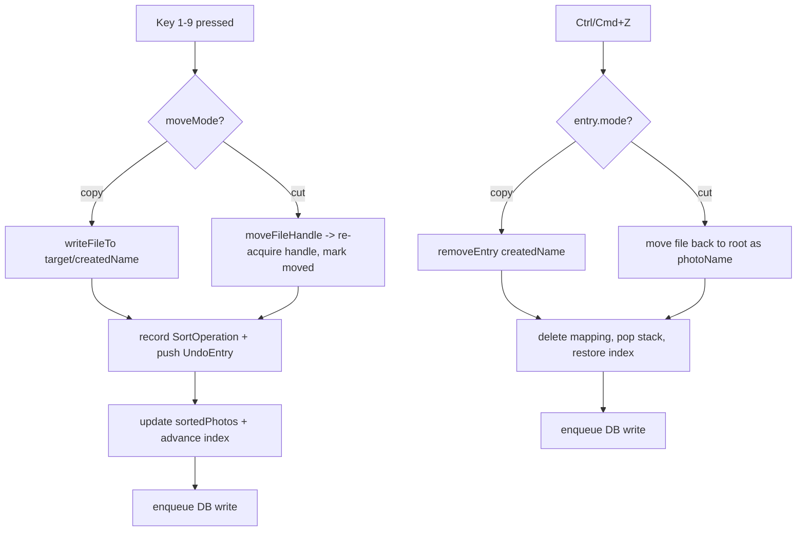

# Software Design — Nata Photo

The design decisions and rationale behind Nata Photo, a 100% client-side photo
& video sorter that runs entirely in a Chromium browser. This document explains
*why* the code is shaped the way it is, not just what it does.

Version 2.0.1 · Last updated 2026-07-14 · Status: Living document

> **Guiding principles.** This document and the codebase follow six code principles — **Clean Code**, **YAGNI**, **DRY**, **KISS**, **Semantic** naming/HTML, and **A11y** (accessibility). Every design decision here is weighed against them: the simplest workable mechanism (KISS), no speculative abstraction (YAGNI), and shared helpers over duplication (DRY). Full definitions: **[PRINCIPLES.md](PRINCIPLES.md)**.

> Related documents: [ARCHITECTURE.md](ARCHITECTURE.md) (structural map),
> [TDD.md](TDD.md) (test design & verification), [SECURITY.md](SECURITY.md)
> (threat model & controls). This document cross-links to those where a decision
> has security or testing consequences.

---

## Table of contents

1. [Design goals & constraints](#1-design-goals--constraints)
2. [Design principles](#2-design-principles)
3. [Key design decisions (ADRs)](#3-key-design-decisions-adrs)
4. [Design patterns used](#4-design-patterns-used)
5. [Core algorithms](#5-core-algorithms)
6. [Concurrency & race-condition handling](#6-concurrency--race-condition-handling)
7. [Error handling & resilience](#7-error-handling--resilience)
8. [Extensibility: adding a new format](#8-extensibility-adding-a-new-format)
9. [Trade-offs & known limitations](#9-trade-offs--known-limitations)

---

## 1. Design goals & constraints

Nata Photo exists to do one thing well: let a photographer flip through the
top-level images and videos in a local folder, in the order they were taken, and
fan them out into destination sub-folders with single-key shortcuts — without
any file ever leaving the machine.

### 1.1 Goals

| # | Goal | How it shapes the design |
|---|------|--------------------------|
| G1 | **Privacy by construction** — nothing is uploaded, ever. | No backend for user data, no telemetry, no network egress. Everything runs against the [File System Access API](https://developer.mozilla.org/docs/Web/API/File_System_Access_API). |
| G2 | **Fast, keyboard-driven sorting.** | Keys `1`–`9` assign folders; `Space`/arrows navigate; `U` jumps to the next unsorted; `Ctrl/Cmd+Z` undoes. See [`ContentViewer.tsx`](../src/features/content-viewer/ui/ContentViewer.tsx). |
| G3 | **Chronological review.** | Files are ordered by capture date (EXIF / QuickTime), not by name or filesystem order. |
| G4 | **Safe file operations.** | Copy is the default; collisions never overwrite; every sort is undoable. |
| G5 | **Resilient sessions.** | Work survives a reload: state is auto-persisted to a JSON DB *inside* the opened folder. |
| G6 | **Broad format support.** | Standard raster, RAW (12 vendors), SVG, video, ICO, HEIC — see [`fileFormats.ts`](../src/shared/config/fileFormats.ts). |
| G7 | **Installable & offline.** | PWA with a Workbox service worker precaching JS/CSS/HTML/WASM. |

### 1.2 Constraints

- **Chromium-only.** The File System Access API (`window.showDirectoryPicker`,
  `FileSystemFileHandle.move()`) is unavailable in Firefox and Safari. This is a
  hard platform constraint, surfaced to the user with a clear message rather than
  a silent failure.
- **Browser sandbox.** No Node APIs, no direct disk access outside the handles
  the user grants. All heavy lifting (RAW decode, video parsing) must run in
  WASM or Web Workers inside the page.
- **Strict CSP with cross-origin isolation.** `script-src 'self'
  'wasm-unsafe-eval'` — no inline scripts, no `eval`. This constrains how the
  service worker is registered and how WASM is loaded (see
  [SECURITY.md](SECURITY.md)).
- **Single view, no router.** The product is one screen; adding a router would
  be dead weight. [`main.tsx`](../src/app/main.tsx) normalizes any non-`/` path back
  to `/`.
- **Top-level, non-recursive scan.** By deliberate scope, only files directly in
  the opened folder are sorted; the destination sub-folders are created inside
  that same folder.

### 1.3 Non-goals

- No cloud sync, accounts, sharing, or server-side storage of user content.
- No editing/retouching — this is a *sorter*, not an editor.
- No recursive/tree traversal of nested folders.
- No cross-browser polyfilling of the File System Access API.

---

## 2. Design principles

- **Local-first & offline-first.** The network is optional; the app is fully
  functional with the machine unplugged.
- **The filesystem is the source of truth.** The DB is a convenience cache of
  *decisions*, not the canonical copy of the files. If the DB is lost, the sorted
  files remain sorted.
- **Fail soft, never throw at the user.** Metadata extraction, RAW decode, DB
  load — every fallible subsystem degrades gracefully and returns a safe default.
- **Untrusted-input mindset for local data too.** The DB file and user-entered
  folder names are treated as untrusted (they live in a folder anyone with write
  access can tamper with). See [`dbService.ts`](../src/shared/services/dbService.ts) and
  [`safeName.ts`](../src/shared/lib/safeName.ts).
- **Stable keys over positional indices.** File *names* — not array positions —
  anchor every persisted relationship.
- **Serializable state, ephemeral handles.** Anything written to disk holds no
  live object references; handles are re-acquired on load.

---

## 3. Key design decisions (ADRs)

Each decision below follows a lightweight ADR shape: **Context / Decision /
Rationale / Alternatives / Trade-offs.**

### ADR-1 — Local-first, no backend for user content

**Context.** Photographers routinely handle sensitive or unpublished work.
Uploading photos to sort them is a privacy and bandwidth non-starter, and it
would require a server, storage, and a trust relationship.

**Decision.** Process everything in the browser via the File System Access API.
The only server that exists is a tiny static file host (see [ADR-11](#adr-11--single-container-nodehelmet-static-server-nginx-removed))
that ships the app bundle and never receives user files.

**Rationale.**
- Zero network egress for user data is a *structural* guarantee, not a policy
  promise — the code simply has no upload path.
- Enables the strict CSP (`connect-src 'self' blob: data:`) and cross-origin
  isolation, because the app legitimately never talks to third-party origins.
- Makes the PWA/offline story trivial: there is no server round-trip to be
  offline *from*.

**Alternatives considered.**
- *Client uploads to a backend that sorts server-side* — rejected: privacy,
  cost, latency, and it defeats the whole premise.
- *A local Electron/Tauri desktop app* — rejected: heavier distribution, native
  build matrix, and the browser already exposes exactly the file primitives
  needed.

**Trade-offs.** Locks the product to Chromium browsers; no multi-device sync; the
user must re-grant folder access per session (a browser security feature, not a
bug).

---

### ADR-2 — Hook-as-controller instead of a heavier state library

**Context.** The app has substantial, interlocking runtime state: the photo list,
current index, folders, the sort mapping, move mode, the operation log, an undo
stack, RAW preview URLs, decode/metadata queues, and a set of directory handles.

**Decision.** Concentrate all of it in a single controller hook,
[`useFileSystem.ts`](../src/features/file-system/model/useFileSystem.ts) (~860 lines), which owns state
via `useState`, side-effect-only data via `useRef`, and orchestration via
`useEffect`/`useCallback`. [`App.tsx`](../src/app/App.tsx) is a thin composition layer
that wires the hook's outputs into presentational components. The *only* global
store is [`statusStore.ts`](../src/shared/store/statusStore.ts) (Zustand), used
exclusively for transient toast notifications.

**Rationale.**
- The state is genuinely *local to one feature* — there is one view and one
  workflow. A global store (Redux/Zustand for everything) would add ceremony
  without decoupling anything.
- Handles and queues (`rootDirHandleRef`, `folderDirHandlesRef`,
  `rawDecodeQueueRef`, `metaQueueRef`) must **not** trigger re-renders, so they
  live in refs. A reducer/store would push us toward serializing things that must
  stay ephemeral.
- Zustand *is* used where a store earns its keep: cross-cutting toasts that must
  be triggerable from non-React code (services call `addStatus`/`clearStatus`).

**Alternatives considered.**
- *Redux Toolkit / Zustand for the whole app* — rejected: the state is not shared
  across distant parts of a tree; the hook already provides a clean interface
  (`FileSystemHook`).
- *`useReducer`* — rejected: many transitions are async and touch refs/handles;
  a reducer would fragment the async orchestration awkwardly.
- *React Context provider* — unnecessary; the single consumer is `App`.

**Trade-offs.** The hook is large and centralizes a lot. Mitigated by pure,
top-level file helpers (`fileExists`, `getUniqueFileName`, `writeFileTo`,
`moveFileHandle`) that are trivially testable in isolation, and by pushing
DB/EXIF/RAW logic into services. See [TDD.md](TDD.md) for how the pure helpers
are unit-tested apart from React.

---

### ADR-3 — Sort mappings keyed by file NAME, not array index

**Context.** Sorting decisions must persist across reloads. The naive key is the
photo's position in the list — but the list is re-sorted chronologically on every
open, files get moved out (cut mode), and the DB is reloaded independently.

**Decision.** The stable key is the **file name** (`PhotoFile.key === name`).
`SortedMapping` is `{ [fileName]: folderId }`, and the metadata cache is keyed the
same way. Array indices (`PhotoFile.id`, `currentIndex`) are treated as
*ephemeral view state* only.

```ts
// src/shared/types/index.ts
export interface SortedMapping {
  [photoKey: string]: string; // fileName -> folderId
}
```

**Rationale.**
- Chronological ordering means index `N` is not stable between sessions; a name
  is.
- On reload, restoring "which photos were sorted where" is a simple name lookup,
  independent of scan order — see the restore loop in `loadDirectory`.
- The metadata cache reuses the same key, so a folder that was opened before
  loads its capture dates instantly.

**Alternatives considered.**
- *Index-based keys* — rejected: breaks the moment the list re-sorts or a file is
  removed; the DB `2.0` schema bump exists precisely to move away from this
  (see the `DB_VERSION` comment in [`dbService.ts`](../src/shared/services/dbService.ts)).
- *Content hash keys* — rejected: hashing every file on open is expensive and
  unnecessary for a single-folder, name-unique namespace.

**Trade-offs.** Two files with the same name can't coexist in one source
folder anyway (the OS forbids it), so name collisions in the *source* are a
non-issue. Collisions in the *target* are handled separately by
`getUniqueFileName` (see [ADR-4](#adr-4--fully-serializable-operation-log-with-no-handles)
and [§5.2](#52-collision-safe-naming--getuniquefilename)). Renaming a file
outside the app orphans its mapping — an acceptable edge case that self-heals on
the next scan.

---

### ADR-4 — Fully serializable operation log with no handles

**Context.** The app keeps a recent-operation log (max 50, persisted) and an undo
stack (max 20, in-memory). Both describe file operations. It is tempting to store
the live `FileSystemFileHandle` on each record for convenience.

**Decision.** `SortOperation` is a **flat, JSON-safe record** — it holds
`photoName`, `folderId`, `folderName`, `mode`, `success`, optional `error`, and
`timestamp`, and **no handles or `File` objects**.

```ts
// src/shared/types/index.ts — "Intentionally holds NO FileSystem handles ...
// so it survives JSON.stringify intact."
export interface SortOperation {
  photoName: string; folderId: string; folderName: string;
  mode: MoveMode; success: boolean; error?: string; timestamp: number;
}
```

**Rationale.**
- The operation log is persisted into `nata-photo-db.json`; a handle cannot be
  serialized to JSON and would silently corrupt the record.
- Keeping handles out of the log means the log can never leak a live capability
  or a stale reference — a security-relevant property (the log stores *what
  happened*, not *access to files*). See [SECURITY.md](SECURITY.md).
- The undo stack (`UndoEntry`) *does* need to act on files, so it carries the
  minimum needed to *re-derive* handles at undo time (`createdName`, `folderId`,
  `photoIndex`) and re-acquires handles from the directory on demand — it never
  caches a handle either.

**Alternatives considered.**
- *Store handles for O(1) undo* — rejected: unserializable, and handles can go
  stale after `move()`; re-acquiring by name is cheap and always correct.

**Trade-offs.** Undo must re-`getFileHandle` by name (one extra async call);
negligible cost for a large gain in robustness.

---

### ADR-5 — Single-writer DB promise chain

**Context.** Every mutation (assign, undo, folder add/remove, mode change,
metadata cache) is a **read-modify-write** of the same `nata-photo-db.json`.
Holding down a `1`–`9` shortcut fires assignments faster than a write completes.
Concurrent read-modify-writes interleave and silently drop updates
(last-writer-wins on a stale read).

**Decision.** Funnel **all** DB writes through one serialized promise chain in
[`dbService.ts`](../src/shared/services/dbService.ts). Every public DB function wraps its
body in `enqueue()`.

```ts
let writeChain: Promise<unknown> = Promise.resolve();

const enqueue = <T>(task: () => Promise<T>): Promise<T> => {
  const run = writeChain.then(task, task); // run after prior task, success or fail
  writeChain = run.then(() => undefined, () => undefined); // keep chain alive
  return run;
};
```

**Rationale.**
- Guarantees strict serialization: each task reads the file *after* the previous
  task has closed its write, so no update is computed on stale state.
- `then(task, task)` runs the next task whether the previous one resolved or
  rejected — one failed write cannot wedge the queue.
- Reassigning `writeChain` to a swallow-errors continuation prevents an
  unhandled rejection from poisoning the chain.

**Alternatives considered.**
- *A mutex/lock library* — rejected: a two-line promise chain is simpler and has
  no dependency.
- *Debounce writes* — used *additionally* for metadata (a 1500 ms debounce in the
  hook) but insufficient alone for correctness: debouncing can still overlap and
  drops intermediate operation records that must be logged.
- *Web Locks API* — rejected: heavier, and cross-tab locking isn't the problem
  here (a single tab holds the directory handle).

**Trade-offs.** Writes are strictly sequential, so throughput is bounded by disk
write latency. In practice each write is a small JSON blob and the chain drains
faster than a human can sort. See [§6](#6-concurrency--race-condition-handling).

---

### ADR-6 — Embedded-JPEG-first RAW strategy, libraw as fallback

**Context.** RAW files (CR2/CR3, NEF, ARW, RAF, …) can't render in an ``.
Full sensor decoding via `libraw-wasm` is slow, memory-hungry, and — in the
shipped version — flaky (see [ADR-9](#adr-9--the-libraw-worker-patch)). But
almost every camera embeds a full- or near-full-resolution JPEG preview inside
the RAW.

**Decision.** In [`rawDecoder.ts`](../src/shared/services/rawDecoder.ts), prefer the
**largest embedded JPEG preview**; only fall back to a full libraw decode when no
*sharp* preview (≥ `SHARP_PREVIEW_MIN_WIDTH` = 800 px) exists, and skip the full
decode entirely for files over `MAX_FULL_DECODE_BYTES` (80 MB).

```ts
const embedded = await extractEmbeddedPreview(file);
if (embedded && embedded.width >= SHARP_PREVIEW_MIN_WIDTH) return embedded.url;
if (file.size <= MAX_FULL_DECODE_BYTES) {
  const full = await decodeWithLibRaw(file);
  if (full) { if (embedded) URL.revokeObjectURL(embedded.url); return full; }
}
return embedded?.url ?? null; // last resort: whatever validated preview we found
```

**Rationale.**
- The embedded preview is both *faster* and usually *sharper* than a half-size
  sensor decode — best quality *and* best latency for the common case.
- The full decode is deliberately configured half-size / AHD / sRGB and guarded
  by a 20 s timeout, an all-white-output check, and worker termination — it is a
  reliability liability, so it runs as rarely as possible.
- Bounding the cached preview to ≤ `MAX_PREVIEW_DIM` (2048 px) via re-encode keeps
  the RAW preview cache small even though the source slice can run to EOF.

**Alternatives considered.**
- *Always full-decode with libraw* — rejected: slow, memory-heavy, and hits the
  upstream worker bug far more often.
- *Trust the first embedded JPEG* — rejected: the first/smallest embedded JPEG is
  a tiny thumbnail; the algorithm scans **all** SOI markers and picks the widest
  that actually decodes ([§5.4](#54-raw-embedded-jpeg-extraction--validation)).
- *Server-side RAW conversion* — rejected: violates [ADR-1](#adr-1--local-first-no-backend-for-user-content).

**Trade-offs.** A RAW whose embedded preview is small *and* is over 80 MB gets
only the small preview (or a "preview unavailable" state). Acceptable: such files
are rare, and correctness/latency for the 99% case wins.

---

### ADR-7 — Lazy, cached metadata extraction

**Context.** A folder may hold thousands of files. EXIF/video metadata is needed
for the metadata panel and — critically — a *capture date* is needed to order
files chronologically. Reading every full file up front would be prohibitively
slow and memory-heavy.

**Decision.** Extract metadata in three tiers:
1. **Header-only reads.** [`exifService.ts`](../src/shared/services/exifService.ts) reads
   only the first `MAX_HEADER_BYTES` (2 MB) of images before parsing with
   ExifReader; video uses a chunked reader.
2. **On-open capture-date pass, bounded-concurrency.** `loadDirectory` runs up to
   8 concurrent workers to fill capture dates *only for files not already cached*,
   then sorts.
3. **Lazy per-view extraction.** Full metadata for the metadata panel is
   extracted on demand for the current photo **and its two neighbors**
   (`currentIndex ± 1`), then cached.

The result is cached in three places: an in-memory `Map` (`metadataByKey`), a
ref (`metadataCacheRef`), and the persisted DB (`metadataCache`), so re-opening a
folder is effectively instant.

**Rationale.**
- Header-only reads cap per-file cost regardless of a RAW/TIFF being tens of MB.
- Prefetching neighbors makes arrow-key navigation feel instantaneous.
- Persisting the cache turns the expensive first open into a one-time cost.

**Alternatives considered.**
- *Extract everything eagerly on open* — rejected: unacceptable latency and
  memory for large folders.
- *No cache* — rejected: every reopen would re-pay the full extraction cost.

**Trade-offs.** The persisted metadata cache grows with the folder; bounded to
`MAX_METADATA_ENTRIES` (100 000) on load. Persistence is debounced (1500 ms) to
avoid write amplification while navigating.

---

### ADR-8 — Explicit blob-URL lifecycle management

**Context.** Each previewable file gets an `URL.createObjectURL(file)`; each
decoded RAW gets its own object/data URL. Object URLs pin their backing blob in
memory until explicitly revoked — a classic browser memory leak when navigating
large folders or re-opening directories.

**Decision.** Own the full lifecycle in [`useFileSystem.ts`](../src/features/file-system/model/useFileSystem.ts):
create URLs on load, **revoke on reload and on unmount** via `revokeAllUrls()`,
and revoke-then-recreate on demand when an `` fails to decode
(`recreatePreviewUrl`). The RAW decoder also revokes any superseded embedded
preview when a full decode wins.

```ts
const revokeAllUrls = useCallback(() => {
  setPhotos((prev) => { prev.forEach((p) => p.url && URL.revokeObjectURL(p.url)); return prev; });
  setRawPreviewUrls((prev) => { prev.forEach(URL.revokeObjectURL); return new Map(); });
  rawPreviewKeysRef.current.clear();
}, []);
useEffect(() => () => revokeAllUrls(), [revokeAllUrls]); // revoke on unmount
```

**Rationale.**
- Prevents unbounded memory growth across directory reloads.
- `recreatePreviewUrl` handles the real-world case where a large image fails its
  first decode: a fresh URL forces the browser to re-fetch/re-decode.
- Non-previewable formats (RAW, HEIC) get `url: null` up front, so no URL is
  minted for something that can't render in ``.

**Alternatives considered.**
- *Rely on GC* — rejected: object URLs are not garbage-collected while the
  document lives; they must be revoked.
- *Data URLs everywhere* — rejected: huge base64 strings for full-size photos;
  object URLs are cheaper for the source files (data URLs are used only for the
  *bounded, re-encoded* RAW previews).

**Trade-offs.** The revoke bookkeeping (`rawPreviewKeysRef`, per-photo `url`)
adds code; the payoff is a flat memory profile.

---

### ADR-9 — The libraw worker patch

**Context.** `libraw-wasm` (through at least 1.4.0) ships a broken worker message
handler: on a worker error it reads the promise rejecter from `.throw`, but the
value is stored under `.error`. The mismatch throws *"n is not a function"* inside
`onmessage` and leaves the decode promise **pending forever** — the RAW spinner
hangs indefinitely.

**Decision.** Monkey-patch each `LibRaw` instance's worker at construction time in
[`rawDecoder.ts`](../src/shared/services/rawDecoder.ts) via `patchLibRawWorker()`,
re-binding `onmessage`/`onerror` to settle the pending promise correctly, and
layer three more guards on top: a 20 s `withTimeout`, an all-white-output
sanity check, and `worker.terminate()` in a `finally` so decoding many RAWs
doesn't accumulate workers.

```ts
worker.onmessage = ({ data }) => {
  const pending = r.waitForWorker; if (!pending) return;
  r.waitForWorker = false;
  if (data?.error) pending.error(data.error); else pending.return(data?.out);
};
worker.onerror = (e) => { const p = r.waitForWorker; if (!p) return;
  r.waitForWorker = false; p.error(e?.message || "libraw worker error"); };
```

**Rationale.**
- A hung promise is the worst failure mode (no error, no timeout, permanent
  spinner). The patch converts it into a normal rejection the caller can catch.
- Defense-in-depth: even if the patch missed a code path, `withTimeout` still
  bounds the wait, and the `finally` still reaps the worker.

**Alternatives considered.**
- *Fork/vendor libraw-wasm* — rejected: heavier maintenance than a targeted
  runtime patch; the patch is small, documented, and self-contained.
- *Only rely on the timeout* — rejected: a 20 s hang per RAW is a terrible UX;
  the patch settles most errors immediately.

**Trade-offs.** The patch reaches into private worker internals (`r.worker`,
`r.waitForWorker`) and could break on a future libraw-wasm refactor — but it is
isolated to one function, and the timeout keeps the app safe if it ever stops
working. Together with [ADR-6](#adr-6--embedded-jpeg-first-raw-strategy-libraw-as-fallback),
libraw is invoked rarely, minimizing exposure.

---

### ADR-10 — Default Copy mode for safety

**Context.** A sort assigns the current file into a target folder. This can either
**copy** (duplicate) or **cut** (move). Move is destructive: a wrong keypress
relocates the original.

**Decision.** Default to **Copy** (`useState<MoveMode>("copy")`, and the fresh DB
seeds `moveMode: "copy"`). Cut is opt-in and persisted per project. Even in Cut
mode, every operation is reversible via the undo stack.

**Rationale.**
- Non-destructive by default follows the principle of least surprise; a
  misfired shortcut costs a duplicate, not lost originals.
- `sanitizeState` coerces any unexpected persisted `moveMode` back to `copy`
  (`s.moveMode === "cut" ? "cut" : "copy"`), so a corrupt DB can't silently put
  the user in destructive mode.

**Alternatives considered.**
- *Default to Cut* — rejected: destructive default; higher blast radius on error.
- *Confirmation dialogs* — rejected: kills the fast keyboard flow; undo is the
  better safety net for a rapid workflow.

**Trade-offs.** Copy leaves the originals in place, so a fully copy-sorted folder
has duplicates until the user removes the originals — an intentional, reversible
outcome.

---

### ADR-11 — Single-container Node/helmet static server (nginx removed)

**Context.** The app is static assets, but they must be served with a strict CSP,
cross-origin isolation (COOP/COEP/CORP — required for the WASM/worker pipeline),
correct WASM/`.webmanifest` MIME types, immutable hashed assets, no-cache HTML,
and an SPA fallback. Earlier revisions used nginx as a reverse proxy in front of
the app.

**Decision.** Ship a **single container** via `docker compose` — **no nginx, no
reverse proxy**. A tiny hardened Node server, [`server/index.js`](../server/index.js)
(Express 5 + helmet 8 + compression), does all of it. The multi-stage
[`Dockerfile`](../Dockerfile) builds the bundle (node:22-slim, pnpm 9), installs
only `express`/`helmet`/`compression` for the runtime, and runs as the non-root
`node` user with `EXPOSE 8080` and a `/healthz` healthcheck.

**Rationale.**
- One process is easier to reason about, audit, and pin than an nginx + app
  split; the security headers and cross-origin isolation live in one place, in
  the same language as the app.
- `helmet` + a small Permissions-Policy middleware produce the exact header set
  the CSP/COOP/COEP posture requires (see [SECURITY.md](SECURITY.md)).
- The runtime image copies only audited `node_modules` and `dist` (as
  `./public`), keeping the attack surface minimal.

**Alternatives considered.**
- *Keep nginx* — rejected: a second server to configure and harden, duplicating
  MIME/CSP logic and adding a moving part for no functional gain at this scale.
- *A static CDN/host* — viable for pure hosting, but wouldn't guarantee the exact
  COOP/COEP + WASM MIME behavior the app needs; the Node server is portable and
  self-describing. For public HTTPS, TLS is terminated at the platform edge
  (Cloudflare / LB / Caddy / Traefik) with `TRUST_PROXY=1`.

**Trade-offs.** A Node runtime is a larger base than a static nginx image, but the
container is hardened at the compose layer (read-only rootfs + tmpfs, `cap_drop:
ALL`, `no-new-privileges`, `init: true`, CPU/memory limits, log rotation). Details
in [SECURITY.md](SECURITY.md).

---

## 4. Design patterns used

| Pattern | Where | Purpose |
|---------|-------|---------|
| **Controller Hook** | [`useFileSystem.ts`](../src/features/file-system/model/useFileSystem.ts) | One hook owns state + orchestration; components stay presentational. See [ADR-2](#adr-2--hook-as-controller-instead-of-a-heavier-state-library). |
| **Service layer / Facade** | `services/{dbService,exifService,rawDecoder}.ts` | Encapsulate persistence, metadata, and RAW decode behind narrow, testable APIs. |
| **Strategy** | `decodeRawImage` (embedded-first vs. full decode) | Pick the decode strategy by preview availability and file size. |
| **Registry / Table-driven config** | [`fileFormats.ts`](../src/shared/config/fileFormats.ts) `PHOTO_FORMATS` | Format support is data, not branching logic — extension→config lookup tables. |
| **Producer/consumer queue** | `writeChain` in dbService; `rawDecodeQueueRef`/`metaQueueRef` in the hook | Serialize writes; dedupe in-flight decode/extract work. |
| **Command + Memento (undo)** | `UndoEntry` stack + `undoLastOperation` | Each sort records enough to reverse itself; undo replays the inverse operation. |
| **Guard / Sanitizer** | `sanitizeState`, `safeRecord`, `validateFolderName` | Normalize untrusted input at the boundary; see [SECURITY.md](SECURITY.md). |
| **Adapter** | `moveFileHandle` | Uses native `handle.move()` when present, else copy-then-delete. |
| **Debounce** | `persistMetadata` (lodash.debounce, 1500 ms) | Coalesce metadata-cache writes during navigation. |
| **Bounded concurrency (worker pool)** | capture-date pass in `loadDirectory` | Up to 8 cooperating async workers sharing a cursor. |
| **Observer store** | [`statusStore.ts`](../src/shared/store/statusStore.ts) (Zustand) | Transient toasts triggerable from outside React. |
| **Error Boundary** | `ErrorBoundary` in [`main.tsx`](../src/app/main.tsx) | Contain render-time crashes below the theme provider. |

---

## 5. Core algorithms

### 5.1 Chronological sort with mtime fallback

**Goal.** Order files by *when they were taken*, degrading gracefully when a
capture date is missing or unparseable.

**Steps.**
1. Scan the top level of the opened directory; keep entries whose extension is a
   supported image/video (`isSupportedImage`).
2. For each file **without cached metadata**, extract header-only metadata to get
   a capture date. This runs with **bounded concurrency** (up to 8 workers over a
   shared `cursor`), reporting progress every 8 files.
3. Compute a sort timestamp per file: parsed capture date if available, else the
   file's `lastModified` (filesystem mtime).
4. Sort ascending (oldest first); break ties by locale-compared file name for a
   stable order.

```ts
const sortTs = (p: PhotoFile) =>
  parseCaptureDate(cache[p.key]?.dateTaken) ?? p.file.lastModified;
imageFiles.sort((a, b) => sortTs(a) - sortTs(b) || a.key.localeCompare(b.key));
```

**Why it's robust.** A file with no EXIF (e.g. a screenshot, an SVG) still gets a
sensible position from its mtime, and the name tiebreak means the order is
deterministic across runs.

### 5.2 Collision-safe naming — `getUniqueFileName`

**Goal.** Never silently overwrite a file already present in the target folder.

**Steps.**
1. If the name is free in the target dir, use it as-is.
2. Otherwise split into base + extension and probe `base_1.ext`, `base_2.ext`, …
   until a free name is found.

```ts
const getUniqueFileName = async (dir, name) => {
  if (!(await fileExists(dir, name))) return name;
  const dot = name.lastIndexOf(".");
  const base = dot > 0 ? name.slice(0, dot) : name;
  const ext  = dot > 0 ? name.slice(dot)   : "";
  let i = 1, candidate = `${base}_${i}${ext}`;
  while (await fileExists(dir, candidate)) candidate = `${base}_${++i}${ext}`;
  return candidate;
};
```

`fileExists` is implemented by attempting `dir.getFileHandle(name)` and catching
the not-found rejection — there is no `exists()` primitive in the File System
Access API.

### 5.3 Copy/Cut assignment + undo reversal

**Assign (`assignPhotoToFolder`).**
1. Resolve the target directory handle (from the folder or the handle ref).
2. Compute a collision-free `createdName` via `getUniqueFileName`.
3. **Copy mode:** `writeFileTo(target, createdName, file)`.
   **Cut mode:** `moveFileHandle(...)`, then **re-acquire** the handle at its new
   location (`target.getFileHandle(createdName)`) so `PhotoFile.handle` is never
   stale, and mark the photo `moved: true`.
4. Record a serializable `SortOperation`, update `sortedPhotos[photo.key] =
   folderId`, push an `UndoEntry` (cap 20), advance `currentIndex`, and enqueue a
   DB write.
5. On failure, log a `success: false` operation with the error message and still
   persist — the log reflects reality.

**Undo (`undoLastOperation`).** Pop the last `UndoEntry` and apply the inverse:
- **Cut:** re-acquire the moved file by `createdName` and move it **back** to the
  root under its original `photoName`; restore the handle and clear `moved`.
- **Copy:** simply `removeEntry(createdName)` — delete the duplicate that was
  created.

Then delete the mapping, pop the stack, restore `currentIndex`, and persist.
Because the undo entry stores the *actual* `createdName` (which may differ from
the original name after a collision suffix), the reversal targets exactly the file
that was written.



### 5.4 RAW embedded-JPEG extraction & validation

**Goal.** Find the *largest decodable* embedded JPEG in a RAW file without
truncating it.

**Steps.**
1. Read the whole file into a `Uint8Array` and collect every SOI offset (a JPEG
   starts with `FF D8 FF`).
2. Build candidate spans: each SOI to the **next** SOI (or EOF), capped at
   `MAX_CANDIDATE_BYTES` (40 MB) — an over-long span means the scan ran into raw
   sensor data, not a preview.
3. Sort candidates largest-first (bigger spans more likely hold the full preview).
4. For up to the first 6 candidates, wrap the slice in a `Blob` and validate with
   `createImageBitmap`. The JPEG decoder finds the real EOI itself and ignores
   trailing bytes — this sidesteps the truncation failure mode of a hand-rolled
   EOI scan on formats like Sony ARW.
5. Keep the candidate with the widest decoded bitmap; **re-encode** it to a
   bounded JPEG (≤ `MAX_PREVIEW_DIM` 2048 px, quality 0.9) so the cache never
   holds a tens-of-MB source slice.

```ts
for (let i = 0; i + 2 < data.length; i++)
  if (data[i] === 0xff && data[i+1] === 0xd8 && data[i+2] === 0xff) sois.push(i);
// ... spans = SOI[i] .. min(SOI[i+1] ?? EOF, SOI[i] + MAX_CANDIDATE_BYTES)
// ... sort by span length desc, validate first 6 with createImageBitmap,
//     keep widest, re-encode via bitmapToDataUrl().
```

If `createImageBitmap` is unavailable, the algorithm trusts the largest candidate
without validation (a graceful degradation path).

### 5.5 All-white decode detection

**Goal.** Detect a failed full libraw decode that emits an all-white buffer, so
the app can fall back instead of showing a blank white frame.

**Steps.** Sample ~2000 evenly-spaced bytes across the decoded buffer; if > 95%
are `255`, treat the decode as failed and return `null`.

```ts
const checkIfAllWhite = (data) => {
  const step = Math.max(1, Math.floor(data.length / 2000));
  let white = 0, checked = 0;
  for (let i = 0; i < data.length; i += step) { if (data[i] === 255) white++; checked++; }
  return checked > 0 && white / checked > 0.95;
};
```

Sampling (rather than scanning every byte) keeps the check O(2000) regardless of
image size.

### 5.6 Flexible date parsing

**Goal.** Turn the many date shapes EXIF and mediainfo emit into a single
comparable timestamp for chronological sort.

**Handled forms.** EXIF `"2023:01:02 13:04:05"`, `"2023-01-02 13:04:05"`,
mediainfo `"UTC 2023-01-02 13:04:05"`, ISO 8601 with `T`, and date-only.

**Steps.**
1. Trim; strip a leading timezone token like `"UTC "` (`/^[A-Z]{2,4}\s+/`).
2. If the string contains `T`, let `new Date()` parse it directly.
3. Otherwise split date/time; convert the EXIF colon-date (`2023:01:02`) to dashes
   (`2023-01-02`); default a missing time to `00:00:00`; construct
   `new Date("YYYY-MM-DDThh:mm:ss")`.
4. Last resort: hand the original string to `new Date()`; return `null` if still
   unparseable.

`parseCaptureDate` wraps this and returns milliseconds (or `null`), which the sort
comparator falls back from to `file.lastModified` — see [§5.1](#51-chronological-sort-with-mtime-fallback).

---

## 6. Concurrency & race-condition handling

Nata Photo has three concurrency hotspots, each handled explicitly:

1. **Rapid mutations → the DB write chain.** Holding a shortcut key fires
   assignments faster than a JSON write completes. All writes are serialized
   through `enqueue`/`writeChain` ([ADR-5](#adr-5--single-writer-db-promise-chain)),
   so every read-modify-write sees the previous write's result. The chain is
   error-tolerant: a failed task neither wedges the queue nor throws an unhandled
   rejection.

2. **Duplicate/overlapping async work → dedupe sets.** The lazy metadata effect
   and the RAW decode effect can both re-fire for the same file (React re-renders,
   neighbor prefetch). Each guards with a ref-held set:
   - `metaQueueRef` — a key currently being extracted is skipped.
   - `rawDecodeQueueRef` + `rawPreviewKeysRef` + `failedRawDecodesRef` — a key
     already decoded, in-flight, or previously *failed* is not retried. A failed
     RAW is recorded so the spinner doesn't loop forever on an undecodable file.
   - A `cancelled` flag in the metadata effect's cleanup drops results that arrive
     after the effect re-runs (stale-closure guard).

3. **Bounded parallelism on open.** The capture-date pass runs up to 8 async
   workers over a shared `cursor` — enough parallelism to hide I/O latency without
   opening thousands of file reads at once.

**Handle freshness.** After a `cut`, the source handle is invalid, so
`assignPhotoToFolder` re-acquires the handle at the destination and `undo`
re-acquires it back at the root. Handles are always re-derived by name, never
cached across a move (ties back to [ADR-4](#adr-4--fully-serializable-operation-log-with-no-handles)).

---

## 7. Error handling & resilience

The design assumes **every** external operation can fail, and none should crash
the app or block the user:

- **DB load is total, never throwing.** `loadProjectState` returns `null` (and
  shows a toast) for a missing, corrupt-JSON, wrong-shape, or wrong-version file,
  and the app starts fresh. On success it runs `sanitizeState`
  ([SECURITY.md](SECURITY.md)) so nothing downstream must re-validate.
- **Metadata extraction fails soft.** `extractMetadata` returns a default
  metadata object on any error; ordering then falls back to mtime. Video metadata
  degrades gracefully when the mediainfo WASM module isn't emitted at build time
  (a documented functional limitation — see [§9](#9-trade-offs--known-limitations)).
- **RAW decode is quadruple-guarded.** worker patch + 20 s timeout + all-white
  check + `failedRawDecodesRef`; on total failure the viewer shows a
  "preview unavailable" state rather than a hang or crash.
- **File operations report and persist failure.** A failed copy/move logs a
  `success: false` `SortOperation` (with the error message) and still writes the
  DB, so the operation log is an honest record.
- **Missing folders on restore are skipped.** If a persisted folder no longer
  exists on disk, it's skipped with a warning and its mappings are dropped
  (`validFolderIds` filter), keeping state consistent with the filesystem.
- **Preview decode retry.** An `` that fails its first decode triggers
  `recreatePreviewUrl` to mint a fresh object URL and retry.
- **Render crashes are contained.** The `ErrorBoundary` in `main.tsx` catches
  render-time exceptions below the theme provider.
- **Browser capability check.** Missing `showDirectoryPicker` yields a clear
  Indonesian error telling the user to use Chrome/Edge/Opera, instead of a
  cryptic `undefined` failure.
- **User-cancelled picker is not an error.** `AbortError` from the directory
  picker is swallowed silently.

---

## 8. Extensibility: adding a new format

Format support is **table-driven** — the registry
[`fileFormats.ts`](../src/shared/config/fileFormats.ts) is the single place to extend.

**To add a format:**
1. Add an entry to `PHOTO_FORMATS` with its `extensions`, optional `mimeTypes`,
   `label`, `category` (`standard | raw | vector | video | other`), and
   `previewable` flag.

   ```ts
   jpegXl: {
     extensions: [".jxl"],
     mimeTypes: ["image/jxl"],
     label: "JPEG XL",
     category: "standard",
     previewable: true, // only if the target browser can render it in 
   },
   ```

2. That's it for detection: the derived tables (`ALL_EXTENSIONS`,
   `PREVIEWABLE_EXTENSIONS`, `EXTENSION_TO_FORMAT`) and the helpers
   (`isSupportedImage`, `isPreviewable`, `getFileFormatInfo`) pick it up
   automatically, so scanning, ordering, and the viewer route it correctly.

**Behavior by category, no extra wiring needed:**
- `standard` / `vector` / `other` (previewable) → rendered via ``.
- `video` → rendered via `<video>`, metadata via mediainfo.js.
- `raw` → routed to the RAW decode pipeline ([ADR-6](#adr-6--embedded-jpeg-first-raw-strategy-libraw-as-fallback)); set `previewable: false`.
- Non-``-decodable formats (like HEIC) → set `previewable: false` so the app
  shows a "preview unavailable" state instead of a broken image.

**When extra code is warranted:** a genuinely new *decode path* (e.g. a new RAW
engine or a client-side HEIC decoder) is a new service module plus a branch in the
hook's decode effect — but the *registry entry above is still the entry point*.
Set `previewable` honestly to match what the browser can actually render.

**Security note.** SVGs are deliberately rendered via `` so any
embedded scripts never execute; keep that invariant for any new
markup-bearing format. See [SECURITY.md](SECURITY.md).

---

## 9. Trade-offs & known limitations

| Area | Limitation | Rationale / mitigation |
|------|-----------|------------------------|
| **Browser support** | Chromium-only (needs the File System Access API). | Core premise; the app detects and explains the requirement rather than degrading silently. |
| **Scope** | Top-level, non-recursive scan; no nested traversal. | Keeps the model simple and the destination folders unambiguous; matches the target workflow. |
| **HEIC/HEIF** | Marked non-previewable; shown as "preview unavailable". | Chromium cannot decode HEIC in ``; a broken image is worse than an honest placeholder. |
| **RAW previews** | A RAW with only a *small* embedded preview **and** size > 80 MB gets just the small preview (or none). | Full decode is skipped above `MAX_FULL_DECODE_BYTES` to protect memory; rare in practice. |
| **libraw reliability** | Depends on a runtime monkey-patch of a third-party worker bug ([ADR-9](#adr-9--the-libraw-worker-patch)). | Isolated to one function; the 20 s timeout + all-white check keep the app safe if it regresses. |
| **Video metadata** | `mediainfo.js`'s `MediaInfoModule.wasm` isn't emitted at build time (Vite can't resolve its runtime `new URL()`), so video metadata may be unavailable. | The extractor catches the failure and returns default metadata — a functional, **non-security** degradation. |
| **DB durability** | The DB lives *inside* the sorted folder; deleting/moving the folder loses session state. | Intentional: the DB is a decision cache, not the source of truth — the sorted files themselves persist. |
| **Undo depth** | In-memory undo stack capped at 20; cleared on reload. | Undo is a fast-workflow safety net, not full history; the persisted operation log (max 50) is the durable audit trail. |
| **Concurrency vs. throughput** | DB writes are strictly serialized ([ADR-5](#adr-5--single-writer-db-promise-chain)). | Correctness over throughput; writes are small and drain faster than a human sorts. |
| **Name-keyed mappings** | Renaming a file outside the app orphans its mapping. | Self-heals on the next scan; content-hash keys were rejected as too costly ([ADR-3](#adr-3--sort-mappings-keyed-by-file-name-not-array-index)). |
| **Copy-mode duplicates** | Fully copy-sorting a folder leaves the originals behind. | Non-destructive by default ([ADR-10](#adr-10--default-copy-mode-for-safety)); reversible and expected. |
| **Persisted-cache growth** | The metadata cache grows with folder size. | Bounded to 100 000 entries on load; debounced writes avoid amplification. |

---

*See also:* [ARCHITECTURE.md](ARCHITECTURE.md) for the source map,
[TDD.md](TDD.md) for how these designs are tested, and [SECURITY.md](SECURITY.md)
for the threat model, header set, and audit results referenced throughout.
