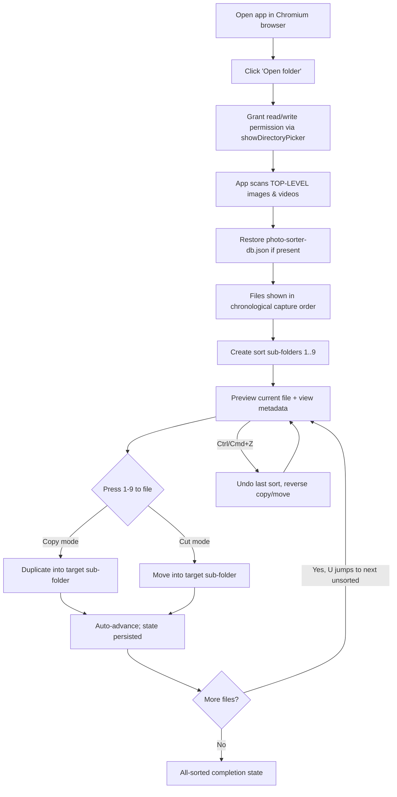
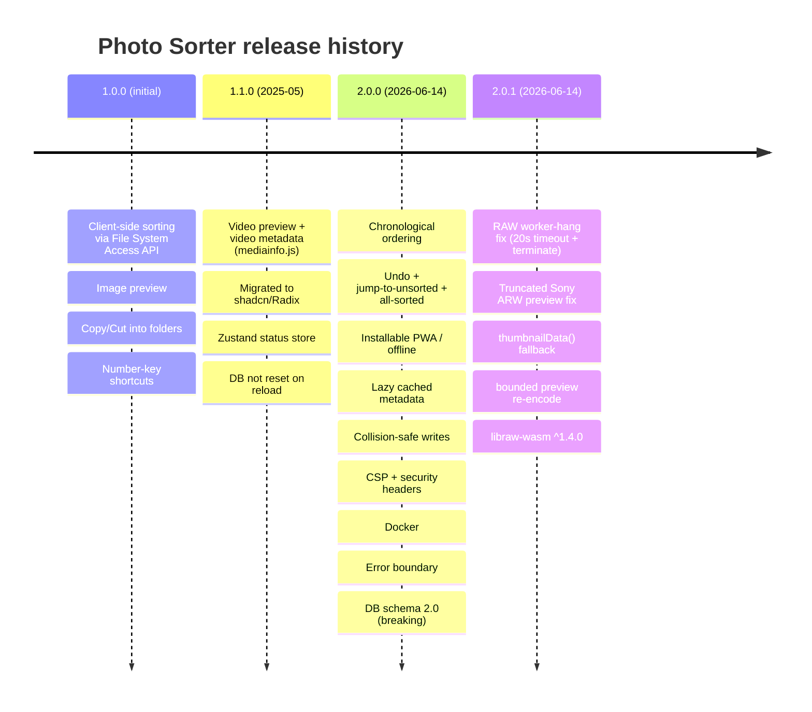

# Product Requirements Document — Photo Sorter

A product-level specification for Photo Sorter, a 100% client-side, keyboard-driven photo & video sorter that runs entirely in the browser and never uploads a byte.

Version 2.0.1 · Last updated 2026-07-14 · Status: Living document

> **Guiding principles.** This product and its codebase follow six code principles — **Clean Code**, **YAGNI**, **DRY**, **KISS**, **Semantic** naming/HTML, and **A11y** (accessibility). The requirements deliberately prioritize a small, focused, accessible product with no feature bloat (YAGNI/A11y). Full definitions: **[PRINCIPLES.md](PRINCIPLES.md)**.

---

## Table of contents

1. [Executive summary & product vision](#1-executive-summary--product-vision)
2. [Problem statement](#2-problem-statement)
3. [Goals & non-goals](#3-goals--non-goals)
4. [Target users & personas](#4-target-users--personas)
5. [User journeys & user stories](#5-user-journeys--user-stories)
6. [Functional requirements (MoSCoW)](#6-functional-requirements-moscow)
7. [Non-functional requirements](#7-non-functional-requirements)
8. [Success metrics & KPIs](#8-success-metrics--kpis)
9. [Release scope & milestones](#9-release-scope--milestones)
10. [Assumptions, dependencies & risks](#10-assumptions-dependencies--risks)
11. [Out of scope & future ideas](#11-out-of-scope--future-ideas)
12. [Appendix — glossary & references](#12-appendix--glossary--references)

---

## 1. Executive summary & product vision

**Photo Sorter** is a browser-based application that lets a person open a local
folder of photos and videos, review each file in chronological order, and file
it into one of up to nine destination sub-folders using single-key shortcuts.
Files are copied or moved directly on the local disk through the
[File System Access API](https://developer.mozilla.org/en-US/docs/Web/API/File_System_API).

The defining characteristic of the product is that **nothing is uploaded**.
There is no backend that processes user media, no telemetry, and no network
egress during use. The web server (see [DEPLOYMENT.md](DEPLOYMENT.md)) exists
only to deliver the static application shell; every image decode, metadata read,
and file operation happens inside the user's own browser sandbox against the
user's own file handles.

### Vision statement

> Give anyone with a large local media library a fast, private, and delightful
> way to triage thousands of files — as quickly as they can press a number key —
> without surrendering their photos to a cloud service.

### What makes it distinctive

| Pillar | What it means in practice |
| --- | --- |
| **Local-first & private** | All processing is client-side via `window.showDirectoryPicker`. No uploads, no accounts, no tracking. |
| **Keyboard-native speed** | Keys `1`–`9` assign the current file; `←`/`→`/`Space` navigate; `U` jumps to the next unsorted file; `Ctrl/Cmd+Z` undoes. |
| **Broad format fluency** | Standard raster, SVG, a deep list of camera RAW formats, and common video containers — including a robust RAW-preview pipeline. |
| **Resilient & recoverable** | Copy/Cut with full undo, collision-safe naming, and an auto-persisted project database written inside the opened folder. |
| **Installable & offline** | A PWA with a precaching service worker: install it, then keep sorting with no network. |
| **Hardened by default** | Strict Content-Security-Policy, cross-origin isolation, and a defense-in-depth server and container (see [SECURITY.md](SECURITY.md)). |

### Current state (v2.0.1)

The product is a **single-view application** (no router) that is
feature-complete for its core triage workflow. Version 2.0 introduced
chronological ordering, undo, PWA/offline support, lazy cached metadata, and
collision-safe file operations; version 2.0.1 hardened the RAW-preview pipeline
against decoder hangs and truncated embedded previews. A dedicated security and
deployment hardening pass replaced the previous nginx-based container with a
single hardened Node/Express static server.

---

## 2. Problem statement

### The situation

Anyone who shoots regularly — photographers, videographers, content creators,
parents with a phone full of family photos — accumulates **large, unsorted
local libraries**: an SD-card dump, a "to-sort" desktop folder, an import from a
phone. The raw material is chronological chaos: keepers mixed with rejects,
RAW+JPEG pairs, screen recordings, and dozens of formats.

### Why existing tools fall short

- **Cloud photo services** (upload-first galleries) require handing every file
  to a third party, consume bandwidth and storage quotas, and create privacy and
  data-residency concerns. For sensitive, professional, or simply private
  material, uploading is a non-starter.
- **Desktop DAM / catalog software** (heavyweight asset managers) is powerful
  but slow to open, opinionated about catalogs and imports, often paid, and far
  more than is needed for the narrow job of *"look at each file and drop it into
  the right pile."*
- **The OS file manager** is private and local, but slow for triage: it has no
  chronological media ordering, weak inline preview for RAW and many video
  formats, no single-key filing, and no undo tuned for a sort workflow.

### The gap

There is no lightweight, private, **keyboard-first** tool that:

1. Works on files exactly where they already live on disk;
2. Presents them in true **capture-time chronological order**;
3. Previews the widest realistic range of formats (RAW and video included);
4. Lets a user file each item with a single keystroke, with copy/move and undo;
5. Requires **zero uploads, accounts, installs, or configuration**; and
6. Can be installed and used **offline**.

### The consequence of not solving it

Users either (a) leave libraries unsorted indefinitely, (b) pay for and learn
heavyweight software, or (c) compromise privacy by uploading to a cloud sorter.
Photo Sorter exists to remove that trade-off.

---

## 3. Goals & non-goals

### 3.1 Product goals

| # | Goal | Rationale |
| --- | --- | --- |
| G1 | **Absolute privacy** — no file ever leaves the device; no telemetry or network egress during use. | The core differentiator and trust anchor. |
| G2 | **Fast keyboard triage** — a user can sort a file in a single keystroke and move through a library rapidly. | Speed is the reason to choose this over a file manager. |
| G3 | **Format breadth** — preview and sort standard raster, SVG, camera RAW, and common video without external tools. | Real libraries are heterogeneous; RAW and video are table stakes for creators. |
| G4 | **Reversibility & data safety** — never silently overwrite; always allow undo; persist and restore project state. | Users must trust the tool with real files. |
| G5 | **Resilience** — recover gracefully from decoder hangs, corrupt state files, and unsupported formats. | Robustness on messy real-world input. |
| G6 | **Zero-friction access** — no install, no account, no config; installable as a PWA; works offline. | Lower the barrier to first use to near zero. |
| G7 | **Security by default** — strict CSP, cross-origin isolation, hardened server & container, audited dependencies. | Handling untrusted media in-browser demands a hardened posture. |

### 3.2 Non-goals (deliberate limitations)

| # | Non-goal | Why it is out of scope |
| --- | --- | --- |
| N1 | **Cloud sync / accounts / sharing.** | Directly contradicts G1 (privacy/local-first). |
| N2 | **Photo editing / RAW development / retouching.** | The product triages and files; it does not edit pixels. |
| N3 | **Recursive/library-wide indexing.** | The workflow deliberately scans only the **top level** of the opened folder to keep the mental model and performance simple. |
| N4 | **A full DAM: ratings, tags, keywords, catalogs, search.** | Out of the "file into piles" scope; may be revisited (see §11). |
| N5 | **Cross-browser parity with Firefox/Safari.** | The File System Access API is Chromium-only; a fallback would fundamentally change the architecture. |
| N6 | **Server-side media processing.** | There is no backend that touches user files; the server ships only static assets. |
| N7 | **Multi-user collaboration / permissions.** | Single-user, single-device tool by design. |

---

## 4. Target users & personas

Photo Sorter targets individuals who own **large local media libraries** and
value speed and privacy. It assumes a Chromium-based desktop browser as the
primary environment, with a usable mobile experience as a secondary surface.

### Persona A — "Rara", the working photographer/creator

- **Context:** Shoots weddings and events; comes home with SD cards containing
  thousands of RAW files (Canon CR3, Sony ARW) plus a few clips.
- **Needs:** Rapidly separate keepers, rejects, and client-specific sets before
  any editing; must see a **sharp RAW preview** without importing into a catalog;
  cannot risk uploading client material.
- **Pain today:** Catalog software is slow to import; the OS viewer can't preview
  RAW well; cloud tools are a privacy and contract risk.
- **How Photo Sorter helps:** Opens the card folder, sees files in capture order
  with embedded-JPEG RAW previews, and files each into `Keep` / `Reject` /
  `Client-A` with keys `1`–`3`, using Cut to physically move rejects out.

### Persona B — "Deni", the privacy-conscious individual

- **Context:** Wants to organize a personal/family photo dump but refuses to
  upload private images to any cloud service.
- **Needs:** A tool that provably keeps everything local; simple copy-based
  sorting so originals are never at risk; something he can verify is offline.
- **How Photo Sorter helps:** Runs entirely client-side; can be installed as a
  PWA and used with networking disabled; the strict CSP and no-egress design are
  documented in [SECURITY.md](SECURITY.md).

### Persona C — "Mira", the offline / low-connectivity user

- **Context:** Travels or works in places with no reliable internet; wants to
  sort on a laptop during downtime.
- **Needs:** The app must fully function without a network after first load.
- **How Photo Sorter helps:** As an installable PWA with a Workbox precache
  (including the RAW-decode WASM), it launches and operates offline.

### Persona D — "Anton", the phone-first casual sorter

- **Context:** Occasionally triages screenshots and clips on a Chromium mobile
  browser.
- **Needs:** Touch-friendly navigation and one-tap filing.
- **How Photo Sorter helps:** The mobile layout offers a fixed bottom action bar
  with one colored button per folder and swipe navigation.
- **Note:** Mobile support depends on File System Access API availability in the
  mobile browser; desktop remains the primary target.

### Persona summary

| Persona | Primary driver | Key features relied on | Surface |
| --- | --- | --- | --- |
| A — Photographer/creator | Speed + RAW/video breadth | RAW preview, chronological order, Cut mode, undo | Desktop |
| B — Privacy-conscious | Local-only guarantee | No-egress design, Copy mode, PWA | Desktop |
| C — Offline user | Works without network | PWA precache, offline decode | Desktop |
| D — Casual mobile | Touch triage | Mobile action bar, swipe nav | Mobile |

---

## 5. User journeys & user stories

### 5.1 Primary journey — "Sort a folder of photos"

### 5.2 Epics and user stories with acceptance criteria

Acceptance criteria use Given/When/Then. IDs are referenced by the requirements
table in §6.

---

#### Epic 1 — Access local files privately

**US-1.1 — Open a local folder**

> As a user, I want to open a local folder so I can sort the media inside it.

- **AC-1.1.1** Given a Chromium browser, when I trigger "Open folder," then the
  native `showDirectoryPicker` prompt appears and, on grant, the app receives a
  directory handle.
- **AC-1.1.2** Given a granted folder, when scanning completes, then only
  **top-level** images and videos are listed (subfolders are not recursed).
- **AC-1.1.3** Given any point during use, then no file content is transmitted
  over the network (verifiable: no upload requests are issued).
- **AC-1.1.4** Given an unsupported browser (Firefox/Safari), when I load the
  app, then I am informed the File System Access API is unavailable rather than
  silently failing.

**US-1.2 — Restore prior work**

> As a returning user, I want my previous sort state restored automatically.

- **AC-1.2.1** Given a folder that already contains `photo-sorter-db.json`, when
  I reopen it, then folders, per-file sort mapping, move mode, and `currentIndex`
  are restored.
- **AC-1.2.2** Given a missing, corrupt, or incompatible-version database, when
  it is loaded, then it is reset to defaults and a **visible warning** is shown.

---

#### Epic 2 — Review files efficiently

**US-2.1 — Chronological ordering**

> As a user, I want files ordered by capture time so I review them in the order
> they happened.

- **AC-2.1.1** Given images with EXIF `DateTimeOriginal`, when the list is built,
  then they are ordered by that capture time.
- **AC-2.1.2** Given videos, when ordering, then QuickTime/mediainfo dates are
  used as the sort key.
- **AC-2.1.3** Given a file with no readable capture date, then the file's
  `lastModified` timestamp is used as the fallback key.

**US-2.2 — Preview a wide range of formats**

> As a user, I want to preview standard images, RAW, SVG, and video inline.

- **AC-2.2.1** Given a standard raster image (JPEG/PNG/WebP/AVIF/GIF/BMP/TIFF) or
  SVG, when selected, then it previews inline.
- **AC-2.2.2** Given a RAW file, when selected, then the app extracts and shows
  the largest embedded JPEG preview; if none is sharp enough, it falls back to a
  full `libraw-wasm` decode (subject to size/timeout guards).
- **AC-2.2.3** Given a video, when selected, then it previews using the native
  player where the container/codec is browser-supported.
- **AC-2.2.4** Given a HEIC/HEIF file, then it is marked **non-previewable**
  (Chromium cannot decode HEIC in ``) while still being sortable.
- **AC-2.2.5** Given a RAW decode that hangs or fails, then a 20s timeout, worker
  termination, and error handling ensure the UI recovers and remains responsive.

**US-2.3 — Inspect metadata**

> As a user, I want to see technical metadata to judge each file.

- **AC-2.3.1** Given an image, then the metadata panel shows available EXIF:
  camera make/model, lens, ISO, shutter, aperture, focal length, date,
  dimensions, and megapixels.
- **AC-2.3.2** Given a video, then the panel shows duration, fps, codecs,
  bitrate, and dimensions (via mediainfo.js) where available.
- **AC-2.3.3** Given navigation to a file, then metadata is extracted **lazily**
  (current file plus neighbors), read header-only for images (first 2MB), and
  **cached** in memory and in the project database.

---

#### Epic 3 — Sort with keyboard speed

**US-3.1 — File into folders with number keys**

> As a user, I want to press `1`–`9` to file the current item instantly.

- **AC-3.1.1** Given one or more sort folders, when I press its number key, then
  the current file is copied or moved into that folder per the active mode.
- **AC-3.1.2** Given a successful sort, then the view auto-advances and the
  mapping is persisted.
- **AC-3.1.3** Given focus is inside a text input, then number/navigation
  shortcuts are **ignored** (so folder names can be typed).

**US-3.2 — Choose Copy or Cut**

> As a user, I want to duplicate or move files depending on my workflow.

- **AC-3.2.1** Given the default state, then the mode is **Copy** (original
  stays; a duplicate is written to the target).
- **AC-3.2.2** Given Cut mode, when I sort, then the file is moved (native
  `handle.move()` when available, else copy-then-delete) and marked `moved`.

**US-3.3 — Never overwrite silently**

> As a user, I want to be sure sorting never destroys an existing file.

- **AC-3.3.1** Given a target folder that already contains a file with the same
  name, when I sort, then a `_1`, `_2`, … suffix is appended instead of
  overwriting.

**US-3.4 — Undo a mistake**

> As a user, I want to undo my last sort.

- **AC-3.4.1** Given at least one sort has occurred, when I press `Ctrl/Cmd+Z`,
  then the last operation is fully reversed (copy removed, or moved file restored
  to source).
- **AC-3.4.2** Given repeated undos, then up to **20** operations can be undone
  from the undo stack.

**US-3.5 — Skip to the next unsorted**

> As a user, I want to jump past already-sorted files.

- **AC-3.5.1** Given some files are already sorted, when I press `U`, then the
  view moves to the next unsorted file.
- **AC-3.5.2** Given every file is sorted, then an **"all sorted"** completion
  state is shown.

**US-3.6 — Navigate freely**

> As a user, I want to move between files by keyboard, mouse, and touch.

- **AC-3.6.1** Given the viewer, then `←`/`→` move previous/next and `Space`
  advances.
- **AC-3.6.2** Given a touch device, then a horizontal swipe (≥50px threshold)
  navigates previous/next.

---

#### Epic 4 — Manage sort destinations

**US-4.1 — Create and manage folders**

> As a user, I want to create the destination folders I'll sort into.

- **AC-4.1.1** Given the folder manager, when I add a folder, then a sub-folder is
  created inside the opened folder and assigned a shortcut (`1`–`9`) and a color.
- **AC-4.1.2** Given an invalid folder name (path separators, reserved/device
  names such as `CON`/`PRN`/`AUX`/`NUL`/`COM1`–`9`/`LPT1`–`9`, control chars,
  `.`/`..`, trailing dot/space, or > 200 chars), then it is **rejected** before
  creation.
- **AC-4.1.3** Given a non-empty folder, when I attempt removal, then the app
  handles it safely (it does not leave the app in an inconsistent state).

---

#### Epic 5 — Persistence, offline, and trust

**US-5.1 — Auto-persist project state**

> As a user, I want my progress saved without thinking about it.

- **AC-5.1.1** Given any state-changing action, then the project state is written
  to `photo-sorter-db.json` inside the opened folder.
- **AC-5.1.2** Given rapid consecutive actions (e.g. holding a key), then writes
  are serialized through a single promise chain so no update is dropped.
- **AC-5.1.3** Given the recent-operation log, then it is capped at **50**
  entries and stores **no** file handles (fully serializable).

**US-5.2 — Install and work offline**

> As a user, I want to install the app and use it without a network.

- **AC-5.2.1** Given a supported browser, then the app is installable as a PWA
  (standalone display).
- **AC-5.2.2** Given the app has been loaded once, then it launches and functions
  offline, including RAW decode (the ~1.3MB libraw WASM is precached).

**US-5.3 — Trust the privacy & security posture**

> As a privacy-conscious user, I want assurance nothing leaks.

- **AC-5.3.1** Given the running app, then a strict CSP with no `unsafe-inline`/
  `unsafe-eval` for scripts (only `wasm-unsafe-eval` for WASM) is enforced.
- **AC-5.3.2** Given any user-supplied SVG, then it is rendered via
  `` so embedded scripts never execute.
- **AC-5.3.3** Given any metadata or user text, then it is auto-escaped by React
  on render.

---

## 6. Functional requirements (MoSCoW)

Priorities: **Must** = required for the product to fulfill its purpose (all
shipped by v2.0.1); **Should** = important, largely shipped; **Could** =
desirable future enhancements; **Won't** = explicitly excluded for now.

### 6.1 Must have

| ID | Requirement | Stories | Status |
| --- | --- | --- | --- |
| FR-M1 | Open a local folder via File System Access API; nothing uploaded. | US-1.1 | Shipped |
| FR-M2 | Scan **top-level** images & videos only (non-recursive). | US-1.1 | Shipped |
| FR-M3 | Chronological ordering by capture date, with `lastModified` fallback. | US-2.1 | Shipped |
| FR-M4 | Inline preview for standard raster and SVG. | US-2.2 | Shipped |
| FR-M5 | RAW preview via largest embedded JPEG, with `libraw-wasm` full-decode fallback and guards (size/timeout/worker termination). | US-2.2 | Shipped |
| FR-M6 | Video preview for browser-supported containers/codecs. | US-2.2 | Shipped |
| FR-M7 | Sort with keys `1`–`9` into folders; auto-advance. | US-3.1 | Shipped |
| FR-M8 | Copy mode (default) and Cut mode (move). | US-3.2 | Shipped |
| FR-M9 | Filename-collision-safe writes (`_1`, `_2`, … suffixes). | US-3.3 | Shipped |
| FR-M10 | Undo last sort with full copy/move reversal (stack ≤ 20). | US-3.4 | Shipped |
| FR-M11 | Create/manage sort sub-folders with shortcut + color; validated names. | US-4.1 | Shipped |
| FR-M12 | Auto-persist project state to `photo-sorter-db.json` (serialized writes). | US-5.1 | Shipped |
| FR-M13 | Reset corrupt/incompatible DB with a visible warning; sanitize on load. | US-1.2 | Shipped |
| FR-M14 | Keyboard navigation (`←`/`→`/`Space`) and shortcut suppression in inputs. | US-3.6, US-3.1 | Shipped |
| FR-M15 | Strict CSP, cross-origin isolation, and full security-header set. | US-5.3 | Shipped |

### 6.2 Should have

| ID | Requirement | Stories | Status |
| --- | --- | --- | --- |
| FR-S1 | Metadata panel for images (EXIF) and video (mediainfo.js). | US-2.3 | Shipped |
| FR-S2 | Lazy, header-only, cached metadata extraction (memory + DB). | US-2.3 | Shipped |
| FR-S3 | Jump to next unsorted (`U`) and "all sorted" completion state. | US-3.5 | Shipped |
| FR-S4 | Installable PWA with offline precache (incl. libraw WASM). | US-5.2 | Shipped |
| FR-S5 | Recent operation log (≤ 50, serializable) and stats. | US-5.1 | Shipped |
| FR-S6 | Responsive desktop (12-col) & mobile (bottom action bar + swipe) layouts. | US-3.6 | Shipped |
| FR-S7 | Light/dark theme with system option (default dark). | — | Shipped |
| FR-S8 | Graceful degradation of video metadata when its WASM isn't emitted. | US-2.3 | Shipped (known limitation) |
| FR-S9 | Automatic image-preview retry on load failure. | US-2.2 | Shipped |

### 6.3 Could have (candidate future work)

| ID | Requirement | Notes |
| --- | --- | --- |
| FR-C1 | Redo (forward of undo) in addition to undo. | Natural complement to FR-M10. |
| FR-C2 | Configurable/extended shortcuts beyond `1`–`9` (e.g. more than 9 folders). | Currently capped by the 9 number keys. |
| FR-C3 | Bulk/multi-select filing. | Speed enhancement for repetitive runs. |
| FR-C4 | HEIC decode support if/when a viable in-browser decoder is available. | Currently non-previewable. |
| FR-C5 | Ratings/flags or lightweight tags. | Would broaden beyond pure filing (see N4). |
| FR-C6 | Optional recursive scan mode. | Would relax N3 behind a toggle. |
| FR-C7 | Export/import of the project database or a sort report. | Portability/audit. |

### 6.4 Won't have (this product, for now)

| ID | Excluded | Rationale |
| --- | --- | --- |
| FR-W1 | Cloud upload, sync, accounts, or sharing. | Contradicts G1 / N1. |
| FR-W2 | Pixel editing / RAW development. | N2. |
| FR-W3 | Firefox/Safari support. | File System Access API is Chromium-only (N5). |
| FR-W4 | Server-side media processing. | No backend touches user files (N6). |
| FR-W5 | Full DAM (catalogs, keyword search). | N4. |

---

## 7. Non-functional requirements

### 7.1 Privacy

| ID | Requirement |
| --- | --- |
| NFR-P1 | No user file content is uploaded or transmitted at any time. |
| NFR-P2 | No telemetry, analytics, or tracking; no accounts. |
| NFR-P3 | The project database is stored **inside the user's own folder**, never on a server. |
| NFR-P4 | The operation log persists no file handles and no image data — only serializable descriptors. |

### 7.2 Security

Grounded in [SECURITY.md](SECURITY.md); the server sets these via `helmet` plus
a Permissions-Policy middleware (verified live).

| ID | Requirement |
| --- | --- |
| NFR-S1 | Strict CSP: `script-src 'self' 'wasm-unsafe-eval'` (no `unsafe-inline`/`unsafe-eval` for scripts); `object-src 'none'`; `frame-ancestors 'none'`; `base-uri 'self'`; `img-src 'self' blob: data:`; `worker-src 'self' blob:`; `upgrade-insecure-requests`. |
| NFR-S2 | Cross-origin isolation: COOP `same-origin` + COEP `require-corp` + CORP `same-origin`. |
| NFR-S3 | Full header set: HSTS (`max-age=63072000; includeSubDomains; preload`), `Referrer-Policy: no-referrer`, `X-Content-Type-Options: nosniff`, `X-Frame-Options: DENY`, restrictive `Permissions-Policy`. |
| NFR-S4 | DB load path hardened against prototype pollution and unbounded memory (`sanitizeState`/`safeRecord`, null-prototype objects, bounded collection sizes). |
| NFR-S5 | Folder-name validation (`validateFolderName`) as defense-in-depth over the API's own path-segment rejection. |
| NFR-S6 | Dependencies audited: `pnpm audit` reports no known vulnerabilities for both the full tree and `--prod`; SVGs rendered via ``; React auto-escaping throughout. |

### 7.3 Performance

| ID | Requirement |
| --- | --- |
| NFR-Perf1 | Metadata is read **header-only** (first 2MB for images) and lazily, so opening a large folder does not read every file in full up front. |
| NFR-Perf2 | RAW previews prefer the embedded JPEG (fast) and re-encode to a bounded JPEG (≤ 2048px) so the cache stays small. |
| NFR-Perf3 | Full libraw sensor decode is **skipped for files > 80MB** and guarded by a 20s timeout with worker termination to bound CPU/memory. |
| NFR-Perf4 | Blob URLs are created on load and **revoked** on reload/unmount to avoid memory leaks. |
| NFR-Perf5 | DB writes are serialized through one promise chain to prevent lost updates under rapid input. |
| NFR-Perf6 | Metadata and decoded previews are cached in memory and (metadata) in the DB to avoid recomputation. |

### 7.4 Browser compatibility

| ID | Requirement |
| --- | --- |
| NFR-B1 | Requires a Chromium-based browser (Chrome/Edge/Opera) that implements the File System Access API. |
| NFR-B2 | Firefox and Safari are not supported (API unavailable); the app should communicate this rather than fail obscurely. |
| NFR-B3 | HEIC/HEIF is marked non-previewable because Chromium cannot decode it in `` (files remain sortable). |

### 7.5 Accessibility

| ID | Requirement |
| --- | --- |
| NFR-A1 | The entire workflow is operable by keyboard. |
| NFR-A2 | Navigation and folder-action buttons carry `aria-label`s; the theme toggle has an `sr-only` label. |
| NFR-A3 | Focus-visible ring (`outline-ring/50`) is present for keyboard focus. |
| NFR-A4 | Keyboard shortcuts are ignored while typing in inputs to avoid conflicts. |

### 7.6 Reliability & data safety

| ID | Requirement |
| --- | --- |
| NFR-R1 | Copies/moves never silently overwrite (collision-safe suffixing). |
| NFR-R2 | Every sort is reversible via undo (stack ≤ 20). |
| NFR-R3 | A corrupt/incompatible database is reset with a visible warning, not a crash. |
| NFR-R4 | DB writes are atomic-ish (`createWritable → write → close`). |
| NFR-R5 | RAW decoder hangs are contained (upstream worker-hang patch, timeout, all-white-output check, worker termination). |
| NFR-R6 | A React error boundary contains render failures. |

### 7.7 Offline & installability

| ID | Requirement |
| --- | --- |
| NFR-O1 | Installable PWA (standalone display; 192/512 icons; theme/background `#0a0f1a`). |
| NFR-O2 | Workbox precaches JS/CSS/HTML/WASM etc. (`maximumFileSizeToCacheInBytes` 4MB to cover the ~1.3MB libraw WASM); `autoUpdate`/`skipWaiting`/`clientsClaim`. |
| NFR-O3 | The service worker is registered manually in `main.tsx` (no inline script) to keep the strict CSP intact. |

### 7.8 Deployment & operability

Grounded in [DEPLOYMENT.md](DEPLOYMENT.md).

| ID | Requirement |
| --- | --- |
| NFR-D1 | The app deploys as a **single container** via `docker compose` — **no nginx and no reverse proxy** in the stack. |
| NFR-D2 | The runtime is a tiny hardened static server (Express 5 + helmet 8 + compression) running as the non-root `node` user, `EXPOSE 8080`, with a `/healthz` healthcheck. |
| NFR-D3 | Container hardening: read-only root FS + tmpfs `/tmp`, `no-new-privileges`, `cap_drop ALL`, `init: true`, CPU/memory limits, log rotation, `restart: unless-stopped`. |
| NFR-D4 | For public HTTPS, TLS is terminated at the platform edge and forwarded to the container; set `TRUST_PROXY=1` so HSTS reflects the external scheme. |

---

## 8. Success metrics & KPIs

Because the product collects **no telemetry** by design (NFR-P2), quantitative
KPIs are measured through **opt-in usability studies, benchmarks, and community
signals**, not silent in-app tracking. Metrics below are the definitions of
success; instrumentation is deliberately external.

### 8.1 Effectiveness / speed

| KPI | Definition | Target |
| --- | --- | --- |
| Time-to-first-sort | From opening a folder to filing the first file. | ≤ 15 s for a returning user. |
| Median sort cadence | Files filed per minute during a triage session. | ≥ 20 files/min via keyboard. |
| Keystrokes per sort | Actions to file one item. | 1 (single number key). |

### 8.2 Reliability / data safety

| KPI | Definition | Target |
| --- | --- | --- |
| Silent-overwrite incidents | Files destroyed by a same-name write. | **0** (guaranteed by design). |
| Data-loss incidents | Files lost during Cut/undo. | **0**. |
| Undo success rate | Sorts that reverse cleanly. | 100% within the 20-entry window. |
| RAW-decode hang rate | Sessions where a decode locks the UI. | ~0 (bounded by timeout + worker kill). |
| DB corruption recovery | Corrupt DBs handled without crash. | 100% (reset + warning). |

### 8.3 Compatibility / coverage

| KPI | Definition | Target |
| --- | --- | --- |
| Format preview coverage | Share of listed files that preview. | High across standard/RAW/video; HEIC knowingly excluded. |
| Supported-browser success | Successful folder-open on Chromium browsers. | 100% where the API is present. |

### 8.4 Security posture

| KPI | Definition | Target |
| --- | --- | --- |
| Known vulnerabilities | `pnpm audit` (full and `--prod`). | **0** ("No known vulnerabilities found"). |
| Header/CSP conformance | Live headers match [SECURITY.md](SECURITY.md). | 100%. |
| Network egress of user data | Bytes of user media sent off-device. | **0**. |

### 8.5 Adoption / satisfaction (community signals)

| KPI | Definition | Target |
| --- | --- | --- |
| PWA install rate | Share of repeat users who install. | Trending up. |
| Task-completion rate | Users who reach "all sorted" for a folder. | ≥ 90% in usability tests. |
| Qualitative satisfaction | SUS / interview sentiment. | Positive; "fast" and "private" as top themes. |

---

## 9. Release scope & milestones

The following maps shipped scope to the [CHANGELOG](../CHANGELOG.md). Version
1.0 predates the recorded changelog entries and is described as the inferred
initial baseline.

### 9.1 Milestone detail

#### v1.0 — Initial baseline (inferred; pre-changelog)

- **Theme:** Core local-first sorting.
- **Scope:** Open a local folder, preview images, and copy/move files into sort
  sub-folders with number-key shortcuts — all client-side.
- **Note:** Not itemized in `CHANGELOG.md`; represents the founding capability
  set that subsequent versions extended.

#### v1.1.0 — Video & component foundation (2025-05)

- **Added:** Video preview and video metadata via mediainfo.js.
- **Changed:** Migration to shadcn/Radix UI components and a Zustand status store.
- **Fixed:** Database no longer reset when reloading the project folder.

#### v2.0.0 — Chronology, safety, PWA (2026-06-14) — *breaking*

- **Breaking:** Database schema bumped to `2.0`; existing
  `photo-sorter-db.json` files are reset on first open.
- **Added:** Chronological ordering by capture date; undo (`Ctrl/Cmd+Z`);
  jump-to-next-unsorted (`U`); "all sorted" state; installable PWA with offline
  support; lazy, cached metadata; automatic image-preview retry;
  filename-collision handling; security headers + CSP + URL normalization;
  Docker support; React error boundary.
- **Changed:** Sort mappings keyed by **file name** (not array index); operation
  log fully serializable and atomic DB writes; RAW preview uses the largest
  embedded JPEG with libraw fallback; broader metadata extraction and robust date
  parsing; responsive metadata panel and full-folder mobile bar.
- **Fixed:** Sort-state desync after cut+reload; stale handles and invalid
  source-delete on cut; infinite RAW retry and unrevoked object URLs; shortcuts
  firing while typing; first-photo-unsortable on mobile; `formatDate` edge cases;
  status-toast race; `removeFolder` on non-empty folders; duplicate/invalid
  folder names; camera make/model duplication; broken HEIC/favicon references.

#### v2.0.1 — RAW pipeline hardening (2026-06-14) — *current*

- **Fixed:** RAW preview no longer hangs on libraw worker errors ("n is not a
  function"); truncated/broken Sony ARW embedded JPEGs now extracted correctly.
- **Changed:** Patched libraw-wasm worker (reject on error) + 20s timeout +
  worker termination after each decode; `thumbnailData()` fallback for RAW
  without an embedded JPEG; previews re-encoded to a bounded JPEG; libraw-wasm
  bumped to `^1.4.0`.

#### Post-2.0.1 — Security & deployment hardening (reflected in this doc set)

Not a numbered app-feature release, but a material posture change captured in
[SECURITY.md](SECURITY.md) and [DEPLOYMENT.md](DEPLOYMENT.md):

- **nginx removed**; app now serves from a single hardened Node/Express
  container.
- exifreader bumped `^4.38.1 → ^4.41.0` (patches DoS advisories in untrusted
  image parsing); `shadcn` CLI moved to devDependencies; transitive dev/build
  advisories pinned via `pnpm.overrides`; DB load path hardened
  (`sanitizeState`/`safeRecord`); folder-name validation added.

### 9.2 Forward-looking view (indicative, not committed)

| Horizon | Candidate theme | Draws from |
| --- | --- | --- |
| Near | Redo, export of a sort report, preview-retry polish. | FR-C1, FR-C7 |
| Mid | Multi-select filing; more-than-9-folders shortcut scheme. | FR-C2, FR-C3 |
| Mid | HEIC preview if a viable in-browser decoder emerges. | FR-C4 |
| Later | Optional recursive scan (behind a toggle); lightweight flags/tags. | FR-C5, FR-C6 |

Any future work must preserve the non-negotiable pillars: **no uploads, no
telemetry, local-first** (G1, N1, N6).

---

## 10. Assumptions, dependencies & risks

### 10.1 Assumptions

| # | Assumption |
| --- | --- |
| A1 | Users run a Chromium-based browser that supports the File System Access API. |
| A2 | Users are willing to grant read/write access to a local folder. |
| A3 | Media of interest lives at the **top level** of the chosen folder (recursion is out of scope, N3). |
| A4 | Capture dates in EXIF/video metadata are the desired sort order; `lastModified` is an acceptable fallback. |
| A5 | Users prefer keyboard-driven speed and single-file review over batch operations. |
| A6 | Publicly hosted deployments terminate TLS at the platform edge (DEPLOYMENT). |

### 10.2 Dependencies

| Type | Dependency | Role | Risk if it changes |
| --- | --- | --- | --- |
| Platform API | File System Access API | The entire local-file capability. | Removal/regression would break the core; no fallback (N5). |
| Library | `libraw-wasm` (^1.4.0) | RAW full-decode fallback. | Upstream bugs (already patched for worker hang); ~1.3MB WASM size. |
| Library | ExifReader (^4.41.0) | Image EXIF parsing of untrusted files. | Security-sensitive; kept ≥ patched (4.39.0). |
| Library | mediainfo.js | Video metadata. | Its WASM isn't emitted at build; video metadata degrades gracefully. |
| Framework | React 19, Vite 8 (rolldown), Tailwind v4, shadcn/Radix, Zustand | App shell & UI. | Major upgrades may require rework. |
| Runtime | Node 22 / Express 5 / helmet 8 / compression | Static server & headers. | Header/CSP regressions would weaken posture. |
| Build/tooling | Node 22+, pnpm 9 (lockfile v9), vite-plugin-pwa (Workbox) | Build & PWA. | Toolchain drift; keep lockfile audited. |

### 10.3 Risks & mitigations

| # | Risk | Likelihood | Impact | Mitigation |
| --- | --- | --- | --- | --- |
| R1 | Chromium-only reach limits the addressable audience. | High | Medium | Clear messaging; desktop-first positioning; API is trending toward broader support. |
| R2 | Data loss during Cut/undo damages trust. | Low | High | Collision-safe writes, native `move()` with copy-then-delete fallback, 20-entry undo, atomic-ish DB writes. |
| R3 | RAW decoder hangs/crashes freeze the UI. | Medium | High | Upstream worker-hang patch, 20s timeout, all-white check, worker termination, 80MB skip. |
| R4 | Corrupt/incompatible DB breaks a returning session. | Low | Medium | Version check + reset with visible warning; `sanitizeState` hardening. |
| R5 | Untrusted-image parsing DoS (exifreader advisories). | Medium | High | Bumped to ^4.41.0; header-only reads; bounded collections. |
| R6 | Video metadata missing due to un-emitted WASM. | Known | Low | Extractor catches failure and returns defaults; documented functional limitation. |
| R7 | Large libraries strain memory (blob URLs, caches). | Medium | Medium | Lazy metadata, bounded preview re-encode, blob-URL revocation, bounded caches. |
| R8 | Misconfigured HTTPS/edge weakens HSTS. | Low | Medium | `TRUST_PROXY=1` guidance; hardened container defaults. |
| R9 | HEIC users expect previews. | Medium | Low | File is sortable and clearly marked non-previewable; revisit if a decoder appears. |

---

## 11. Out of scope & future ideas

### 11.1 Explicitly out of scope (current product)

- **Cloud, accounts, sharing, sync** — contradicts the privacy pillar (N1/FR-W1).
- **Editing/RAW development** — Photo Sorter files; it does not modify pixels
  (N2/FR-W2).
- **Recursive / whole-library indexing** — top-level scan only (N3/FR-W5).
- **Firefox/Safari support** — File System Access API is Chromium-only
  (N5/FR-W3).
- **Server-side media processing** — the server ships static assets only
  (N6/FR-W4).
- **Full DAM features** (catalogs, keyword search, ratings pipelines) — N4.

### 11.2 Future ideas (unprioritized backlog)

- **Redo** to complement undo; extend the reversible-history window.
- **Multi-select / bulk filing** for repetitive triage.
- **More than nine destinations** via a modifier or chorded shortcut scheme.
- **HEIC preview** once a viable in-browser decoder is available.
- **Lightweight flags/ratings/tags** (without becoming a full DAM).
- **Optional recursive scan** behind an explicit toggle.
- **Export/import** of the project database and a human-readable sort report.
- **Additional accessibility** enhancements (screen-reader flows, high-contrast
  themes) and localization beyond the current Indonesian UI.

Everything above remains subordinate to the invariant pillars: **no uploads, no
telemetry, local-first, hardened by default**.

---

## 12. Appendix — glossary & references

### 12.1 Glossary

| Term | Meaning |
| --- | --- |
| **File System Access API** | Browser API (`window.showDirectoryPicker`) enabling read/write to user-selected local folders; Chromium-only. |
| **Copy mode** | Sorting duplicates the file into the target folder; the original stays. **Default.** |
| **Cut mode** | Sorting moves the file into the target folder (native `handle.move()` or copy-then-delete). |
| **Sort folder** | A destination sub-folder (created inside the opened folder) bound to a `1`–`9` shortcut and a color. |
| **Project database** | `photo-sorter-db.json` written inside the opened folder; holds folders, per-file mapping, mode, `currentIndex`, operation log, metadata cache, stats. Schema `2.0`. |
| **Embedded preview** | The JPEG a camera stores inside a RAW file; extracted for fast, sharp previews. |
| **PWA** | Progressive Web App; installable with an offline-capable service worker. |
| **Cross-origin isolation** | COOP + COEP + CORP configuration enabling powerful, isolated web-platform features. |

### 12.2 Reference documents

- [README.md](../README.md) — project overview and quick start.
- [CHANGELOG.md](../CHANGELOG.md) — release history.
- [ARCHITECTURE.md](ARCHITECTURE.md) — source map and control flow.
- [SECURITY.md](SECURITY.md) — security posture and audit results.
- [DEPLOYMENT.md](DEPLOYMENT.md) — container, server, and hosting.

### 12.3 Key source references

- Controller / app state: [src/hooks/useFileSystem.ts](../src/hooks/useFileSystem.ts)
- Single view: [src/App.tsx](../src/App.tsx) · Entry: [src/main.tsx](../src/main.tsx)
- Persistence: [src/services/dbService.ts](../src/services/dbService.ts)
- Metadata: [src/services/exifService.ts](../src/services/exifService.ts)
- RAW decode: [src/services/rawDecoder.ts](../src/services/rawDecoder.ts)
- Format registry: [src/config/fileFormats.ts](../src/config/fileFormats.ts)
- Name safety: [src/lib/safeName.ts](../src/lib/safeName.ts)
- Types: [src/types/index.ts](../src/types/index.ts)
- Static server: [server/index.js](../server/index.js)
