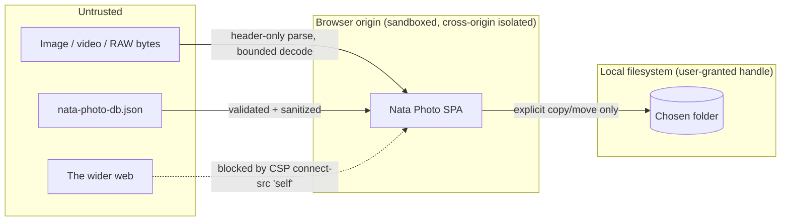

# Security Policy & Audit

How Nata Photo is secured, the results of a full security audit, and how to report a vulnerability.

Version 2.0.1 · Last updated 2026-07-14 · Status: Living document

> **Guiding principles.** This document and the codebase follow six code principles — **Clean Code**, **YAGNI**, **DRY**, **KISS**, **Semantic** naming/HTML, and **A11y** (accessibility). The security posture favors the smallest attack surface and least privilege (KISS/YAGNI), one canonical header definition mirrored across deployment targets (DRY), and clear, auditable controls (Clean Code). Full definitions: **[PRINCIPLES.md](PRINCIPLES.md)**.

---

## 1. TL;DR

- **Nata Photo has no backend.** Every file is opened, decoded, and sorted **locally in the browser** via the [File System Access API](https://developer.mozilla.org/en-US/docs/Web/API/File_System_API). Nothing is uploaded; there is no telemetry and no network egress (enforced by `connect-src 'self'`).
- **Dependency tree is clean.** After this audit `pnpm audit` reports **"No known vulnerabilities found"** for both the full tree and the production (`--prod`) tree. The production container ships only `express`, `helmet`, `compression` (0 known vulns) plus the static build.
- **Deployment is hardened and nginx-free.** A single container runs a tiny Express + [helmet](https://helmetjs.github.io/) static server as a **non-root** user with a **read-only** root filesystem, **all Linux capabilities dropped**, and `no-new-privileges`.
- **World-class HTTP headers**, including a strict Content-Security-Policy, cross-origin isolation (COOP + COEP + CORP), HSTS, and a deny-by-default Permissions-Policy.

---

## 2. Reporting a vulnerability

Please report security issues **privately** — do not open a public GitHub issue.

- **Preferred:** open a private advisory at
  <https://github.com/frama21/nata-photo/security/advisories/new>.
- A machine-readable contact is published per [RFC 9116](https://www.rfc-editor.org/rfc/rfc9116) at
  [`/.well-known/security.txt`](../public/.well-known/security.txt).

We aim to acknowledge reports within a few days. Because the app is fully client-side and self-hostable, most fixes ship as a new build/image that operators pull.

---

## 3. Security model

Nata Photo is a **local-first, zero-backend** single-page app. Its security model follows from that:

| Property | Consequence |
| --- | --- |
| No server-side application logic | No server-side injection, SSRF, auth, or session surface. |
| No network egress at runtime | A compromised page cannot exfiltrate the user's files — `connect-src 'self'` blocks it. |
| Explicit, user-granted file access | The app only touches the folder the user picks in the OS dialog, and only after an explicit gesture. |
| State stored beside the user's data | Project state lives in `nata-photo-db.json` **inside the chosen folder** — never in a cloud or shared store. |

The remaining attack surface is the classic client-side one: malicious **media files** or a malicious **`nata-photo-db.json`** trying to crash/DoS the tab or pollute app state, cross-site attacks against the served page (XSS, clickjacking, framing), and supply-chain risk in dependencies. Each is addressed below.

### Trust boundaries



---

## 4. Security controls

### 4.1 Content-Security-Policy

Set by [`server/index.js`](../server/index.js) via helmet, and verified on live responses:

```
default-src 'self'; base-uri 'self'; object-src 'none'; frame-ancestors 'none';
form-action 'self'; img-src 'self' blob: data:; media-src 'self' blob:;
font-src 'self' data:; style-src 'self' 'unsafe-inline';
script-src 'self' 'wasm-unsafe-eval'; worker-src 'self' blob:;
connect-src 'self' blob: data:; manifest-src 'self'; upgrade-insecure-requests
```

| Directive | Value | Why |
| --- | --- | --- |
| `default-src` | `'self'` | Deny-by-default for anything not called out below. |
| `script-src` | `'self' 'wasm-unsafe-eval'` | **No** `'unsafe-inline'`/`'unsafe-eval'`. `'wasm-unsafe-eval'` is the minimum needed to compile the libraw / mediainfo WASM. |
| `style-src` | `'self' 'unsafe-inline'` | Required by Tailwind v4 / Radix runtime-injected styles. See [accepted risks](#8-accepted-risks--known-limitations). |
| `img-src` / `media-src` | `'self' blob: data:` / `'self' blob:` | Previews are locally generated `blob:`/`data:` URLs. |
| `worker-src` | `'self' blob:` | libraw-wasm and mediainfo spawn Web Workers. |
| `connect-src` | `'self' blob: data:` | **No remote hosts** — the app never phones home. |
| `object-src` | `'none'` | No plugins/embeds. |
| `base-uri` | `'self'` | Blocks `<base>` tag hijacking. |
| `frame-ancestors` | `'none'` | Anti-clickjacking (belt-and-suspenders with `X-Frame-Options`). |
| `form-action` | `'self'` | No off-origin form posts. |
| `upgrade-insecure-requests` | — | Upgrades any stray `http:` subresource to `https:`. |

### 4.2 HTTP response headers

All responses carry the full header set (verified live):

| Header | Value |
| --- | --- |
| `Content-Security-Policy` | see §4.1 |
| `Cross-Origin-Opener-Policy` | `same-origin` |
| `Cross-Origin-Embedder-Policy` | `require-corp` |
| `Cross-Origin-Resource-Policy` | `same-origin` |
| `Strict-Transport-Security` | `max-age=63072000; includeSubDomains; preload` |
| `Referrer-Policy` | `no-referrer` |
| `X-Content-Type-Options` | `nosniff` |
| `X-Frame-Options` | `DENY` |
| `X-Permitted-Cross-Domain-Policies` | `none` |
| `X-DNS-Prefetch-Control` | `off` |
| `X-Download-Options` | `noopen` |
| `Origin-Agent-Cluster` | `?1` |
| `X-XSS-Protection` | `0` (legacy, buggy auditor intentionally disabled) |
| `Permissions-Policy` | deny-all except `fullscreen=(self)`, `picture-in-picture=(self)` |

`Permissions-Policy` explicitly denies `accelerometer`, `autoplay`, `browsing-topics`, `camera`, `display-capture`, `encrypted-media`, `geolocation`, `gyroscope`, `interest-cohort`, `magnetometer`, `microphone`, `midi`, `payment`, `publickey-credentials-get`, `screen-wake-lock`, `serial`, `sync-xhr`, `usb`, and `xr-spatial-tracking`.

### 4.3 Cross-origin isolation

`COOP: same-origin` + `COEP: require-corp` place the document in a **cross-origin isolated** context: the tab is process-isolated, cross-origin data cannot leak into it, and `SharedArrayBuffer` / high-resolution timers are available to the WASM decoders. `CORP: same-origin` on every response satisfies COEP for our (entirely same-origin) subresources.

### 4.4 Client-side hardening

| Control | Where | What it does |
| --- | --- | --- |
| **Untrusted-DB sanitization** | [`dbService.ts`](../src/shared/services/dbService.ts) `sanitizeState`/`safeRecord` | On load, the DB's object maps are copied into **null-prototype** objects with `__proto__`/`constructor`/`prototype` keys dropped (prototype-pollution guard); collection sizes are bounded (100 000 mappings / metadata entries, 1 000 folders, 50 operations); `moveMode`/`currentIndex` are coerced to safe defaults. |
| **Folder-name validation** | [`safeName.ts`](../src/shared/lib/safeName.ts) `validateFolderName` | Defense-in-depth over the File System Access API's own rejection of path segments: blocks path separators, Windows-reserved punctuation, ASCII control chars, `.`/`..`, reserved device names (`CON`, `NUL`, `COM1`…), trailing dot/space, and names > 200 chars. |
| **Header-only, bounded decoding** | [`exifService.ts`](../src/shared/services/exifService.ts), [`rawDecoder.ts`](../src/shared/services/rawDecoder.ts) | Images are parsed from the first **2 MB** only; full RAW sensor decode is skipped above **80 MB**; previews are re-encoded to **≤ 2048 px**; libraw decodes are killed after **20 s** and the worker is terminated. This bounds the DoS impact of a hostile file. |
| **Patched image parser** | `exifreader ^4.41.0` | Fixes two DoS advisories in the EXIF parser that runs on untrusted images (see §5). |
| **Output escaping** | React | All metadata and user text render through React's JSX escaping — no `dangerouslySetInnerHTML`, no `innerHTML`, no `eval` anywhere in `src/`. |
| **SVG safety** | [`ContentViewer.tsx`](../src/features/content-viewer/ui/ContentViewer.tsx) | SVGs render via ``; scripts embedded in an SVG **do not execute** in the `` context. |
| **No secrets, no cookies** | — | The app stores no credentials and sets no cookies; there is nothing to steal via XSS beyond what the user already granted. |
| **Blob-URL lifecycle** | [`useFileSystem.ts`](../src/features/file-system/model/useFileSystem.ts) | Object URLs are revoked on reload/unmount to prevent memory leaks. |
| **Handle-free operation log** | [`types/index.ts`](../src/shared/types/index.ts) | `SortOperation` intentionally stores no file handles, so the persisted log cannot smuggle live capabilities. |

---

## 5. Dependency & supply-chain security

### Audit results

| | Before | After |
| --- | --- | --- |
| `pnpm audit --prod` | 1 high + several moderate (exifreader, shadcn tree) | **No known vulnerabilities found** |
| `pnpm audit` (incl. dev) | 15 (2 high, 12 moderate, 1 low) | **No known vulnerabilities found** |
| Production image deps | full frontend tree via nginx image | only `express`, `helmet`, `compression` (0 vulns) |

### Findings & remediation

| # | Severity | Finding | Fix |
| --- | --- | --- | --- |
| 1 | **High** + Moderate | `exifreader` DoS via crafted ICC `mluc` tag ([GHSA-h64w-w9pr-82m4](https://github.com/advisories/GHSA-h64w-w9pr-82m4)) and unbounded metadata decompression ([GHSA-rr89-w3h9-m66j](https://github.com/advisories/GHSA-rr89-w3h9-m66j)). ExifReader parses **untrusted user images**, so this was the most material finding. | Bump `exifreader` `^4.38.1 → ^4.41.0` (patched ≥ 4.39.0). |
| 2 | Supply-chain | The `shadcn` **CLI** was listed under `dependencies`, pulling a large server-side tree (`hono`, `qs`, `js-yaml`, `@babel/core`, `@modelcontextprotocol/sdk`) into the **production** dependency graph. None of it ships in the browser bundle. | Move `shadcn` to `devDependencies` (still needed at build time for the `shadcn/tailwind.css` import in `globals.css`). |
| 3 | Moderate/Low | Remaining **dev/build-only** transitive advisories (`hono`, `qs`, `js-yaml`, `@babel/core`, `vite` dev-server `fs.deny` bypass, `launch-editor`, `brace-expansion`). | Pin patched versions via `pnpm.overrides` and bump `vite` to `^8.1.4`. |
| 4 | Hardening | Prototype-pollution / unbounded-memory risk when reading `nata-photo-db.json`. | `sanitizeState`/`safeRecord` (see §4.4). |
| 5 | Hardening | Folder-name input only blocked a few characters. | `validateFolderName` (see §4.4). |
| 6 | Hardening | nginx image shipped the whole toolchain and ran as root. | Minimal non-root Node runtime + hardened compose (see §6). |

> **Production vs. development:** the only reason any advisory ever appeared in the tree is the `shadcn` CLI, which is a **build-time-only** dev dependency. It is never installed into the production image and never reaches a browser. The `pnpm.overrides` in [`package.json`](../package.json) keep even the dev tree green.

### Reproduce

```bash
pnpm install
pnpm audit             # full tree  → No known vulnerabilities found
pnpm audit --prod      # prod only  → No known vulnerabilities found
```

---

## 6. Deployment & container hardening

The app deploys as **one container** via `docker compose` — no nginx, no reverse proxy required (see [`Dockerfile`](../Dockerfile), [`docker-compose.yml`](../docker-compose.yml), [`server/index.js`](../server/index.js)).

**Image (`Dockerfile`)**

- Multi-stage: (1) build the SPA with pnpm on `node:22-slim`; (2) `npm ci --omit=dev` the three runtime deps on `node:22-alpine` from a committed lockfile; (3) a minimal `node:22-alpine` runtime that contains **only** `server/index.js`, the audited `node_modules`, and the static `dist`.
- Runs as the unprivileged built-in **`node`** user (no root).
- No shell tooling, no build toolchain, no frontend dependencies in the final image.
- `HEALTHCHECK` uses Node's built-in `fetch` against `/healthz` (no `curl`/`wget`).

**Runtime (`docker-compose.yml`)**

| Hardening | Setting |
| --- | --- |
| Immutable root FS | `read_only: true` (+ a 16 MB `tmpfs` at `/tmp`, the only writable path) |
| No privilege escalation | `security_opt: [no-new-privileges:true]` |
| Least privilege | `cap_drop: [ALL]` (the server needs no Linux capabilities) |
| Proper PID 1 | `init: true` (tini reaps zombies, forwards signals) |
| Resource caps | `deploy.resources.limits`: 1 CPU / 256 MB (reservation 64 MB) |
| Log rotation | `json-file` driver, `10m × 3` |
| Self-healing | `healthcheck` + `restart: unless-stopped` |

**The server (`server/index.js`)** sets all headers from §4, accepts only `GET`/`HEAD` (`405` otherwise), serves hashed `/assets/*` immutably and HTML/`sw.js`/manifest with `no-cache`, emits correct `application/wasm` / `application/manifest+json` MIME types, returns real `404`s for missing assets (never HTML-as-JS), and shuts down gracefully on `SIGTERM`/`SIGINT`.

### TLS

HSTS is only honoured over HTTPS. For a public deployment, terminate TLS at your platform edge (Cloudflare, a cloud load balancer, or an existing Caddy/Traefik) and forward to the container; set `TRUST_PROXY=1` so protocol detection and HSTS reflect the external scheme.

---

## 7. Verification checklist

- [x] `pnpm audit` and `pnpm audit --prod` → **clean**.
- [x] `pnpm build` (typecheck + bundle) → **passes**.
- [x] `pnpm lint` → **clean**.
- [x] Live header check on `/`, `/assets/*`, `/manifest.webmanifest`, `/.well-known/security.txt` → CSP + all headers present; WASM served as `application/wasm`; immutable vs `no-cache` correct.
- [x] `POST /` → `405`; missing `/assets/x.js` → `404`; unknown route → SPA shell.
- [x] `SIGTERM` → graceful shutdown.

Quick header check:

```bash
docker compose up -d --build
curl -sSD - http://localhost:8080/ -o /dev/null
```

---

## 8. Accepted risks & known limitations

- **`style-src 'unsafe-inline'`** — required by Tailwind v4 / Radix's runtime-injected styles. The residual risk (CSS injection) is low given React output-escaping and the absence of any HTML-injection sink; a nonce-based style policy is impractical with this component stack.
- **HSTS requires HTTPS** — the container speaks HTTP; the header is inert unless TLS is terminated in front of it (see §6).
- **`MediaInfoModule.wasm` is not emitted at build time** — Vite cannot statically resolve mediainfo's runtime `new URL(...)`, so **video metadata degrades gracefully** (the extractor catches the failure and returns default metadata). This is a functional note, not a security issue: nothing is fetched cross-origin, and CSP would block it if it were.
- **Browser support** — the app requires the File System Access API (Chromium-based browsers only).

---

## 9. Hardening recommendations for operators

- Pin the image by digest and run `pnpm audit` / `docker scout` (or Trivy) in CI on every build.
- Serve only over HTTPS; consider submitting the domain to the [HSTS preload list](https://hstspreload.org/).
- Keep the container updated (`docker compose pull && up -d --build`) so dependency patches ship.
- Do not add cross-origin `<script>`/`connect` sources to the CSP; the app is designed to need none.
- If you fork, keep `shadcn` in `devDependencies` and retain the `pnpm.overrides`.

---

## 10. Audit changelog

- **2026-07-14** — Full audit for v2.0.1: patched `exifreader`; removed `shadcn` from production deps; pinned dev-tree advisories to a clean `pnpm audit`; added DB sanitization and folder-name validation; replaced the nginx deployment with a hardened non-root Node/helmet single-container setup; added `security.txt` and this policy.
