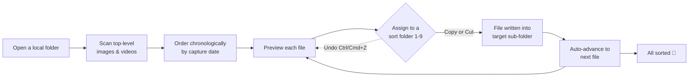
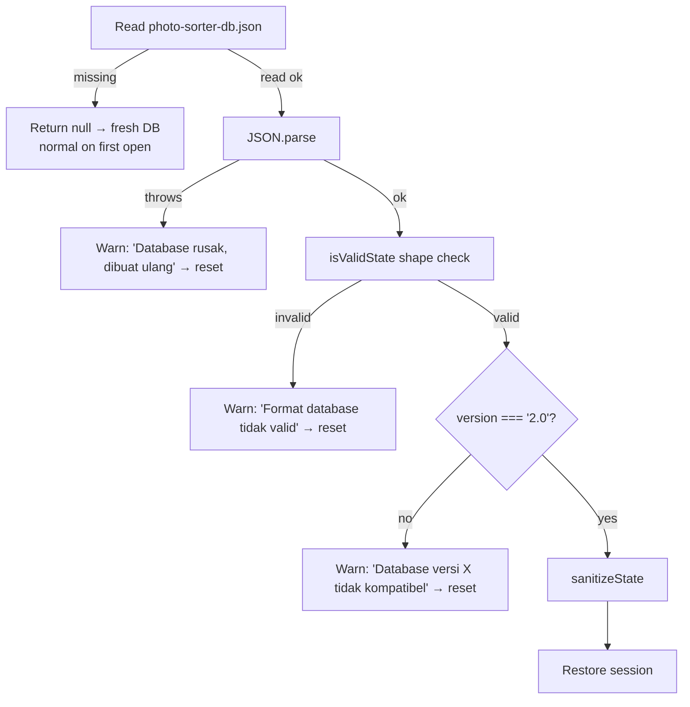

# Photo Sorter — Functional Specification

The authoritative functional specification for Photo Sorter: a 100% client-side, browser-based photo and video sorter. This document defines *what* the application does — its scope, behaviours, limits, edge cases, and acceptance criteria — independent of implementation detail.

Version 2.0.1 · Last updated 2026-07-14 · Status: Living document

> **Guiding principles.** This document and the codebase follow six code principles — **Clean Code**, **YAGNI**, **DRY**, **KISS**, **Semantic** naming/HTML, and **A11y** (accessibility). In this spec they appear as precise, bounded, testable requirements that specify only what the product needs (YAGNI) and call out accessible behavior (A11y). Full definitions and verification: **[PRINCIPLES.md](PRINCIPLES.md)**.

---

## 1. Overview & scope

Photo Sorter is a single-view web application that lets a user triage a local folder full of photos and videos and file each item into named sub-folders using single-key shortcuts. Everything runs in the browser: files are read and written directly on the user's disk through the [File System Access API](https://developer.mozilla.org/en-US/docs/Web/API/File_System_API) (`window.showDirectoryPicker`). Nothing is uploaded, there is no backend for user data, no telemetry, and no network egress of file contents.

The typical workflow:



### In scope

- Opening one local directory at a time and scanning its **top-level** images and videos.
- Ordering files by capture date/time (with a robust fallback).
- Creating sort sub-folders inside the opened directory and assigning files to them via **Copy** (duplicate) or **Cut** (move).
- Undo of the most recent sort, filename-collision safety, keyboard/mouse/touch navigation, lazy metadata extraction, RAW/video preview, project persistence, offline PWA operation, theming, and a responsive desktop/mobile layout.

### Out of scope

See [§13 Non-goals](#13-non-goals). Broadly: no uploading, no recursion into sub-folders, no editing/renaming/deleting of source files beyond the sort operation, no multi-folder or multi-tab sessions, and no server-side processing.

### Related documents

- [ARCHITECTURE.md](ARCHITECTURE.md) — source map and module responsibilities.
- [SECURITY.md](SECURITY.md) — threat model, CSP, headers, and audit results.
- [DEPLOYMENT.md](DEPLOYMENT.md) — container, server, and hosting.
- Primary source of truth in code:
  [src/hooks/useFileSystem.ts](../src/hooks/useFileSystem.ts),
  [src/config/fileFormats.ts](../src/config/fileFormats.ts),
  [src/services/dbService.ts](../src/services/dbService.ts),
  [src/services/exifService.ts](../src/services/exifService.ts),
  [src/services/rawDecoder.ts](../src/services/rawDecoder.ts),
  [src/lib/safeName.ts](../src/lib/safeName.ts),
  [src/types/index.ts](../src/types/index.ts).

---

## 2. Glossary & definitions

| Term | Definition |
| --- | --- |
| **Opened folder / root** | The single directory the user selects with the OS folder picker. All scanning, sort sub-folders, and the project database live here. Represented by a `FileSystemDirectoryHandle`. |
| **Photo / file / item** | Any supported image *or* video at the top level of the opened folder. In the UI these are all "foto". Internally modelled as a `PhotoFile`. |
| **Sort folder** | A sub-folder created inside the opened folder that files are sorted into. Modelled as a `SortFolder` with a colour and an optional `1`–`9` shortcut. |
| **Shortcut** | A digit key `1`–`9` bound to one sort folder. Only the first nine folders receive a shortcut. |
| **Copy mode** | Assigning a file duplicates it into the target folder; the original stays in the root. |
| **Cut mode** | Assigning a file **moves** it into the target folder; it is removed from the root. |
| **Key** | The stable identifier used for persisted mappings: the file **name** (e.g. `IMG_0421.CR2`). Not the array index. |
| **Sorted mapping** | The `{ fileName -> folderId }` record of which folder each file was filed into. |
| **Operation** | A fully serializable, handle-free record of one sort action (`SortOperation`) shown in the operation log. |
| **Undo stack** | An in-memory (non-persisted) stack of up to 20 reversible sort actions. |
| **Project database** | A single JSON file, `photo-sorter-db.json`, written inside the opened folder. Schema version `2.0`. |
| **Previewable** | A format flag indicating the browser can render the file directly in an ``/`<video>` element. RAW and HEIC/HEIF are non-previewable (RAW is handled by a decoder; HEIC has no in-browser decode). |
| **Embedded preview** | A JPEG image stored inside a RAW file by the camera, used as the fast/sharp preview source. |
| **PWA** | Progressive Web App: the installable, offline-capable packaging of the app. |

---

## 3. Supported platforms & browser requirements

| Requirement | Detail |
| --- | --- |
| **Browser engine** | Chromium-based only: Google Chrome, Microsoft Edge, Opera (and other current Chromium browsers). |
| **Hard dependency** | The [File System Access API](https://developer.mozilla.org/en-US/docs/Web/API/File_System_API) (`window.showDirectoryPicker`). |
| **Unsupported** | Firefox and Safari do **not** implement `showDirectoryPicker`; the app cannot open a folder there. |
| **Secure context** | Must be served over HTTPS (or `http://localhost`). The File System Access API and the service worker require a secure context. Cross-origin isolation (COOP/COEP) is also enabled by the host — see [SECURITY.md](SECURITY.md). |
| **Native move optimization** | When `FileSystemFileHandle.move()` is available, Cut uses it; otherwise the app falls back to copy-then-delete (functionally identical, slightly slower). |
| **RAW decode** | Uses WebAssembly (`libraw-wasm`) and Web Workers; requires `wasm-unsafe-eval` in the CSP (granted by the host) and worker support. |
| **Language** | The user interface is Indonesian (`lang="id"`). Code, comments, README, and this document are English. |

**FR-PLATFORM-1.** On a browser without `showDirectoryPicker`, opening a folder MUST fail gracefully with a visible Indonesian error toast and message: *"Browser tidak mendukung File System Access API"* / *"…Gunakan Chrome/Edge/Opera terbaru."* No exception may reach the user unhandled.

---

## 4. Supported file formats

The format registry lives in [src/config/fileFormats.ts](../src/config/fileFormats.ts). A file is **supported** (i.e. shown in the sorter) if its lowercased extension matches any entry below. `previewable` indicates whether the browser can render it directly. Extension matching is case-insensitive.

### 4.1 Standard raster images

All previewable via ``.

| Format | Extensions | MIME | Previewable | Notes |
| --- | --- | --- | --- | --- |
| JPEG | `.jpg` `.jpeg` `.jpe` | image/jpeg | Yes | Most common; EXIF-rich. |
| PNG | `.png` | image/png | Yes | |
| GIF | `.gif` | image/gif | Yes | Animated GIFs play in ``. |
| WebP | `.webp` | image/webp | Yes | |
| AVIF | `.avif` | image/avif | Yes | |
| BMP | `.bmp` `.dib` | image/bmp | Yes | |
| TIFF | `.tiff` `.tif` | image/tiff | Yes | Rendered natively by Chromium. |

### 4.2 RAW formats

None are previewable directly; each is handled by the RAW decoder ([§8](#8-raw--video-preview)).

| Format | Extensions | Previewable | Notes |
| --- | --- | --- | --- |
| Canon RAW | `.cr2` `.cr3` `.crw` | No | Decoder path. |
| Nikon RAW | `.nef` `.nrw` | No | |
| Sony RAW | `.arw` `.srf` `.sr2` | No | |
| Fuji RAW | `.raf` | No | |
| Panasonic RAW | `.rw2` `.raw` | No | `.raw` is a generic extension owned by Panasonic here. |
| Olympus RAW | `.orf` | No | |
| Pentax RAW | `.pef` `.ptx` | No | |
| Leica / DNG RAW | `.dng` `.rwl` | No | Adobe DNG and Leica raw. |
| Hasselblad RAW | `.3fr` | No | |
| Sigma RAW | `.x3f` | No | |

### 4.3 Vector

| Format | Extensions | MIME | Previewable | Notes |
| --- | --- | --- | --- | --- |
| SVG | `.svg` | image/svg+xml | Yes | Rendered via `` so **embedded scripts never execute** (see [SECURITY.md](SECURITY.md)). |

### 4.4 Video

All previewable via the native `<video>` element with controls.

| Format | Extensions | MIME | Previewable | Notes |
| --- | --- | --- | --- | --- |
| MP4 | `.mp4` `.m4v` | video/mp4, video/x-m4v | Yes | |
| WebM | `.webm` | video/webm | Yes | |
| Ogg Video | `.ogv` | video/ogg | Yes | |
| QuickTime | `.mov` `.qt` | video/quicktime | Yes | |
| AVI | `.avi` | video/x-msvideo | Yes | Playback depends on the OS codec. |
| WMV | `.wmv` | video/x-ms-wmv | Yes | Playback depends on the OS codec. |
| Matroska | `.mkv` | video/x-matroska | Yes | Playback depends on the OS codec. |
| Flash Video | `.flv` | video/x-flv | Yes | Playback depends on the OS codec. |
| MPEG | `.mpeg` `.mpg` `.mpe` | video/mpeg | Yes | |
| MPEG Transport Stream | `.ts` | video/mp2t | Yes | |
| 3GP | `.3gp` `.3g2` | video/3gpp, video/3gpp2 | Yes | |

> Note: `previewable: true` means Photo Sorter *offers* a native `<video>` player. Actual playback of container/codec combinations (AVI, WMV, MKV, FLV) is subject to the browser/OS decoders and may not play everywhere. This does not affect sorting.

### 4.5 Other

| Format | Extensions | MIME | Previewable | Notes |
| --- | --- | --- | --- | --- |
| ICO | `.ico` | image/x-icon | Yes | Windows icon. |
| HEIC/HEIF | `.heic` `.heif` | image/heic | **No** | Chromium cannot decode HEIC/HEIF in an ``, so it is marked non-previewable rather than showing a permanently broken image. The file can still be sorted; the viewer shows a "Preview tidak tersedia" placeholder. |

**FR-FORMAT-1.** Only files whose extension is in the registry are scanned; all other entries are ignored.
**FR-FORMAT-2.** A non-previewable file (RAW handled separately; HEIC/HEIF) MUST still be fully sortable, with its format label shown and a preview-unavailable placeholder where applicable.

---

## 5. Functional requirements

Requirements are grouped by feature area. Each area lists behaviour, limits, and edge cases; acceptance criteria are consolidated in [§14](#14-acceptance-criteria).

### 5.1 Folder opening & scanning

- **FR-OPEN-1.** The empty state presents a single "Pilih Folder Foto" action that invokes the OS directory picker (`window.showDirectoryPicker`).
- **FR-OPEN-2.** On selection, the app scans only the **top level** of the chosen folder (`dirHandle.values()`), non-recursively. Sub-folders are never descended into.
- **FR-OPEN-3.** Only entries of kind `file` whose extension is supported ([§4](#4-supported-file-formats)) become items. Everything else (unsupported files, sub-directories, the database file) is skipped.
- **FR-OPEN-4.** Reloading a (possibly different) folder resets the previous session: all blob URLs are revoked, the RAW decode queue, failed-decode set, metadata queue, and the undo stack are cleared, and error/operations state is reset.
- **FR-OPEN-5.** Opening a folder initializes or loads the project database (see [§6](#6-project-persistence--database)) and restores prior state where valid.
- **FR-OPEN-6.** If the user cancels the picker (`AbortError`), the app returns silently to the empty state — this is **not** an error.
- **Edge cases:** an empty folder or a folder with no supported files yields `totalPhotos === 0` and keeps the empty/pick-folder state. A previously-recorded sort folder that no longer exists on disk is skipped with a warning toast, and mappings pointing at it are dropped on load.

### 5.2 Chronological ordering

- **FR-ORDER-1.** Items are ordered by **capture date/time, oldest first**. The sort key is the parsed capture date (`EXIF DateTimeOriginal` → `DateTimeDigitized` → `DateTime` for images; QuickTime creation date / mediainfo `Encoded/Recorded/Tagged/File-Modified` dates for video).
- **FR-ORDER-2.** When no capture date can be parsed, the key falls back to the file's `lastModified` (filesystem mtime).
- **FR-ORDER-3.** Ties are broken by file name (`localeCompare`) for a stable, deterministic order.
- **FR-ORDER-4.** To build the ordering, capture dates are extracted **concurrently** (up to 8 workers) over files lacking cached metadata; progress is shown as *"Membaca tanggal foto N/total…"*. Files already in the metadata cache are not re-read, making subsequent opens of the same folder effectively instant.
- **FR-ORDER-5.** Date parsing is tolerant of multiple shapes: EXIF `"2023:01:02 13:04:05"`, ISO 8601 with `T`, `"2023-01-02 13:04:05"`, and mediainfo's `"UTC 2023-01-02 13:04:05"`. Unparseable strings yield `null` and trigger the mtime fallback.

### 5.3 Sorting — Copy vs Cut mode

- **FR-SORT-1.** Pressing a folder's shortcut (`1`–`9`), clicking its button in the sidebar `FolderManager`, or tapping it in the mobile action bar assigns the **current** file to that folder.
- **FR-SORT-2.** The mode is a global toggle. **Default is Copy.**
  - **Copy:** the file is written (duplicated) into the target folder; the original remains in the root.
  - **Cut:** the file is moved into the target folder (native `handle.move()` when available, else copy-then-delete). The item is flagged `moved: true` and its handle is re-acquired at the new location so it is never stale.
- **FR-SORT-3.** A successful assignment: records the mapping `key -> folderId`, appends a success `SortOperation`, pushes an undo entry, auto-advances `currentIndex` to the next file (clamped to the last index), and persists the change to the database.
- **FR-SORT-4.** Re-assigning an already-sorted file to a different folder overwrites its mapping and performs a fresh copy/move into the new target. (The prior copy is not automatically removed; the mapping reflects the latest target.)
- **FR-SORT-5.** A failed assignment appends a failure `SortOperation` (with the error message), surfaces an error, does **not** advance, and still persists the failure to the operation log.
- **FR-SORT-6.** Concurrent rapid assignments (e.g. holding a key) are safe: all database writes are funneled through a single serialized promise chain so updates cannot interleave or be dropped.
- **Edge cases:** if the target folder handle cannot be resolved, the assignment aborts with *"Folder target tidak ditemukan"*. Assigning the last file advances to (stays on) the last index.

### 5.4 Filename-collision handling

- **FR-COLLISION-1.** Copies and moves MUST NOT silently overwrite an existing file in the target folder.
- **FR-COLLISION-2.** When the target already contains a file of the same name, a numeric suffix is appended before the extension: `name.jpg` → `name_1.jpg`, `name_2.jpg`, … incrementing until an unused name is found.
- **FR-COLLISION-3.** The actual written name (`createdName`, which may differ from the original) is recorded in the undo entry so undo targets the right file.
- **Edge case:** files without an extension get the suffix appended to the whole name (`README` → `README_1`).

### 5.5 Undo

- **FR-UNDO-1.** `Ctrl/Cmd+Z` (or the Undo control) reverses the **most recent** sort operation.
- **FR-UNDO-2.** Reversal is mode-aware:
  - **Copy:** deletes the duplicate that was created in the target folder (`removeEntry(createdName)`).
  - **Cut:** moves the file back from the target folder to the root under its original name and re-acquires the restored handle (`moved: false`).
- **FR-UNDO-3.** Undo removes the file's sorted mapping, pops the undo stack, restores `currentIndex` to the file's original position, and persists the reverted state.
- **FR-UNDO-4.** The undo stack holds at most **20** entries (oldest dropped). It is **in-memory only** and is cleared on folder reload — undo does not survive a page reload.
- **FR-UNDO-5.** Removing a sort folder drops any undo entries that target it, so undo can never reference a deleted folder.
- **Edge cases:** if the target folder handle is gone, undo aborts with *"Tidak bisa undo: folder target tidak ditemukan"*. Undo with an empty stack is a no-op (`canUndo` is false).

### 5.6 Navigation & jump-to-unsorted

- **FR-NAV-1.** Navigation moves `currentIndex` within `[0, photos.length − 1]`, clamped at both ends.
- **FR-NAV-2.** `→` / Space / next-button / left-swipe advance; `←` / prev-button / right-swipe go back.
- **FR-NAV-3.** `U` jumps to the **next unsorted** file, scanning forward and wrapping around the list; if all files are sorted it is a no-op.
- **FR-NAV-4.** Touch swipe uses a **50 px** horizontal threshold; movement below the threshold does not navigate.
- **FR-NAV-5.** Keyboard shortcuts are ignored while focus is in an `<input>`, `<textarea>`, or a `contenteditable` element.
- **FR-NAV-6.** On desktop, the prev button is disabled at index 0 and the next button is disabled at the last index.

### 5.7 Lazy metadata extraction & display

- **FR-META-1.** Full metadata is extracted **lazily on demand** for the current file and its immediate neighbours (`currentIndex`, `+1`, `−1`), never for the whole list up front.
- **FR-META-2.** For images, only the **first 2 MB** (`MAX_HEADER_BYTES`) of the file is read and parsed with ExifReader, so huge RAW/TIFF files are never fully loaded into memory for metadata.
- **FR-META-3.** For video, `mediainfo.js` analyses the file via a chunked reader; General/Video/Audio tracks yield duration, fps, codecs, bitrate, and dimensions. Phone-recorded QuickTime `extra` tags are consulted for make/model/date.
- **FR-META-4.** Extracted metadata is cached in memory (`metadataByKey`) and persisted to the database metadata cache (debounced, 1.5 s) so future opens are instant.
- **FR-META-5.** The metadata panel displays, when available: camera make/model, lens, ISO, shutter speed, aperture, focal length, date taken, dimensions, and megapixels (images); duration, fps, video/audio codec, bitrate, and dimensions (video). Missing values render as `-`.
- **FR-META-6.** All metadata and file-name text is auto-escaped by React on render; no metadata is ever interpreted as HTML.
- **Degradation:** if metadata extraction throws, a default/placeholder metadata object (`fileSize`, `megapixels: 0`, `dimensions {0,0}`, `isVideo`) is used and ordering falls back to mtime. `mediainfo.js`'s WASM module is not emitted at build time, so **video metadata degrades gracefully** — the extractor catches the failure and returns defaults (functional, non-security note; see [SECURITY.md](SECURITY.md)).

### 5.8 RAW & video preview

**RAW** ([src/services/rawDecoder.ts](../src/services/rawDecoder.ts)) — quality-first strategy, decoded on demand for the current RAW item only:

1. **Extract the largest embedded JPEG preview.** Scan for JPEG SOI markers (`FF D8 FF`), slice each candidate from its SOI to the next SOI (or EOF), capped at 40 MB (`MAX_CANDIDATE_BYTES`); validate up to the 6 largest candidates with `createImageBitmap`; pick the widest that actually decodes; re-encode it to a bounded JPEG (longest side ≤ **2048 px**, `MAX_PREVIEW_DIM`) so the cache stays small.
2. If a **sharp** embedded preview (width ≥ **800 px**, `SHARP_PREVIEW_MIN_WIDTH`) is found, use it directly.
3. Otherwise, if the file is ≤ **80 MB** (`MAX_FULL_DECODE_BYTES`), fall back to a full `libraw-wasm` sensor decode: half-size, AHD interpolation (`userQual: 3`), sRGB, camera white balance. Guarded by a **20 s** timeout (`LIBRAW_TIMEOUT_MS`), an upstream worker-hang patch (`patchLibRawWorker`), an all-white-output check, and worker termination after each decode.
4. Last resort: use whatever validated embedded preview was found, even if small; otherwise the viewer shows "Preview tidak tersedia".

- **FR-RAW-1.** Only the currently-viewed RAW is decoded; decoding is queued per key and never runs twice concurrently for the same file.
- **FR-RAW-2.** A RAW that fails to decode is recorded in a failed-decode set and is **not** retried while the folder stays open.
- **FR-RAW-3.** Full sensor decode is **skipped** for files larger than 80 MB (embedded preview only).
- **FR-RAW-4.** While decoding, the viewer shows a spinner with *"Mendecode RAW…"*.

**Video** — previewable formats render in a native `<video controls>` element sourced from a blob URL. No transcoding is performed.

**Standard images** — rendered in `` from a blob URL. On a decode error, the object URL is recreated and the load retried up to **2** times before showing the spinner-cleared fallback (some large images fail the first decode).

### 5.9 Project persistence / database

See [§6](#6-project-persistence--database) for the full state & persistence model. Summary:

- **FR-DB-1.** A single JSON file, `photo-sorter-db.json`, schema version `2.0`, is auto-created inside the opened folder on first open and updated after every state change.
- **FR-DB-2.** Persisted: sort folders, the per-file sort mapping (keyed by file **name**), the move mode, `currentIndex`, a recent operation log (max 50), a per-file metadata cache, stats, and a timestamp.
- **FR-DB-3.** All writes are serialized (single promise chain) and use `createWritable → write → close`.
- **FR-DB-4.** On load, the file is validated (shape + version) and **sanitized** (prototype-pollution stripping, size bounds, scalar coercion). A missing/corrupt/incompatible file is reset with a visible warning.

### 5.10 PWA & offline

- **FR-PWA-1.** The app is an installable PWA (standalone display, Indonesian manifest name *"Photo Sorter — Sortir Foto & Video Lokal"*, theme/background colour `#0a0f1a`, 192 & 512 px icons).
- **FR-PWA-2.** A Workbox service worker precaches JS/CSS/HTML/WASM and other assets for offline use, with `maximumFileSizeToCacheInBytes` of 4 MB to cover the ~1.3 MB `libraw` WASM.
- **FR-PWA-3.** Update strategy is `autoUpdate` (`skipWaiting` + `clientsClaim`); the SW self-updates on reload.
- **FR-PWA-4.** The service worker is registered **manually** in [src/main.tsx](../src/main.tsx) on `window` load — no inline registration script is injected, preserving the strict CSP.
- **FR-PWA-5.** The app is a single view with no router; any non-`/` path is normalized back to `/` in `main.tsx`.
- **Note:** offline covers the *application shell*. Opening a folder and processing files always works locally regardless of connectivity, because no network is involved in file handling.

### 5.11 Theming

- **FR-THEME-1.** Light and dark themes plus a "system" option are available via the navbar toggle. **Default theme is dark.**
- **FR-THEME-2.** The chosen theme persists in `localStorage` under key `vite-ui-theme`.
- **FR-THEME-3.** Design tokens use the OKLCH colour space (light on `:root`, dark on `.dark`); see [UI facts / globals.css](../src/assets/styles/globals.css).

### 5.12 Responsive & mobile

- **FR-RESP-1.** On large screens (`lg`+), the layout is a 12-column grid: the content viewer spans 8 columns; a sticky sidebar (`top-24`) spans 4 columns and holds `FolderManager`, `MetadataPanel`, `OperationLog`, and `Stats`.
- **FR-RESP-2.** On mobile, everything stacks into a single column and a fixed bottom `MobileActionBar` shows prev/next controls plus one colour-coded button per sort folder.
- **FR-RESP-3.** Swipe navigation is available on touch devices (50 px threshold). Desktop arrow buttons are hidden on mobile.
- **FR-RESP-4.** Accessibility: navigation and folder-action buttons carry `aria-label`s, the theme toggle has an `sr-only` label, the focus-visible ring is present, and the app is fully keyboard-operable.

---

## 6. State & persistence model

### 6.1 Runtime state (in-memory)

Owned by the controller hook [src/hooks/useFileSystem.ts](../src/hooks/useFileSystem.ts):

| State | Meaning | Persisted? |
| --- | --- | --- |
| `photos: PhotoFile[]` | Scanned items, chronologically ordered (holds live handles, `File` objects, blob URLs). | No (rebuilt on open) |
| `currentIndex` | Index of the currently-viewed item. | Yes |
| `folders: SortFolder[]` | Sort folders (with live `dirHandle`). | Yes (handle-free subset) |
| `sortedPhotos: SortedMapping` | `{ fileName -> folderId }`. | Yes |
| `moveMode: "copy" \| "cut"` | Current mode (default `copy`). | Yes |
| `operations: SortOperation[]` | Handle-free operation log. | Yes (max 50) |
| `undoStack: UndoEntry[]` | Reversible actions (max 20). | **No** (in-memory only) |
| `rawPreviewUrls`, `isDecodingRaw` | RAW preview cache & decode flag. | No |
| `metadataByKey`, metadata cache | Lazily-extracted metadata. | Yes (metadata cache) |

### 6.2 Persisted schema — `photo-sorter-db.json`

Written inside the opened folder. Schema `version: "2.0"`. Shape (`CompleteProjectState`, see [src/services/dbService.ts](../src/services/dbService.ts) and [src/types/index.ts](../src/types/index.ts)):

```jsonc
{
  "version": "2.0",
  "folders": [
    { "id": "uuid", "name": "Keep", "shortcut": "1", "color": "bg-red-500", "createdAt": 0 }
  ],
  "sortedPhotos": { "IMG_0421.CR2": "uuid" },   // keyed by file NAME
  "moveMode": "copy",
  "currentIndex": 0,
  "operations": [
    { "photoName": "IMG_0421.CR2", "folderId": "uuid", "folderName": "Keep",
      "mode": "copy", "success": true, "timestamp": 0 }
  ],
  "metadataCache": { "IMG_0421.CR2": { "fileSize": 0, "megapixels": 0, "dimensions": { "width": 0, "height": 0 }, "isVideo": false } },
  "stats": { "totalPhotos": 0, "sortedCount": 0, "successOperations": 0, "failedOperations": 0 },
  "timestamp": 0
}
```

Key facts:

- **Mapping key is the file name**, not the array index — so ordering changes never corrupt assignments.
- `folders` in the DB is a **handle-free** subset (no `dirHandle`); handles are re-acquired at open time from the folder name.
- `operations` is capped at **50** (`MAX_OPERATIONS`); `SortOperation` holds **no** filesystem handles so it survives `JSON.stringify` intact.
- Writes are serialized through one promise chain; each write is `createWritable → write → close`.
- Metadata-cache writes are debounced (1.5 s) and flushed on unmount.

### 6.3 Load, validation, sanitization & reset

The database file lives in a user-writable folder and is therefore treated as **untrusted input**. On load ([src/services/dbService.ts](../src/services/dbService.ts)):



`sanitizeState` guarantees, on every load:

| Guard | Bound / behaviour |
| --- | --- |
| Prototype-pollution keys | `__proto__`, `constructor`, `prototype` stripped via `safeRecord()` into null-prototype objects. |
| `sortedPhotos` size | ≤ 100 000 entries (`MAX_SORTED_ENTRIES`); non-string values dropped. |
| `metadataCache` size | ≤ 100 000 entries (`MAX_METADATA_ENTRIES`); non-object values dropped. |
| `folders` count | ≤ 1 000 (`MAX_FOLDERS`); entries lacking string `id`/`name` dropped. |
| `operations` | Sliced to the last 50. |
| `moveMode` | Coerced to `"cut"` only if exactly `"cut"`, else `"copy"`. |
| `currentIndex` | Coerced to a finite, non-negative integer, else `0`. |

**Reset conditions** (each resets to a fresh DB with a visible Indonesian warning, never throwing): file missing (silent, first-open), invalid JSON, invalid shape, or version ≠ `2.0`.

**On restore**, additionally: sort folders whose directory no longer exists on disk are skipped (with a toast), and any mapping pointing at a missing folder is dropped. `currentIndex` is clamped to the current photo count.

> Deleting `photo-sorter-db.json` fully resets the project; the app recreates it on the next open.

---

## 7. Keyboard shortcuts

Shortcuts are handled globally in [src/components/ContentViewer.tsx](../src/components/ContentViewer.tsx) and are **ignored while typing** in an `<input>`, `<textarea>`, or `contenteditable` element.

| Key | Action | Notes |
| --- | --- | --- |
| `1`–`9` | Assign current file to sort folder 1–9 | Only bound if a folder holds that shortcut; the first nine folders receive shortcuts. |
| `→` | Next file | Clamped at the last index. |
| `←` | Previous file | Clamped at index 0. |
| `Space` | Next file | `preventDefault` (no page scroll). |
| `U` / `u` | Jump to next unsorted file | Wraps around; no-op if all sorted. |
| `Ctrl+Z` / `Cmd+Z` | Undo last sort | `preventDefault`; no-op if the undo stack is empty. |

Additional (non-keyboard) input methods: click folder buttons in the sidebar/mobile bar to assign; click desktop chevrons or swipe (≥ 50 px) to navigate.

---

## 8. RAW & video preview — summary matrix

| Item type | Preview source | Fallbacks / limits |
| --- | --- | --- |
| Standard raster / vector / ICO | Blob URL in `` | Object URL recreated + retried up to 2× on decode error. |
| Video (previewable) | Blob URL in `<video controls>` | Playback subject to OS/browser codecs; no transcoding. |
| RAW | Largest embedded JPEG preview (≥ 800 px = "sharp"), re-encoded ≤ 2048 px | Else `libraw-wasm` half-size AHD sRGB decode (≤ 80 MB), 20 s timeout, all-white check, worker terminated. Else smaller embedded preview. Else "Preview tidak tersedia". Failures are not retried while the folder is open. |
| HEIC/HEIF | None (non-previewable) | "Preview tidak tersedia" placeholder; still sortable. |

---

## 9. Viewer & UI states

| State | Trigger | Presentation |
| --- | --- | --- |
| **Empty / pick-folder** | `totalPhotos === 0` | Full-height empty panel, "Pilih Folder Foto" button, note that Chrome/Edge/Opera is required and files are processed locally. |
| **Loading** | Directory scan / date extraction in progress | Button shows "Membaca…"; status toasts show *"Memuat folder Project…"* and *"Membaca tanggal foto N/total…"*. |
| **Viewer — image** | Current item is a previewable image | `` with a spinner until loaded; badge shows format label and folder/"Belum di sortir" status. |
| **Viewer — video** | Current item is a video | Native `<video controls>`. |
| **Viewer — RAW decoding** | Current RAW being decoded | Spinner + *"Mendecode RAW…"* / *"Ini mungkin memerlukan waktu beberapa detik"*. |
| **Viewer — preview unavailable** | Non-previewable (HEIC, RAW with no preview) | File icon + format label + *"Preview tidak tersedia"*. |
| **All sorted** | `totalPhotos > 0 && unsortedCount === 0` | Green alert: *"Semua N foto sudah disortir 🎉"*. |
| **Error** | Recoverable error | Red `Alert` with the error message; toasts via the status store. |
| **Fatal error** | Uncaught render error | `ErrorBoundary` fallback (app is wrapped in `ErrorBoundary`). |

---

## 10. Status toasts (status store)

Transient status is managed by a Zustand store ([src/stores/statusStore.ts](../src/stores/statusStore.ts)) and surfaced by `StatusIndicator` in the navbar:

- At most **3** toasts kept at once.
- `success` / `error` toasts auto-expire after **3 s**; `loading` toasts persist until explicitly cleared (`clearStatus`).
- Toast types carry an icon hint (`folder`, `file`, `db`).

---

## 11. Error states & user-facing messages

All user-facing copy is Indonesian. Representative messages by area:

| Area | Condition | Message (Indonesian) |
| --- | --- | --- |
| Platform | No File System Access API | *"Browser tidak mendukung File System Access API"* (toast) / *"…Gunakan Chrome/Edge/Opera terbaru."* (error) |
| Open | Load failed (non-abort) | *"Gagal memuat project"* (toast) + the underlying error message. |
| Open | User cancelled picker | *(silent — no error)* |
| Open | Restored folder missing on disk | *"Folder {name} tidak ditemukan, dilewati"* |
| Folder add | Empty name | Defaults to *"Folder {n}"* (auto-named), otherwise validated. |
| Folder add | Illegal name | *"Nama folder tidak boleh mengandung \ / : * ? " < > | atau karakter kontrol"* |
| Folder add | Trailing dot/space | *"Nama folder tidak boleh diakhiri dengan titik atau spasi"* |
| Folder add | Reserved device name | *""{name}" adalah nama yang dicadangkan sistem"* |
| Folder add | Too long (> 200) | *"Nama folder maksimal 200 karakter"* |
| Folder add | `.` or `..` | *"Nama folder tidak valid"* |
| Folder add | Duplicate | *"Folder "{name}" sudah ada"* |
| Folder add | Create failed | *"Gagal membuat folder: {reason}"* |
| Folder remove | Delete failed | *"Gagal menghapus folder: {reason}"* |
| Sort | Missing target folder | *"Folder target tidak ditemukan"* |
| Sort | Copy/move failed | *"Gagal memindahkan {name}: {reason}"* + toast. |
| Undo | Target folder missing | *"Tidak bisa undo: folder target tidak ditemukan"* |
| Undo | Reversal failed | *"Gagal undo: {reason}"* |
| DB | Corrupt JSON | *"Database rusak, dibuat ulang"* |
| DB | Invalid shape | *"Format database tidak valid, dibuat ulang"* |
| DB | Version mismatch | *"Database versi {v} tidak kompatibel, dibuat ulang"* |
| DB | Save failed | *"Gagal menyimpan data"* / *"Gagal update folder"* / *"Gagal update mode"* |

---

## 12. Folder-name validation

User-entered sort-folder names are validated by [src/lib/safeName.ts](../src/lib/safeName.ts) (`validateFolderName`) as **defense-in-depth** on top of the File System Access API's own path-segment rejection. A name is rejected if it:

- is empty (after trim), or exceeds **200** characters;
- equals `.` or `..`;
- contains a path separator or Windows-reserved punctuation `\ / : * ? " < > |`, or any ASCII control character (U+0000–U+001F);
- ends with a `.` or a space;
- matches a reserved DOS/Windows device name (`CON`, `PRN`, `AUX`, `NUL`, `COM1`–`COM9`, `LPT1`–`LPT9`), with or without an extension.

Spaces and hyphens are allowed. Duplicate names (case-insensitive) are rejected separately in the add flow.

---

## 13. Non-goals

Photo Sorter deliberately does **not**:

1. **Upload or transmit** files, metadata, or telemetry anywhere. There is no backend for user data and no network egress of file contents.
2. **Recurse** into sub-folders — only the top level of the opened folder is scanned.
3. **Edit, rename, rotate, crop, or transcode** files. The only mutations are copy/move into sort folders and creation/removal of sort folders.
4. **Delete source files** except as the removal side of a Cut move (or removing a sort folder the user explicitly deletes).
5. **Support non-Chromium browsers.** Firefox/Safari lack `showDirectoryPicker` and are unsupported.
6. **Provide multi-folder, multi-tab, or cloud sync** sessions. One opened folder at a time; state lives only in that folder's database.
7. **Guarantee playback** of every video container/codec — that depends on the OS/browser decoders.
8. **Persist the undo stack** across reloads — undo is a within-session convenience only.
9. **Act as a general file manager** (no tagging, search, ratings, or batch tools beyond sorting).
10. **Impersonate** any device or produce authoritative records; the operation log is a convenience audit trail, not a tamper-proof ledger.

---

## 14. Acceptance criteria

Each feature is accepted when its criteria hold. IDs cross-reference [§5](#5-functional-requirements).

### Folder opening & scanning (5.1)

- [ ] Opening a folder with mixed content lists **only** top-level supported images/videos; sub-folders, unsupported files, and `photo-sorter-db.json` are excluded.
- [ ] Cancelling the picker returns to the empty state with **no** error shown.
- [ ] Opening a second folder revokes prior blob URLs and clears the undo stack and queues.
- [ ] An empty or all-unsupported folder keeps the pick-folder empty state.

### Chronological ordering (5.2)

- [ ] Files with EXIF/video capture dates appear oldest-first; files without a date fall back to mtime; equal keys break ties by name deterministically.
- [ ] Re-opening the same folder does not re-read dates for cached files (fast open).

### Sorting — Copy/Cut (5.3)

- [ ] Default mode is **Copy**; a copied file appears in the target folder while the original remains in the root.
- [ ] In **Cut** mode the file is moved (absent from the root, present in the target), flagged `moved`, and its handle re-acquired.
- [ ] A successful sort auto-advances to the next file and persists to the DB; a failed sort logs a failure and does **not** advance.
- [ ] Holding a shortcut key does not drop or interleave DB writes.

### Filename collisions (5.4)

- [ ] Sorting a file whose name already exists in the target writes `name_1.ext` (then `_2`, …) and never overwrites the existing file.
- [ ] The undo entry references the actually-written name.

### Undo (5.5)

- [ ] `Ctrl/Cmd+Z` after a Copy deletes the duplicate; after a Cut restores the file to the root under its original name.
- [ ] Undo removes the mapping, restores the original index, and persists.
- [ ] The undo stack never exceeds 20 entries and is empty after a folder reload.
- [ ] Removing a folder purges undo entries and mappings for it; undo then cannot reference it.

### Navigation & jump-to-unsorted (5.6)

- [ ] Arrows/Space/buttons/swipe move within bounds and clamp at both ends.
- [ ] `U` lands on the next unsorted file (wrapping); with everything sorted it is a no-op.
- [ ] Swipes below 50 px do not navigate; shortcuts do nothing while a text field is focused.

### Metadata (5.7)

- [ ] Metadata is extracted for the current file and its neighbours only, reading ≤ 2 MB for images.
- [ ] The panel shows available EXIF/video fields; missing fields show `-`.
- [ ] Extraction failure yields default metadata without crashing; video metadata degrades gracefully if the mediainfo WASM is unavailable.

### RAW & video preview (5.8)

- [ ] A RAW with an embedded preview ≥ 800 px shows a sharp preview quickly; the cached preview's longest side is ≤ 2048 px.
- [ ] A RAW without a sharp preview and ≤ 80 MB attempts a `libraw` decode bounded by a 20 s timeout; failures show "Preview tidak tersedia" and are not retried.
- [ ] Files > 80 MB never trigger a full sensor decode.
- [ ] Videos play in a native controls player; HEIC shows the preview-unavailable placeholder yet remains sortable.

### Persistence (5.9 / §6)

- [ ] `photo-sorter-db.json` (version `2.0`) is created on first open and updated after each change.
- [ ] A corrupt/invalid/incompatible DB is reset with a visible warning and never throws.
- [ ] On load, prototype-pollution keys are stripped and collection sizes are bounded per the sanitization table.
- [ ] Deleting the DB file resets the project; a folder removed on disk is skipped and its mappings dropped.

### PWA & offline (5.10)

- [ ] The app installs as a PWA and its shell loads offline via the service worker.
- [ ] Any non-`/` path is normalized to `/`; the SW is registered without an inline script (CSP intact).

### Theming & responsive (5.11 / 5.12)

- [ ] Theme defaults to dark, toggles across light/dark/system, and persists under `vite-ui-theme`.
- [ ] Desktop shows the 8/4-column grid with a sticky sidebar; mobile stacks with a fixed bottom action bar and swipe navigation.
- [ ] Navigation and folder buttons expose `aria-label`s and the app is fully keyboard-operable.

---

## 15. Constants & limits reference

| Constant | Value | Where | Meaning |
| --- | --- | --- | --- |
| Undo stack size | 20 | [useFileSystem.ts](../src/hooks/useFileSystem.ts) | Max reversible sorts (in-memory). |
| Concurrent date-extract workers | 8 | [useFileSystem.ts](../src/hooks/useFileSystem.ts) | Parallelism for chronological ordering. |
| Metadata persist debounce | 1500 ms | [useFileSystem.ts](../src/hooks/useFileSystem.ts) | Debounce for metadata-cache writes. |
| Swipe threshold | 50 px | [ContentViewer.tsx](../src/components/ContentViewer.tsx) | Minimum horizontal swipe to navigate. |
| Image decode retries | 2 | [ContentViewer.tsx](../src/components/ContentViewer.tsx) | Object-URL recreation retries. |
| `MAX_HEADER_BYTES` | 2 MB | [exifService.ts](../src/services/exifService.ts) | Image header slice for EXIF. |
| `MAX_FULL_DECODE_BYTES` | 80 MB | [rawDecoder.ts](../src/services/rawDecoder.ts) | Above this, skip full RAW decode. |
| `SHARP_PREVIEW_MIN_WIDTH` | 800 px | [rawDecoder.ts](../src/services/rawDecoder.ts) | Embedded preview "sharp" threshold. |
| `MAX_CANDIDATE_BYTES` | 40 MB | [rawDecoder.ts](../src/services/rawDecoder.ts) | Cap per embedded-JPEG candidate. |
| `MAX_PREVIEW_DIM` | 2048 px | [rawDecoder.ts](../src/services/rawDecoder.ts) | Cached preview longest side. |
| `LIBRAW_TIMEOUT_MS` | 20 000 ms | [rawDecoder.ts](../src/services/rawDecoder.ts) | Per-libraw-op timeout. |
| `DB_VERSION` | `"2.0"` | [dbService.ts](../src/services/dbService.ts) | DB schema version. |
| `MAX_OPERATIONS` | 50 | [dbService.ts](../src/services/dbService.ts) | Persisted operation-log length. |
| `MAX_SORTED_ENTRIES` | 100 000 | [dbService.ts](../src/services/dbService.ts) | Mapping size bound on load. |
| `MAX_METADATA_ENTRIES` | 100 000 | [dbService.ts](../src/services/dbService.ts) | Metadata-cache size bound on load. |
| `MAX_FOLDERS` | 1 000 | [dbService.ts](../src/services/dbService.ts) | Folder count bound on load. |
| Folder name max length | 200 | [safeName.ts](../src/lib/safeName.ts) | Max folder-name characters. |
| Status toasts kept | 3 | [statusStore.ts](../src/stores/statusStore.ts) | Max concurrent toasts. |
| Toast auto-expire | 3 s | [statusStore.ts](../src/stores/statusStore.ts) | success/error auto-dismiss. |
| PWA cache file cap | 4 MB | vite PWA config | Covers ~1.3 MB libraw WASM. |
| Folder colours | 9 | [useFileSystem.ts](../src/hooks/useFileSystem.ts) | `bg-{red,blue,green,yellow,purple,pink,indigo,orange,teal}-500`. |

---

*Photo Sorter is fully client-side: your files never leave your machine. See [SECURITY.md](SECURITY.md) for the security posture and [DEPLOYMENT.md](DEPLOYMENT.md) for hosting.*
