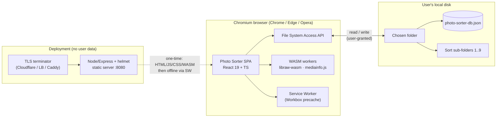
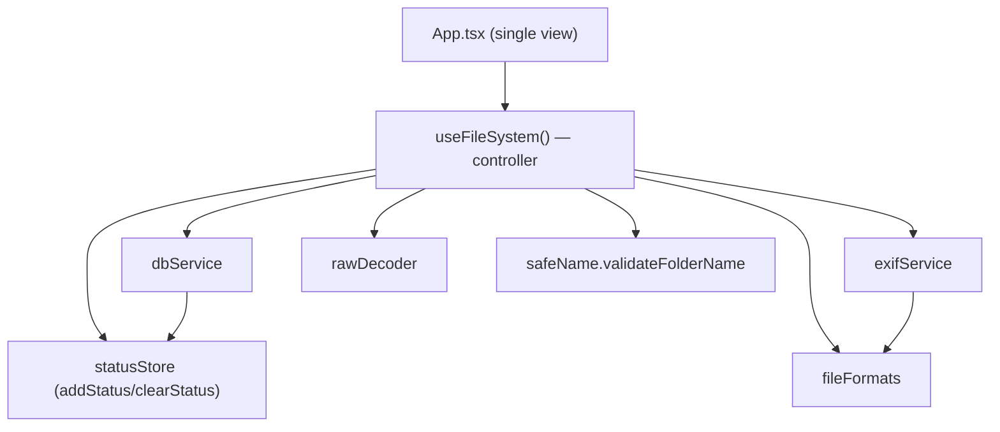
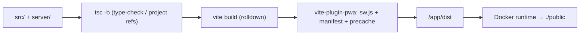

# Photo Sorter — Technical Design Document (TDD)

The deep engineering reference for Photo Sorter: every module, data structure, control flow, concurrency guarantee, performance limit, and deployment detail, grounded in the actual source.

Version 2.0.1 · Last updated 2026-07-14 · Status: Living document

> **Guiding principles.** This document and the codebase follow six code principles — **Clean Code**, **YAGNI**, **DRY**, **KISS**, **Semantic** naming/HTML, and **A11y** (accessibility). The technical design keeps modules small and single-purpose (Clean Code/KISS), shares logic through one helper per concern (DRY), and models the domain with meaningful types (Semantic). Full definitions: **[PRINCIPLES.md](PRINCIPLES.md)**.

---

## 1. Purpose & audience

This document is the authoritative **technical design** for Photo Sorter. It exists so that a contributor can understand *how* the app is built — not just what it does — and change it safely.

Read this document when you need to:

- understand the responsibilities and public contract of a specific module;
- reason about the concurrency model (why writes can't interleave, why RAW decodes can't stampede);
- change the persisted database schema, the RAW-decode pipeline, or the metadata extraction path;
- reproduce, harden, or debug the container deployment and its security headers.

**Audience:** maintainers and contributors comfortable with React, TypeScript, the browser File System Access API, and container deployment. It assumes familiarity with the concepts introduced in [ARCHITECTURE.md](ARCHITECTURE.md); the visual/interaction layer is specified in [DESIGN.md](DESIGN.md); the threat model and control set live in [SECURITY.md](SECURITY.md). This document goes one level deeper than all three and cross-links back to them rather than repeating them.

> Scope note. The **code, comments, README, and CHANGELOG are English**; the **user-facing UI copy is Indonesian** (`lang="id"`). Code snippets in this document therefore contain Indonesian status strings verbatim — that is intentional, not a typo.

---

## 2. System context

Photo Sorter is a **100% client-side** photo & video sorter. It runs entirely in a Chromium-based browser and touches the filesystem only through the user-granted [File System Access API](https://developer.mozilla.org/en-US/docs/Web/API/File_System_Access_API) (`window.showDirectoryPicker`). There is **no backend, no telemetry, and no network egress** for user data: nothing is uploaded, and every byte of every photo is read, decoded, and written locally.

The only server in the system is a **static file server** that ships the compiled SPA. It never sees a user's photos — it serves HTML, JS, CSS, and WASM, and nothing more.



**Runtime requirements.** A Chromium-based browser (Chrome / Edge / Opera). Firefox and Safari do **not** implement `showDirectoryPicker`, so the app cannot function there and surfaces a clear error (`"Browser tidak mendukung File System Access API. Gunakan Chrome/Edge/Opera terbaru."`).

**End-to-end workflow.**

1. The user opens a local folder via the OS picker.
2. The app scans the **top level only** (non-recursive) for supported images & videos.
3. Files are ordered **chronologically** by capture date/time, falling back to `File.lastModified`.
4. The user previews each file and assigns it to a numbered sort sub-folder with single-key shortcuts (`1`–`9`).
5. Files are **copied** (default) or **moved / cut** into sub-folders created inside the opened folder.
6. All session state is auto-persisted to `photo-sorter-db.json` in the opened folder, so reopening the same folder restores the session.

---

## 3. Tech stack & versions

| Layer | Technology | Version | Role |
|---|---|---|---|
| UI framework | React + React DOM | `^19.2.5` | Component model, StrictMode |
| Language | TypeScript | `~6.0.2` | Types, `tsc -b` project build |
| Bundler / dev server | Vite (rolldown) | `^8.1.4` | Build + HMR |
| Styling | Tailwind CSS | `^4.2.4` | Utility CSS, OKLCH tokens |
| Styling helpers | `tw-animate-css`, `tailwind-merge`, `clsx`, `class-variance-authority` | `^1.4.0` / `^3.5.0` / `^2.1.1` / `^0.7.1` | Animations, class merging, variants |
| UI primitives | `radix-ui` (shadcn "radix-nova", neutral base) | `^1.4.3` | Accessible primitives |
| Icons | `lucide-react` | `^1.14.0` | Icon set |
| State | `zustand` | `^5.0.13` | Transient status store |
| Image EXIF | `exifreader` | `^4.41.0` | Image metadata (patched, see [SECURITY.md](SECURITY.md)) |
| Video metadata | `mediainfo.js` | `^0.3.7` | Video metadata (WASM) |
| RAW decode | `libraw-wasm` | `^1.4.0` | Sensor decode (WASM worker) |
| PWA | `vite-plugin-pwa` (Workbox) | `^1.3.0` | Service worker, offline |
| Carousel | `embla-carousel-react` | `^8.6.0` | Viewer interactions |
| Utilities | `lodash.debounce`, `lodash.isempty` | `^4.0.8` / `^4.4.0` | Debounce, emptiness check |
| **Server** | `express` | `5.2.1` | Static HTTP server |
| **Server** | `helmet` | `8.3.0` | Security headers |
| **Server** | `compression` | `1.8.1` | gzip / brotli |
| Runtime | Node.js | `22` (server `engines >=20`) | Build & serve |
| Package manager | pnpm | `9.15.9` (lockfile v9) | Frontend deps |
| Build tooling | shadcn CLI | `^4.7.0` (**devDependencies**) | `shadcn/tailwind.css` at build time |

Build orchestration is a two-step `pnpm run build` → `tsc -b && vite build`. See [§13 Build pipeline](#13-build-pipeline).

---

## 4. Module-by-module technical design

The source is organized around a single **controller hook** ([`useFileSystem`](../src/hooks/useFileSystem.ts)) that owns all app state and orchestrates three stateless **services** ([`dbService`](../src/services/dbService.ts), [`exifService`](../src/services/exifService.ts), [`rawDecoder`](../src/services/rawDecoder.ts)), backed by a **format registry** ([`fileFormats`](../src/config/fileFormats.ts)), a **name validator** ([`safeName`](../src/lib/safeName.ts)), and a **transient status store** ([`statusStore`](../src/stores/statusStore.ts)). See [ARCHITECTURE.md](ARCHITECTURE.md) for the component composition; this section documents the internals.



### 4.1 `useFileSystem` — the controller hook

[`src/hooks/useFileSystem.ts`](../src/hooks/useFileSystem.ts) (~860 lines) is the single source of truth. `App.tsx` calls it once and distributes its return value to the presentational components. It owns **all** app state, holds the non-serializable filesystem handles in refs, and orchestrates directory loading, chronological sorting, folder management, the copy/cut assign operation, undo, navigation, lazy metadata extraction, RAW decode, blob-URL lifecycle, and DB persistence.

#### 4.1.1 Public interface — `FileSystemHook`

The hook returns a single `FileSystemHook` object. **State fields** (re-render triggers):

| Field | Type | Meaning |
|---|---|---|
| `photos` | `PhotoFile[]` | The scanned, chronologically-sorted files. |
| `currentIndex` | `number` | Index of the currently-previewed file. |
| `folders` | `SortFolder[]` | The sort sub-folders (with live `dirHandle`). |
| `sortedPhotos` | `SortedMapping` | `{ [fileName]: folderId }` — which folder each file was sorted into. |
| `isLoading` | `boolean` | True during directory scan / metadata extraction. |
| `error` | `string \| null` | Last user-facing error (Indonesian). |
| `moveMode` | `MoveMode` | `"copy"` (default) or `"cut"`. |
| `operations` | `SortOperation[]` | Recent operation log (mirrors DB, capped at 50). |
| `rawPreviewUrls` | `Map<string, string>` | `key → object/data URL` of decoded RAW previews. |
| `isDecodingRaw` | `boolean` | True while a RAW decode is in flight. |
| `metadataByKey` | `Map<string, PhotoMetadata>` | Lazily-extracted metadata by file key. |
| `canUndo` | `boolean` | `undoStack.length > 0`. |

**Methods:**

| Method | Signature | Behavior |
|---|---|---|
| `loadDirectory` | `() => Promise<void>` | Opens the picker, resets prior session, scans, extracts capture dates, sorts, restores DB state. |
| `addFolder` | `(name: string) => Promise<void>` | Validates the name, creates a sub-folder, assigns shortcut/color, persists. |
| `removeFolder` | `(folderId: string) => Promise<void>` | Recursively deletes the sub-folder, drops its mappings & undo entries, persists. |
| `assignPhotoToFolder` | `(photoIndex, folderId) => Promise<void>` | Copies/cuts the file into the folder, logs the op, pushes an undo entry, advances index, persists. |
| `undoLastOperation` | `() => Promise<void>` | Reverses the last assign (delete duplicate for copy, move-back for cut). |
| `navigatePhoto` | `(direction: "next" \| "prev") => void` | Clamped index step. |
| `jumpToNextUnsorted` | `() => void` | Cyclically finds the next file with no mapping. |
| `recreatePreviewUrl` | `(photoKey: string) => void` | Revokes & recreates a blob URL after an `` decode error. |
| `setMoveMode` | `(mode: MoveMode) => void` | Sets copy/cut and persists the mode. |
| `getCurrentPhoto` | `() => PhotoFile \| null` | `photos[currentIndex]`. |
| `getCurrentFolder` | `() => SortFolder \| null` | The folder the current file is sorted into, if any. |
| `getOperationStats` | `() => { success; failed; total }` | Derived counts over `operations`. |

#### 4.1.2 Internal state (`useState`)

| State | Type | Initial | Notes |
|---|---|---|---|
| `photos` | `PhotoFile[]` | `[]` | |
| `currentIndex` | `number` | `0` | |
| `folders` | `SortFolder[]` | `[]` | |
| `sortedPhotos` | `SortedMapping` | `{}` | |
| `isLoading` | `boolean` | `false` | |
| `error` | `string \| null` | `null` | |
| `moveMode` | `MoveMode` | `"copy"` | **Default is Copy.** |
| `operations` | `SortOperation[]` | `[]` | |
| `undoStack` | `UndoEntry[]` | `[]` | Internal only (not exposed); bounded to 20. |
| `rawPreviewUrls` | `Map<string,string>` | `new Map()` | |
| `isDecodingRaw` | `boolean` | `false` | |
| `metadataByKey` | `Map<string,PhotoMetadata>` | `new Map()` | |

`UndoEntry` (internal) captures everything needed to reverse an assign **without** holding a handle: `{ photoKey, photoName, createdName, folderId, mode, photoIndex }`. `createdName` is the *actual* name written to the target (it may carry a `_1`/`_2` collision suffix), which is what undo must delete/move.

#### 4.1.3 Internal refs (mutable, no re-render)

| Ref | Type | Purpose |
|---|---|---|
| `rootDirHandleRef` | `FileSystemDirectoryHandle \| null` | The opened root folder. |
| `folderDirHandlesRef` | `Map<folderId, FileSystemDirectoryHandle>` | Live handles for sort folders (handles aren't serialized to the DB). |
| `isInitializedRef` | `boolean` | Set once the first load completes. |
| `rawDecodeQueueRef` | `Set<key>` | RAW decodes currently in flight (dedup). |
| `rawPreviewKeysRef` | `Set<key>` | RAW keys already decoded (skip re-decode). |
| `failedRawDecodesRef` | `Set<key>` | RAW keys that failed (don't retry, avoids loops). |
| `metaQueueRef` | `Set<key>` | Metadata extractions in flight (dedup). |
| `metadataCacheRef` | `Record<key, PhotoMetadata>` | The mutable metadata cache mirrored to the DB. |

Handles and File objects are **deliberately kept out of React state and out of the DB** — they are non-serializable and can go stale after a move. The stable `key` (the file name) is the bridge between serializable state and the live handles.

#### 4.1.4 Effects

The hook wires five effects:

1. **Unmount cleanup — revoke all URLs.** `revokeAllUrls()` iterates `photos` and `rawPreviewUrls`, calling `URL.revokeObjectURL` on each, then clears the RAW preview map and `rawPreviewKeysRef`. Runs on unmount, and is also invoked imperatively at the top of `loadDirectory` when switching folders. Prevents blob-URL leaks across reloads.
2. **Flush pending metadata write on unmount.** `persistMetadata` is a `lodash.debounce` (1500 ms) wrapper around `updateDatabaseMetadata`. The effect calls `persistMetadata.flush()` on unmount so an in-flight debounce isn't lost.
3. **Lazy metadata extraction.** Keyed on `[currentIndex, photos, metadataByKey, persistMetadata]`. For the current file and its two neighbors (`currentIndex ± 1`, clamped), if metadata isn't already present or in-flight, it extracts via `extractMetadata`, writes to `metadataByKey` and `metadataCacheRef`, and schedules a debounced DB persist. A `cancelled` flag in the cleanup guards against setState-after-unmount.
4. **RAW decode on demand.** Keyed on `[currentIndex, photos]`. If the current file's category is `"raw"` and it isn't already decoded/queued/failed, it runs `decodeRawImage(file)`, storing the resulting URL in `rawPreviewUrls` (and recording the key), or marking it failed. `isDecodingRaw` toggles around the call.
5. **(implicit) blob-URL creation** happens during `loadDirectory` scanning (see below), not in a dedicated effect — each previewable file gets `URL.createObjectURL(file)` at scan time; non-previewable files get `url: null`.

#### 4.1.5 Pure file-operation helpers

Four handle-level helpers live at module scope (no component state):

- `fileExists(dir, name)` — probe via `getFileHandle`, catch = false.
- `getUniqueFileName(dir, name)` — collision-safe naming: returns `name` if free, else appends `_1`, `_2`, … before the extension until free. **Copies/moves never silently overwrite.**
- `writeFileTo(dir, name, file)` — `getFileHandle({create:true})` → `createWritable` → `write` → `close`.
- `moveFileHandle(handle, destDir, destName, sourceDir, sourceName)` — uses the **native `handle.move()`** when available, else falls back to **copy-then-delete** (`writeFileTo` then `sourceDir.removeEntry`).

### 4.2 `dbService` — persisted project state

[`src/services/dbService.ts`](../src/services/dbService.ts) is the only module that reads or writes `photo-sorter-db.json`. Every mutation is a **read-modify-write** of that single file.

#### 4.2.1 Public API

| Function | Signature | Purpose |
|---|---|---|
| `initProjectDatabase` | `(dir) => Promise<CompleteProjectState>` | Load existing DB, or create & return a fresh one. |
| `updateDatabaseAfterOperation` | `(dir, update) => Promise<void>` | Persist a sort/undo: new `sortedPhotos`, `currentIndex`, optional `operation`, recomputed stats. |
| `updateDatabaseFolders` | `(dir, folders) => Promise<void>` | Persist folder add/remove (handle-free folder records). |
| `updateDatabaseMode` | `(dir, moveMode) => Promise<void>` | Persist copy/cut mode. |
| `updateDatabaseMetadata` | `(dir, cache) => Promise<void>` | Persist the per-file metadata cache (debounced by caller). |
| `loadProjectState` | `(dir) => Promise<CompleteProjectState \| null>` | Read + validate + sanitize; `null` on missing/corrupt/incompatible. |

Constants: `DB_FILENAME = "photo-sorter-db.json"`, `DB_VERSION = "2.0"`, `MAX_OPERATIONS = 50`, `MAX_SORTED_ENTRIES = MAX_METADATA_ENTRIES = 100_000`, `MAX_FOLDERS = 1_000`.

#### 4.2.2 Write-serialization chain

Because every write is a read-modify-write of the same file, running two concurrently (e.g. the user **holds down** a shortcut key, or metadata persistence overlaps an assign) would interleave reads and writes and **silently drop updates**. All writes are therefore funneled through a **single promise chain** so they execute strictly one at a time:

```ts
let writeChain: Promise<unknown> = Promise.resolve();

const enqueue = <T>(task: () => Promise<T>): Promise<T> => {
  const run = writeChain.then(task, task);   // run after the previous task, success OR failure
  writeChain = run.then(() => undefined, () => undefined); // keep the chain alive past rejections
  return run;
};
```

Every public mutator (`initProjectDatabase`, `updateDatabaseAfterOperation`, `updateDatabaseFolders`, `updateDatabaseMode`, `updateDatabaseMetadata`) wraps its body in `enqueue(...)`. The `.then(task, task)` form runs the next task whether the previous resolved or rejected; the follow-up `.then(noop, noop)` ensures one failed write never poisons the chain. This is the app's core concurrency guarantee for persistence — see [§9 Concurrency model](#9-concurrency-model).

#### 4.2.3 Validation & `sanitizeState`

The DB file lives **inside the user's chosen folder**, so it is untrusted input: it may be corrupt, an old version, or crafted by whoever can write to that folder. `loadProjectState` never throws; it degrades to `null` (which triggers a fresh DB and a visible warning toast) and passes anything valid through `sanitizeState`.

The load path is:

1. **Read** `photo-sorter-db.json`. Missing file → `return null` (normal on first open, no warning).
2. **Parse** JSON. Parse error → warn `"Database rusak, dibuat ulang"`, return `null`.
3. **Shape check** (`isValidState`): requires `version:string`, `folders:array`, `sortedPhotos:object!=null`, `operations:array`. Fail → warn `"Format database tidak valid, dibuat ulang"`, return `null`.
4. **Version check**: `parsed.version !== "2.0"` → warn `"Database versi X tidak kompatibel, dibuat ulang"`, return `null`.
5. **Sanitize** and return.

`sanitizeState` hardens against **prototype pollution** and **unbounded memory**:

- `safeRecord(input, valueOk, max)` copies a string-keyed record into a **null-prototype object** (`Object.create(null)`), skipping the `DANGEROUS_KEYS` set (`__proto__`, `constructor`, `prototype`), skipping values that fail the type guard, and stopping at `max` entries.
- `sortedPhotos` → `safeRecord(... string values, 100_000)`.
- `metadataCache` → `safeRecord(... object values, 100_000)`.
- `folders` → filtered to objects with `string id` + `string name`, sliced to `MAX_FOLDERS` (1000).
- `operations` → last `MAX_OPERATIONS` (50).
- `moveMode` → coerced to `"cut"` only if exactly `"cut"`, else `"copy"`.
- `currentIndex` → `Math.floor` of a finite `>= 0` number, else `0`.

See [SECURITY.md](SECURITY.md) for the rationale and threat model behind these controls.

#### 4.2.4 Atomic-ish write

`writeDatabaseFile` uses `getFileHandle({create:true})` → `createWritable()` → `write(JSON.stringify(state, null, 2))` → `close()`. The `createWritable`/`close` pair is the browser's atomic-swap primitive (the temp buffer is committed on `close`), so a partially-written file is not left in place on success.

### 4.3 `exifService` — metadata extraction & date parsing

[`src/services/exifService.ts`](../src/services/exifService.ts) exposes `extractMetadata(file)` plus `parseCaptureDate` and a family of formatters (`formatFileSize`, `formatDate`, `formatTimestamp`, `formatDuration`, `formatBitrate`).

`extractMetadata` dispatches on category (image vs video) and **always returns a `PhotoMetadata`** — on any failure it returns a default `{ fileSize, megapixels: 0, dimensions: {0,0}, isVideo }` and logs a warning. It never throws into the caller.

**Image path (`extractImageMetadata`).** Reads **only the first 2 MB** (`MAX_HEADER_BYTES`) via `file.slice(0, MAX_HEADER_BYTES)` — EXIF lives in the header, so a huge RAW/TIFF never gets pulled fully into memory. It parses with `ExifReader.load(buffer, { async: true, expanded: true })`, then extracts, with layered fallbacks:

- **Dimensions**: `file "Image Width/Height"` → `exif.PixelX/YDimension` → `exif.ImageWidth/ImageLength` → `0`.
- **Megapixels**: `round(w*h/1e6 * 10)/10`.
- **Camera**: `Make`, `Model`.
- **Lens**: `LensModel` → `Lens` → `LensSpecification` → `LensMake`.
- **ISO**: `ISOSpeedRatings` → `PhotographicSensitivity` → `ISOSpeed`.
- **Exposure**: `ExposureTime`/`ShutterSpeedValue`, `FNumber`/`ApertureValue`/`MaxApertureValue`, `FocalLength`/`FocalLengthIn35mmFilm`.
- **Date**: `DateTimeOriginal` → `DateTimeDigitized` → `DateTime`.

Two small helpers do the heavy lifting: `toNum` (first positive number from number/string/array), `str`/`desc` (first non-empty trimmed string / tag `description`, ignoring `"Undefined"`).

**Video path (`extractVideoMetadata`).** Instantiates `mediaInfoFactory()` and calls `analyzeData(getSize, readChunk)` with a chunked reader (`file.slice(offset, offset+chunkSize)`). It locates the `General`, `Video`, and `Audio` tracks by `@type` and reads duration, dimensions/megapixels, `FrameRate`, codecs (`Video.Format`, `Audio.Format`), and bitrate (`OverallBitRate` → `BitRate`). Phone-recorded videos store camera/date in QuickTime "extra" tags whose key naming varies by mediainfo version, so `xtra(...)` checks both dotted and underscored forms (`com.apple.quicktime.creationdate` / `com_apple_quicktime_creationdate`, etc.), falling back to `Encoded_Date` / `Recorded_Date` / `Tagged_Date` / `File_Modified_Date`.

> Known limitation: `mediainfo.js`'s `MediaInfoModule.wasm` is not emitted at build time (Vite can't resolve its runtime `new URL()`), so video metadata **degrades gracefully** — the extractor catches the failure and returns the default metadata. This is a functional, non-security note (see [§16](#16-known-limitations--future-work) and [SECURITY.md](SECURITY.md)).

**Date parsing (`parseFlexibleDate` → `parseCaptureDate`).** `parseCaptureDate` is the chronological sort key. `parseFlexibleDate` normalizes the many shapes EXIF and mediainfo emit:

- strips a leading timezone token like `"UTC "` (mediainfo prepends it);
- if the string contains `T`, tries ISO parsing directly;
- otherwise splits into date/time, converts EXIF colon dates (`"2023:01:02"`) to dashes, and builds `"YYYY-MM-DDThh:mm:ss"`;
- last resort: hands the raw string to `new Date(...)`.

Returns `null` when unparseable — the caller then falls back to `File.lastModified`.

### 4.4 `rawDecoder` — the RAW preview pipeline

[`src/services/rawDecoder.ts`](../src/services/rawDecoder.ts) exposes `decodeRawImage(file): Promise<string | null>` — a bounded, quality-first pipeline that prefers the camera's embedded JPEG preview and only falls back to a full sensor decode when necessary.

Constants: `MAX_FULL_DECODE_BYTES = 80 MB`, `SHARP_PREVIEW_MIN_WIDTH = 800`, `MAX_CANDIDATE_BYTES = 40 MB`, `MAX_PREVIEW_DIM = 2048`, `LIBRAW_TIMEOUT_MS = 20000`.

**Pipeline (`decodeRawImage`):**

1. `extractEmbeddedPreview(file)` — scan the file bytes for JPEG **SOI markers** (`FF D8 FF`). Each SOI-to-next-SOI (or EOF) span, capped at `MAX_CANDIDATE_BYTES` (40 MB), is a candidate. Candidates are sorted **largest-span first** and the top **6** are validated with `createImageBitmap`. The bitmap that decodes with the **greatest width** wins; it's re-encoded via `bitmapToDataUrl` to a JPEG bounded to `MAX_PREVIEW_DIM` (2048 px, quality 0.9) so the cache never holds tens of MB of source slice. If `createImageBitmap` is unavailable, the largest candidate is trusted blindly.
2. If a **validated** embedded preview is at least `SHARP_PREVIEW_MIN_WIDTH` (800 px) wide → **return it** (fast and sharp).
3. Otherwise, if `file.size <= MAX_FULL_DECODE_BYTES` (80 MB) → `decodeWithLibRaw(file)`.
4. Last resort → return whatever validated embedded preview we found, even if small (`embedded?.url ?? null`).

**Full decode (`decodeWithLibRaw`):**

- `new LibRaw()`, then **`patchLibRawWorker(raw)`** immediately.
- `raw.open(bytes, { useCameraWb:true, userQual:3 /* AHD */, halfSize:true, outputColor:1 /* sRGB */, outputBps:8, noAutoBright:false })` under a 20 s timeout.
- Try `libRawThumbnail(raw)` first (fast, reliable across formats): a JPEG thumbnail becomes a blob URL; an RGB bitmap goes through `rgbToDataUrl`.
- Else decode the sensor: `raw.metadata()` + `raw.imageData()` (each under timeout), guarded by an **all-white-output check** (`checkIfAllWhite` samples ~2000 points; >95% pure-white = failed decode → `null`), then `rgbToDataUrl` (1/3/4-channel aware, quality 0.92).
- **`finally`**: `raw.worker?.terminate?.()` — libraw spawns one worker per instance, so it's terminated after every decode to prevent worker accumulation.

**Robustness guards.**

- `patchLibRawWorker` works around an **upstream libraw-wasm bug** (through ≥1.4.0): the worker message handler read the promise rejecter from `.throw` while `runFn` stored it under `.error`, so any worker error threw `"n is not a function"` and left the decode promise **pending forever** (the RAW spinner hung). The patch re-binds `worker.onmessage`/`worker.onerror` to the correct keys and always settles the promise.
- `withTimeout(promise, ms)` rejects any libraw call that doesn't settle within `LIBRAW_TIMEOUT_MS`, so a dead/stuck worker can never hang the UI.
- Files over 80 MB skip the full decode entirely.

See [§8 sequence diagrams](#8-sequence-diagrams) for the decode flow.

### 4.5 `fileFormats` — the format registry

[`src/config/fileFormats.ts`](../src/config/fileFormats.ts) is the single registry of supported formats. `PHOTO_FORMATS` maps a format key to `{ extensions, mimeTypes?, label, category, previewable }`, with `category ∈ { standard | raw | vector | video | other }`. Derived lookups (`ALL_EXTENSIONS`, `PREVIEWABLE_EXTENSIONS`, `EXTENSION_TO_FORMAT`) power the helpers `isSupportedImage`, `isPreviewable`, and `getFileFormatInfo`, all keyed on the lowercased extension.

Coverage: standard raster (JPEG/JPE, PNG, GIF, WebP, AVIF, BMP/DIB, TIFF/TIF), **RAW** (Canon CR2/CR3/CRW, Nikon NEF/NRW, Sony ARW/SRF/SR2, Fuji RAF, Panasonic RW2/RAW, Olympus ORF, Pentax PEF/PTX, Leica/DNG + RWL, Hasselblad 3FR, Sigma X3F — all `previewable:false`, handled by `rawDecoder`), **vector** SVG, **other** ICO (previewable) and HEIC/HEIF (`previewable:false` — Chromium can't decode it in ``), and **video** (MP4/M4V, WebM, OGV, MOV/QT, AVI, WMV, MKV, FLV, MPEG/MPG/MPE, TS, 3GP/3G2).

### 4.6 `statusStore` — transient toasts

[`src/stores/statusStore.ts`](../src/stores/statusStore.ts) is a small Zustand store of status toasts (`{ id, type: "idle"|"loading"|"success"|"error", message, icon: "db"|"folder"|"file"|"save" }`). It keeps **at most 3** (`slice(0, 3)`), **auto-expires** `success`/`error` after **3 s** via `setTimeout`, and exposes `clearStatus()` to drop just the `loading` toasts (used in `finally` blocks). `addStatus`/`removeStatus`/`clearStatus` are exported as plain functions (`useStatusStore.getState()`) so services outside React can drive toasts.

### 4.7 `safeName` — folder-name validation

[`src/lib/safeName.ts`](../src/lib/safeName.ts) exports `validateFolderName(raw)` used by the folder-add flow as **defense-in-depth** on top of the File System Access API's own path-segment rejection. It trims, then rejects: empty names, names > 200 chars, `.`/`..`, path separators / Windows-reserved punctuation (`\ / : * ? " < > |`), ASCII control chars (U+0000–U+001F), a trailing dot or space, and reserved device names (`CON`, `PRN`, `AUX`, `NUL`, `COM1-9`, `LPT1-9`). It returns `{ ok: true, name }` or `{ ok: false, reason }` with an Indonesian reason.

---

## 5. Data model (TypeScript interfaces)

All types live in [`src/types/index.ts`](../src/types/index.ts) (plus `FileFormatConfig` in `fileFormats.ts`). The critical design decision is the split between **live, non-serializable objects** (handles, `File`, blob URLs) and the **serializable subset** persisted to the DB.

```ts
// src/config/fileFormats.ts
export interface FileFormatConfig {
  extensions: string[];
  mimeTypes?: string[];
  label: string;
  category: "standard" | "raw" | "vector" | "video" | "other";
  previewable: boolean;
}

// src/types/index.ts
export interface PhotoMetadata {
  cameraMake?: string;
  cameraModel?: string;
  lens?: string;
  iso?: number;
  shutterSpeed?: string;
  aperture?: string;
  focalLength?: string;
  dateTaken?: string;
  fileSize: number;
  megapixels: number;
  duration?: number;      // video, seconds
  fps?: number;           // video
  videoCodec?: string;    // video
  audioCodec?: string;    // video
  bitrate?: number;       // video, bits/sec
  isVideo: boolean;
  dimensions: { width: number; height: number };
}

export interface PhotoFile {
  id: number;
  key: string;                  // stable identifier = the file name; the persisted mapping key
  name: string;
  handle: FileSystemFileHandle; // live, non-serializable
  file: File;                   // live, non-serializable
  url: string | null;           // blob URL for previewable files, else null
  size: number;
  format: FileFormatConfig;
  metadata: PhotoMetadata;      // may be a lightweight placeholder until lazily extracted
  moved?: boolean;              // true once a "cut" has moved this file out of root
}

export interface SortFolder {
  id: string;                   // crypto.randomUUID()
  name: string;
  shortcut: string | null;      // "1".."9" | null
  color: string;                // tailwind class, e.g. "bg-red-500"
  createdAt: number;
  dirHandle: FileSystemDirectoryHandle | null; // live, non-serializable
}

export interface SortedMapping { [photoKey: string]: string; } // fileName -> folderId

export type MoveMode = "cut" | "copy";
export type NavigationDirection = "next" | "prev";

// Fully serializable — holds NO handles/File objects, survives JSON.stringify.
export interface SortOperation {
  photoName: string;
  folderId: string;
  folderName: string;
  mode: MoveMode;
  success: boolean;
  error?: string;
  timestamp: number;
}

export interface ProjectState {
  version: string;
  folders: Array<{ id: string; name: string; shortcut: string | null; color: string; createdAt: number; }>;
  sortedPhotos: SortedMapping;
  moveMode: MoveMode;
  currentIndex: number;
  timestamp: number;
}
```

`CompleteProjectState` ([`dbService.ts`](../src/services/dbService.ts)) extends `ProjectState` with `operations: SortOperation[]`, an optional `metadataCache: Record<string, PhotoMetadata>`, and a `stats` block (`totalPhotos`, `sortedCount`, `successOperations`, `failedOperations`).

**Handle color palette** (9, indexed by folder position): `bg-red-500`, `bg-blue-500`, `bg-green-500`, `bg-yellow-500`, `bg-purple-500`, `bg-pink-500`, `bg-indigo-500`, `bg-orange-500`, `bg-teal-500`.

---

## 6. `photo-sorter-db.json` schema

A single JSON file written **inside the opened folder**. It is the durable session state; handles and blob URLs are never persisted (they are re-acquired on load by name).

### 6.1 Field spec

| Field | Type | Constraints (post-sanitize) | Notes |
|---|---|---|---|
| `version` | `string` | must equal `"2.0"` | Any other value → reset. |
| `folders` | `Array<{id,name,shortcut,color,createdAt}>` | each needs `string id` + `string name`; ≤ **1000** | **No `dirHandle`** — re-acquired by name on load. |
| `sortedPhotos` | `Record<fileName, folderId>` | string values only; ≤ **100 000** entries; null-prototype | Keyed by **file name**, not index. |
| `moveMode` | `"cut" \| "copy"` | coerced to `"copy"` unless exactly `"cut"` | Default `"copy"`. |
| `currentIndex` | `number` | finite, `>= 0`, floored; else `0` | Clamped again on restore to `photos.length-1`. |
| `operations` | `SortOperation[]` | last **50** kept | Recent operation log. |
| `metadataCache` | `Record<fileName, PhotoMetadata>` | object values only; ≤ **100 000**; null-prototype | Makes reopening a folder instant. |
| `stats` | `{ totalPhotos, sortedCount, successOperations, failedOperations }` | derived | Recomputed on each op write. |
| `timestamp` | `number` | `Date.now()` at write | Last-write marker. |

### 6.2 Realistic example

```json
{
  "version": "2.0",
  "folders": [
    { "id": "b1f0c8e2-3a4d-4e6f-9a2b-1c2d3e4f5a6b", "name": "Keep",   "shortcut": "1", "color": "bg-red-500",   "createdAt": 1752460800000 },
    { "id": "c2a1d9f3-4b5e-4f70-8b3c-2d3e4f5a6b7c", "name": "Reject", "shortcut": "2", "color": "bg-blue-500",  "createdAt": 1752460815000 },
    { "id": "d3b2e0a4-5c6f-4081-9c4d-3e4f5a6b7c8d", "name": "Maybe",  "shortcut": "3", "color": "bg-green-500", "createdAt": 1752460830000 }
  ],
  "sortedPhotos": {
    "IMG_0001.CR3": "b1f0c8e2-3a4d-4e6f-9a2b-1c2d3e4f5a6b",
    "IMG_0002.JPG": "c2a1d9f3-4b5e-4f70-8b3c-2d3e4f5a6b7c",
    "VID_0003.MOV": "d3b2e0a4-5c6f-4081-9c4d-3e4f5a6b7c8d"
  },
  "moveMode": "copy",
  "currentIndex": 3,
  "operations": [
    { "photoName": "IMG_0001.CR3", "folderId": "b1f0c8e2-3a4d-4e6f-9a2b-1c2d3e4f5a6b", "folderName": "Keep",   "mode": "copy", "success": true,  "timestamp": 1752460901000 },
    { "photoName": "IMG_0002.JPG", "folderId": "c2a1d9f3-4b5e-4f70-8b3c-2d3e4f5a6b7c", "folderName": "Reject", "mode": "copy", "success": true,  "timestamp": 1752460912000 },
    { "photoName": "VID_0003.MOV", "folderId": "d3b2e0a4-5c6f-4081-9c4d-3e4f5a6b7c8d", "folderName": "Maybe",  "mode": "copy", "success": false, "error": "The requested file could not be read", "timestamp": 1752460923000 }
  ],
  "metadataCache": {
    "IMG_0001.CR3": {
      "cameraMake": "Canon", "cameraModel": "Canon EOS R6", "lens": "RF24-70mm F2.8 L IS USM",
      "iso": 400, "shutterSpeed": "1/250", "aperture": "f/2.8", "focalLength": "50 mm",
      "dateTaken": "2026:07:13 18:22:05", "fileSize": 28451092, "megapixels": 20.1,
      "isVideo": false, "dimensions": { "width": 5472, "height": 3648 }
    },
    "VID_0003.MOV": {
      "cameraMake": "Apple", "cameraModel": "iPhone 15 Pro",
      "dateTaken": "UTC 2026-07-13 09:15:44", "fileSize": 104857600, "megapixels": 8.3,
      "duration": 42.5, "fps": 30, "videoCodec": "HEVC", "audioCodec": "AAC",
      "bitrate": 19500000, "isVideo": true, "dimensions": { "width": 3840, "height": 2160 }
    }
  },
  "stats": { "totalPhotos": 128, "sortedCount": 3, "successOperations": 2, "failedOperations": 1 },
  "timestamp": 1752460923000
}
```

### 6.3 Version & reset policy

- **Current schema: `"2.0"`.** `sortedPhotos` is keyed by **file name** (not array index), and `SortOperation` is a slim, handle-free record.
- On load, a **missing** file is normal (no warning) and yields a fresh DB. A **corrupt**, **shape-invalid**, or **version-mismatched** file is **reset** — the app writes a new empty DB and shows a visible Indonesian warning toast (`"Database rusak, dibuat ulang"` / `"Format database tidak valid, dibuat ulang"` / `"Database versi X tidak kompatibel, dibuat ulang"`). Older `1.0` databases are intentionally not migrated.
- There is **no in-place migration**. Bumping `DB_VERSION` is a hard reset by design — the DB is a cache of a reproducible sorting session, not a system of record.

---

## 7. Control-flow: `loadDirectory` in detail

`loadDirectory` is the entry point that turns a picked folder into a live session:

1. Show a loading toast; verify `showDirectoryPicker` exists (else error out for Firefox/Safari).
2. `await window.showDirectoryPicker()`.
3. **Reset prior session**: `revokeAllUrls()`, clear the RAW/metadata queues and `failedRawDecodesRef`, empty the undo stack, set `rootDirHandleRef`, clear operations/error.
4. `initProjectDatabase(dir)` → load or create the DB; seed `metadataCacheRef` from `metadataCache`.
5. **Scan top level** via `for await (const entry of dir.values())`; for each supported image/video build a `PhotoFile` (create a blob URL only if previewable), reusing cached metadata or a lightweight placeholder.
6. **Extract capture dates concurrently** with a **pool of up to 8 workers** over a shared cursor; only files without cached metadata are read (header-only). Progress toasts fire every 8 files.
7. **Sort** by `parseCaptureDate(dateTaken) ?? file.lastModified`, tie-broken by `key.localeCompare`.
8. Build `metadataByKey`, `setPhotos`, and **persist the freshly-extracted cache** so the next open of this folder is instant.
9. **Restore DB state**: re-acquire each folder's `dirHandle` by name (skip + warn if missing), drop `sortedPhotos` entries pointing at vanished folders, restore `moveMode`, clamp `currentIndex`, restore `operations`.
10. Mark initialized, clear loading, success toast.

Errors other than `AbortError` (user cancelled the picker) set `error` and a failure toast; `clearStatus()` runs in `finally`.

---

## 8. Sequence diagrams

### 8.1 Open folder

```mermaid
sequenceDiagram
  actor User
  participant App
  participant Hook as useFileSystem
  participant OS as showDirectoryPicker
  participant DB as dbService
  participant EXIF as exifService

  User->>App: click "Open folder"
  App->>Hook: loadDirectory()
  Hook->>OS: showDirectoryPicker()
  OS-->>Hook: rootDirHandle
  Hook->>Hook: revokeAllUrls(); reset queues + undo stack
  Hook->>DB: initProjectDatabase(root)
  DB-->>Hook: CompleteProjectState (or fresh)
  loop each top-level entry
    Hook->>Hook: isSupportedImage? build PhotoFile (+ blob URL)
  end
  par up to 8 workers
    Hook->>EXIF: extractMetadata(file)  %% only if not cached
    EXIF-->>Hook: PhotoMetadata
  end
  Hook->>Hook: sort by capture date, else lastModified
  Hook->>DB: updateDatabaseMetadata(root, cache)
  Hook->>Hook: restore folders (re-acquire handles), mappings, mode, index
  Hook-->>App: photos, folders, sortedPhotos ready
```

### 8.2 Assign (cut / move)

```mermaid
sequenceDiagram
  actor User
  participant Hook as useFileSystem
  participant FS as FileSystem handles
  participant DB as dbService

  User->>Hook: press "2" (assignPhotoToFolder(idx, folderId))
  Hook->>FS: getUniqueFileName(target, name)  %% collision-safe
  FS-->>Hook: createdName (maybe name_1)
  Hook->>FS: moveFileHandle(handle -> target/createdName)
  Note over FS: native handle.move() if available,<br/>else copy-then-delete
  Hook->>FS: target.getFileHandle(createdName)  %% re-acquire, never stale
  Hook->>Hook: setPhotos(handle=updated, moved=true)
  Hook->>Hook: sortedPhotos[key]=folderId; push UndoEntry(createdName); index++
  Hook->>DB: updateDatabaseAfterOperation({sorted, index, op, stats})
  DB-->>Hook: (enqueued, serialized write)
  Hook-->>User: success toast
```

### 8.3 Undo (cut)

```mermaid
sequenceDiagram
  actor User
  participant Hook as useFileSystem
  participant FS as FileSystem handles
  participant DB as dbService

  User->>Hook: Ctrl/Cmd+Z (undoLastOperation)
  Hook->>Hook: entry = undoStack.top  (mode === "cut")
  Hook->>FS: target.getFileHandle(entry.createdName)
  Hook->>FS: moveFileHandle(back to root as entry.photoName)
  Hook->>FS: root.getFileHandle(entry.photoName)  %% restored handle
  Hook->>Hook: setPhotos(handle=restored, moved=false)
  Hook->>Hook: delete sortedPhotos[key]; pop undoStack; currentIndex=entry.photoIndex
  Hook->>DB: updateDatabaseAfterOperation({sorted, index, stats})  %% no op logged
  Hook-->>User: "Dibatalkan: <name>"
```

For **copy** undo the file was duplicated, so undo simply `target.removeEntry(entry.createdName)` and drops the mapping.

### 8.4 RAW decode

```mermaid
sequenceDiagram
  participant Hook as useFileSystem (effect)
  participant RD as rawDecoder
  participant BM as createImageBitmap
  participant LR as libraw-wasm worker

  Hook->>RD: decodeRawImage(file)  %% current photo is category "raw"
  RD->>RD: scan bytes for SOI (FF D8 FF), build candidates (cap 40MB), sort largest-first
  loop top 6 candidates
    RD->>BM: createImageBitmap(slice)
    BM-->>RD: bitmap (width) — pick widest, re-encode <=2048px
  end
  alt embedded preview width >= 800
    RD-->>Hook: preview URL (fast path)
  else file <= 80MB
    RD->>LR: patch worker; open(halfSize, AHD, sRGB) [20s timeout]
    RD->>LR: thumbnailData() -> else metadata()+imageData()
    LR-->>RD: pixels (all-white check)
    RD->>LR: worker.terminate()  %% always, in finally
    RD-->>Hook: decoded URL or null
  else
    RD-->>Hook: small embedded preview or null
  end
```

---

## 9. Concurrency model

Photo Sorter has several independent asynchronous flows; each has an explicit guard against races.

| Flow | Hazard | Guard |
|---|---|---|
| **DB writes** | Two read-modify-writes of `photo-sorter-db.json` interleave (holding a shortcut key; metadata persist overlapping an assign) and drop updates. | Single `writeChain` promise; every mutator wraps its body in `enqueue()` so writes run **strictly one at a time**, and the chain survives rejections. |
| **RAW decode** | The same file is decoded repeatedly as the effect re-fires; a failed decode retries forever. | `rawDecodeQueueRef` (in-flight dedup), `rawPreviewKeysRef` (already-done skip), `failedRawDecodesRef` (no-retry). One decode per key ever. |
| **Metadata extraction** | Neighbor prefetch double-extracts the same file. | `metaQueueRef` in-flight set + `metadataByKey.has(key)` check; a `cancelled` flag prevents setState-after-unmount. |
| **Capture-date scan** | Reading hundreds of headers serially is slow; unbounded parallelism thrashes memory. | Fixed pool of **≤ 8** workers over a shared cursor. |
| **Metadata persistence** | Every navigation would write the DB. | `lodash.debounce(1500ms)`, flushed on unmount. |
| **libraw worker** | A worker error leaves the decode promise pending forever; workers accumulate. | `patchLibRawWorker` (settle on error), `withTimeout(20s)`, `worker.terminate()` in `finally`. |
| **Blob URLs** | Leak across reloads/unmount. | `revokeAllUrls()` on unmount and at the top of `loadDirectory`; `recreatePreviewUrl` revokes before recreating. |

The design principle throughout: **serialize the one shared mutable resource** (the DB file) and **dedup/bound everything else** with refs and small worker pools. Handles are re-acquired by name after any move so a stale handle is never used.

---

## 10. Performance & limits

| Constant | Value | Where | Rationale |
|---|---|---|---|
| EXIF header slice | **2 MB** (`MAX_HEADER_BYTES`) | `exifService` | EXIF lives in the header; never pull a huge RAW/TIFF fully into memory. |
| Max full RAW decode | **80 MB** (`MAX_FULL_DECODE_BYTES`) | `rawDecoder` | Above this, skip the expensive sensor decode; rely on the embedded preview. |
| RAW candidate cap | **40 MB** (`MAX_CANDIDATE_BYTES`) | `rawDecoder` | A real embedded preview is never larger; longer spans mean the scan hit sensor data. |
| Preview longest side | **2048 px** (`MAX_PREVIEW_DIM`) | `rawDecoder` | Re-encode decoded bitmaps small so the cache stays lean. |
| Sharp-preview threshold | **800 px** (`SHARP_PREVIEW_MIN_WIDTH`) | `rawDecoder` | Below this a preview is a thumbnail; prefer a libraw decode. |
| libraw timeout | **20 000 ms** (`LIBRAW_TIMEOUT_MS`) | `rawDecoder` | A stuck worker can never hang the UI. |
| Capture-date workers | **8** | `useFileSystem` | Bounded parallelism for header reads. |
| Operation log cap | **50** (`MAX_OPERATIONS`) | `dbService` | Keeps the DB small; recent history only. |
| Undo stack cap | **20** | `useFileSystem` | `slice(-19)` + new entry. |
| Sorted-map cap | **100 000** (`MAX_SORTED_ENTRIES`) | `dbService` | Unbounded-memory guard on load. |
| Metadata-cache cap | **100 000** (`MAX_METADATA_ENTRIES`) | `dbService` | Same. |
| Folder cap | **1 000** (`MAX_FOLDERS`) | `dbService` | Same. |
| Metadata persist debounce | **1500 ms** | `useFileSystem` | Coalesce DB writes during navigation. |
| Status toasts kept | **3**, auto-expire **3 s** | `statusStore` | Non-intrusive UI. |
| Precache file-size limit | **4 MB** | `vite.config.ts` (Workbox) | Covers the ~1.3 MB libraw WASM. |

---

## 11. Deployment & runtime design

> **nginx has been removed.** The app now deploys as a **single container** via `docker compose`. There is no nginx and no reverse proxy in the stack; a tiny hardened Node/Express server serves the static build.

### 11.1 Multi-stage `Dockerfile`

| Stage | Base image | What it does |
|---|---|---|
| **1. build** | `node:22-slim` | `corepack prepare pnpm@9.15.9`, `pnpm install --frozen-lockfile` (with a cache mount), `pnpm run build` → `/app/dist`. |
| **2. server-deps** | `node:22-alpine` | `npm ci --omit=dev` of `server/` (only `express`, `helmet`, `compression`) from `server/package-lock.json` — fully reproducible. |
| **3. runtime** | `node:22-alpine` | Copies `server/index.js`, the audited prod `node_modules`, and `dist` (as `./public`); runs as the non-root built-in **`node`** user; `EXPOSE 8080`; `HEALTHCHECK` hits `/healthz` with Node's built-in `fetch`; `CMD ["node","index.js"]`. |

The frontend toolchain and dependencies never reach the runtime image — only the compiled static output plus three small server packages ship.

### 11.2 The static server (`server/index.js`)

Express 5 + helmet 8 + compression. Behavior:

- `x-powered-by` disabled; strong ETags.
- **helmet** sets a strict CSP (`useDefaults:false`, every directive explicit), **cross-origin isolation** (COOP `same-origin` + COEP `require-corp` + CORP `same-origin`) so the WASM workers can use `SharedArrayBuffer`, **HSTS** (2 years, `includeSubDomains`, `preload`), `Referrer-Policy: no-referrer`, and `X-Frame-Options: DENY`.
- A middleware sets a restrictive **Permissions-Policy** (denies accelerometer, autoplay, browsing-topics, camera, display-capture, encrypted-media, geolocation, gyroscope, interest-cohort, magnetometer, microphone, midi, payment, publickey-credentials-get, screen-wake-lock, serial, sync-xhr, usb, xr-spatial-tracking; allows only `self` fullscreen + picture-in-picture).
- **GET/HEAD only** — any other verb gets `405 Method Not Allowed` with `Allow: GET, HEAD`.
- `compression()` for gzip/brotli.
- `/healthz` → `ok` (liveness/readiness probe).
- Static serving with correct MIME (`.wasm` → `application/wasm`, `.webmanifest` → `application/manifest+json`), `dotfiles:"allow"` (serves `/.well-known/security.txt`), **immutable caching** for content-hashed `/assets/*` (`max-age=31536000, immutable`) and **`no-cache`** for HTML / service worker / manifest / icons so PWA updates ship immediately.
- **SPA fallback**: an unknown *navigation* path returns `index.html` (the client normalizes the URL back to `/`); anything that **looks like an asset** (starts with `/assets/` or has a file extension) returns a real **404**, so the browser never parses `index.html` as JS/CSS/WASM.
- **Graceful shutdown** on `SIGTERM`/`SIGINT`: `server.close()` then a 10 s force-exit fallback.

### 11.3 Response headers (verified live)

| Header | Value |
|---|---|
| `Content-Security-Policy` | `default-src 'self'; base-uri 'self'; object-src 'none'; frame-ancestors 'none'; form-action 'self'; img-src 'self' blob: data:; media-src 'self' blob:; font-src 'self' data:; style-src 'self' 'unsafe-inline'; script-src 'self' 'wasm-unsafe-eval'; worker-src 'self' blob:; connect-src 'self' blob: data:; manifest-src 'self'; upgrade-insecure-requests` |
| `Cross-Origin-Opener-Policy` | `same-origin` |
| `Cross-Origin-Embedder-Policy` | `require-corp` |
| `Cross-Origin-Resource-Policy` | `same-origin` |
| `Strict-Transport-Security` | `max-age=63072000; includeSubDomains; preload` |
| `Referrer-Policy` | `no-referrer` |
| `X-Content-Type-Options` | `nosniff` |
| `X-Frame-Options` | `DENY` |
| `X-Permitted-Cross-Domain-Policies` | `none` |
| `X-DNS-Prefetch-Control` | `off` |
| `X-Download-Options` | `noopen` |
| `Origin-Agent-Cluster` | `?1` |
| `X-XSS-Protection` | `0` (legacy auditor disabled) |
| `Permissions-Policy` | denies all powerful features; allows only `fullscreen=(self)`, `picture-in-picture=(self)` |

The CSP has **no `'unsafe-inline'`/`'unsafe-eval'` for scripts** — only `'wasm-unsafe-eval'` for WASM compilation. `style-src 'unsafe-inline'` is an accepted, documented requirement of Tailwind/Radix runtime-injected styles. Full rationale and threat model: [SECURITY.md](SECURITY.md).

### 11.4 `docker-compose.yml` hardening

```yaml
read_only: true                    # immutable root filesystem
tmpfs: [ "/tmp:size=16m,mode=1777" ]  # the only writable path
security_opt: [ "no-new-privileges:true" ]
cap_drop: [ ALL ]
init: true                         # tini as PID 1 (reap zombies, forward signals)
deploy.resources.limits: { cpus: "1.0", memory: 256M }   # reservation: 64M
healthcheck: node fetch /healthz   # 30s interval, 5s timeout, 3 retries, 10s start
logging: json-file (max-size 10m, max-file 3)
restart: unless-stopped
ports: [ "8080:8080" ]
```

For public HTTPS, terminate TLS at the platform edge (Cloudflare, a load balancer, or an existing Caddy/Traefik) and forward to the container; set `TRUST_PROXY=1` so HSTS and scheme detection reflect the external scheme.

---

## 12. Configuration & environment variables

| Variable | Default | Consumer | Effect |
|---|---|---|---|
| `PORT` | `8080` | `server/index.js` | Listen port. |
| `HOST` | `0.0.0.0` | `server/index.js` | Bind address. |
| `STATIC_DIR` | `./public` (image) / `../dist` (local) | `server/index.js` | Directory of compiled SPA. |
| `TRUST_PROXY` | `false` | `server/index.js` | Enable **only** behind a trusted TLS terminator so `req.protocol`/HSTS reflect the external scheme. |
| `NODE_ENV` | `production` | Docker/compose | Standard production toggle. |

Frontend build-time configuration lives in [`vite.config.ts`](../vite.config.ts): the `@` → `src` alias, `optimizeDeps.exclude: ["mediainfo.js"]`, dev-server COOP/COEP headers (to match production isolation), and the PWA manifest + Workbox options.

---

## 13. Build pipeline



- `pnpm run build` = `tsc -b && vite build`. Type errors fail the build.
- **PWA**: `registerType: "autoUpdate"` with `injectRegister: false` — the service worker is registered **manually** in `main.tsx` (`navigator.serviceWorker.register("/sw.js")` on `window` load) so **no inline `<script>`** is injected, preserving the strict CSP. Workbox precaches `**/*.{js,css,html,wasm,svg,png,ico,woff2}` with `maximumFileSizeToCacheInBytes: 4 MB` (to cover the ~1.3 MB libraw WASM), `cleanupOutdatedCaches`, and `navigateFallback: /index.html`. `autoUpdate` implies `skipWaiting` + `clientsClaim`, so a new SW takes over on reload.
- **Manifest**: standalone display, theme/background `#0a0f1a`, 192 & 512 icons, Indonesian name `"Photo Sorter — Sortir Foto & Video Lokal"`, `lang: "id"`.
- **Entry** (`main.tsx`): `StrictMode → ErrorBoundary → ThemeProvider (defaultTheme dark, storageKey "vite-ui-theme") → App`; it also normalizes any non-`/` path back to `/` (single-view app, no router).

---

## 14. Testing & verification strategy

Photo Sorter is a browser app whose core capability (`showDirectoryPicker`) requires a real Chromium user gesture, so verification leans on manual and infrastructure checks rather than a large unit-test suite.

**Static / build gates**

- `pnpm run build` (`tsc -b && vite build`) — type-checking is the first gate; the CI/image build fails on any type error.
- `pnpm run lint` — ESLint (with `eslint-plugin-react-hooks` and `typescript-eslint`) enforces hook rules and TS correctness.
- `pnpm audit` (full tree and `--prod`) — must report **"No known vulnerabilities found"**; enforced by `pnpm.overrides` for transitive dev/build advisories. See [SECURITY.md](SECURITY.md).

**Functional verification (manual, Chromium)**

- Open-folder flow: scan, chronological order, DB creation, session restore on reopen.
- Assign in both **copy** and **cut** modes, including a forced filename collision to confirm the `_1`/`_2` suffix.
- **Undo** in both modes (delete duplicate vs. move-back), and undo across a collision-suffixed name.
- Folder add (name-validation rejections), remove (recursive, mapping/undo cleanup).
- RAW previews across formats (embedded-preview path vs. libraw fallback), the 20 s timeout, and the all-white guard.
- DB **reset** paths: hand-corrupt the JSON, downgrade the `version`, and confirm the warning toast + fresh DB.

**Deployment verification**

- `docker compose up -d --build`, then confirm `/healthz` returns `ok`.
- Assert the response-header table (§11.3) with `curl -I` against a running container (headers are described as "verified live").
- Confirm cross-origin isolation is active (`self.crossOriginIsolated === true`) so WASM workers get `SharedArrayBuffer`.
- Confirm hashed `/assets/*` are `immutable` and HTML/`sw.js`/manifest are `no-cache`.

**Suggested future automation** (not yet present): Playwright end-to-end against a Chromium instance with a seeded temp directory, and unit tests for the pure, deterministic helpers (`getUniqueFileName`, `parseFlexibleDate`/`parseCaptureDate`, `sanitizeState`/`safeRecord`, `validateFolderName`, `checkIfAllWhite`) which need no filesystem.

---

## 15. Observability

By design there is **no telemetry and no network egress** — nothing about the user or their files leaves the browser. Operational visibility is therefore local:

- **In-app status toasts** (`statusStore`) surface every DB/folder/file operation to the user in real time (loading/success/error, Indonesian).
- **Console diagnostics**: services log with prefixed tags (`[DB]`, `[Hook]`, `[PWA]`) for corrupt-DB, version-mismatch, folder-not-found, metadata-extract, and RAW-decode failures.
- **Operation log**: the last 50 `SortOperation`s (with `success`/`error`) are persisted in the DB and rendered in the `OperationLog` component and `Stats`.
- **Server side**: `server/index.js` logs startup and shutdown; `/healthz` drives the Docker `HEALTHCHECK` and compose healthcheck; container logs are rotated (`json-file`, 10 MB × 3).

There is no server-side request/response logging of user content because the server never receives any.

---

## 16. Known limitations & future work

**Current limitations**

- **Chromium-only.** Firefox/Safari lack `showDirectoryPicker`; the app cannot run there (clear error shown).
- **Top-level scan only.** Sub-folders are not recursed; only the opened folder's direct children are scanned.
- **HEIC/HEIF is non-previewable.** Chromium cannot decode it in ``, so it is marked `previewable:false` (still sortable, just no preview).
- **Video metadata may be absent.** `mediainfo.js`'s `MediaInfoModule.wasm` is not emitted at build time (Vite can't resolve its runtime `new URL()`), so video metadata **degrades gracefully** to defaults. Functional, not a security issue.
- **libraw-wasm is flaky.** The upstream hang-on-error bug is patched (`patchLibRawWorker`) and every decode is timeout- and worker-termination-guarded, but the full sensor decode remains the fallback of last resort; the embedded-preview path is the reliable route for almost every RAW.
- **No schema migration.** A `DB_VERSION` bump is a hard reset by design.
- **Undo depth 20; operation log 50.** History beyond those bounds is dropped.
- **HSTS only matters over HTTPS** behind a TLS terminator; `style-src 'unsafe-inline'` is required by Tailwind/Radix.

**Future work**

- Optional recursive scan with a depth cap.
- Playwright E2E and unit tests for the pure helpers (see §14).
- Bundle `MediaInfoModule.wasm` explicitly so video metadata is always available.
- A configurable undo depth / operation-log size.
- A migration path (rather than reset) for future DB schema bumps.
- Client-side HEIC decode via a dedicated WASM decoder to lift the preview limitation.

---

## 17. Related documents

- [ARCHITECTURE.md](ARCHITECTURE.md) — system structure, component composition, data flow at a higher altitude.
- [DESIGN.md](DESIGN.md) — UI/UX, design tokens (OKLCH), layout, accessibility, PWA presentation.
- [SECURITY.md](SECURITY.md) — threat model, CSP rationale, dependency-audit findings and fixes, hardening controls.

### Source map (quick links)

| Concern | File |
|---|---|
| Controller hook | [`src/hooks/useFileSystem.ts`](../src/hooks/useFileSystem.ts) |
| DB service | [`src/services/dbService.ts`](../src/services/dbService.ts) |
| Metadata | [`src/services/exifService.ts`](../src/services/exifService.ts) |
| RAW decode | [`src/services/rawDecoder.ts`](../src/services/rawDecoder.ts) |
| Format registry | [`src/config/fileFormats.ts`](../src/config/fileFormats.ts) |
| Status store | [`src/stores/statusStore.ts`](../src/stores/statusStore.ts) |
| Name safety | [`src/lib/safeName.ts`](../src/lib/safeName.ts) |
| Types | [`src/types/index.ts`](../src/types/index.ts) |
| Static server | [`server/index.js`](../server/index.js) |
| Container | [`Dockerfile`](../Dockerfile) · [`docker-compose.yml`](../docker-compose.yml) |
| Build config | [`vite.config.ts`](../vite.config.ts) |
