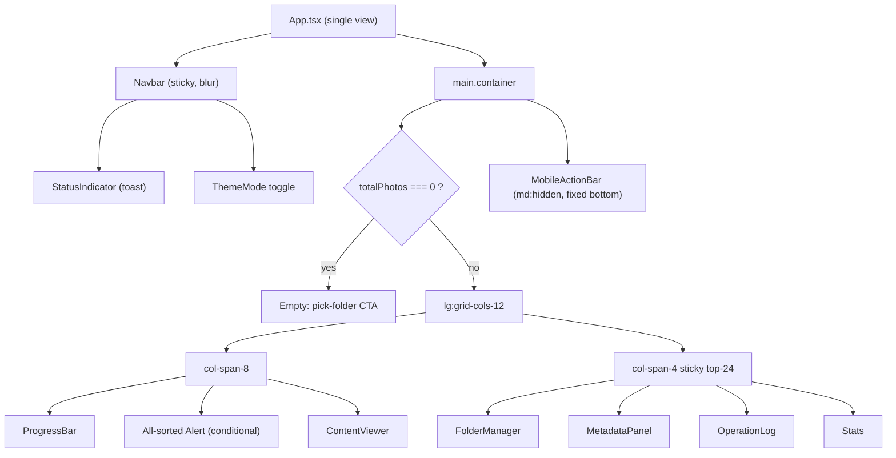
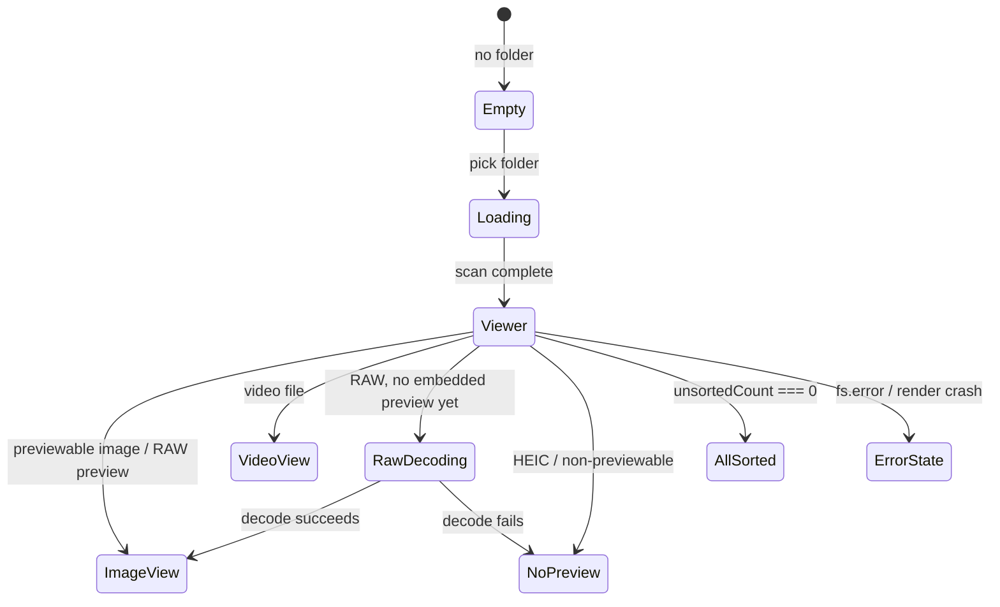

# UI / UX Design

The visual and interaction design system for Nata Photo — a keyboard-first, 100% client-side photo & video sorter. This document is the single source of truth for design tokens, layout, components, screen states, theming, motion, accessibility, and localization.

Version 2.3.0 · Last updated 2026-07-19 · Status: Living document

> **Design revamp (2.3.0).** The UI was overhauled with a distinctive **"darkroom" identity**: a warm amber signature accent over warm-tinted charcoal/off-white neutrals (OKLCH tokens with low chroma, not the old grayscale-neutral set), a three-family type system (Bricolage Grotesque / Inter / JetBrains Mono — see §3), an ambient radial-glow background, high-impact motion (`fade-up`, `scale-in`, staggered entrances) and **skeleton shimmer** loaders, a **stat-tile** treatment across the sidebar panels, **tooltips on every icon button**, and a **language toggle** (EN/ID). All motion respects `prefers-reduced-motion`. Some subsections below predate the revamp and are being updated incrementally; §3 (Typography) and the tokens in `src/app/styles/globals.css` are authoritative.

> **Guiding principles.** This design system and the codebase follow the craft principles — **Clean Code**, **YAGNI**, **DRY**, **KISS**, **Semantic** naming/HTML, and **A11y** — plus the longevity principles (Readable · Understandable · Reusable · Scalable · Maintainable · Easy to Hand Over). The UI is built accessibility-first (A11y) with semantic HTML and meaningful tokens (Semantic), reusing one design-token set and shared components — `PanelHeader`, `WithTooltip` (DRY/Reusable) — and the simplest layout that works (KISS). Full definitions: **[PRINCIPLES.md](PRINCIPLES.md)**.

> Related: [DESIGN.md](DESIGN.md) (product design rationale) · [ARCHITECTURE.md](ARCHITECTURE.md) (source map & data flow) · [SECURITY.md](SECURITY.md) (CSP & headers that shape what the UI may render) · [PRINCIPLES.md](PRINCIPLES.md) · [PRD.md](PRD.md)

---

## 1. Design language & foundations

Nata Photo is a **utilitarian, content-first tool**. The interface exists to get out of the way of one repetitive task: look at a photo, press a key, move on. Every design decision serves throughput and clarity.

**Principles**

| Principle | How it shows up in the UI |
| --- | --- |
| Content first | The media preview dominates the viewport (up to `75vh` / 8 of 12 columns). Chrome is quiet: a translucent navbar and a neutral card frame. |
| Keyboard-first | Number keys `1`–`9` sort; arrows/space navigate; `U` jumps to the next unsorted; `Ctrl/Cmd+Z` undoes. On-screen controls mirror, never replace, the keyboard. |
| Neutral canvas, colorful signal | The base palette is fully desaturated (neutral OKLCH greys). Color is reserved as *signal*: the 9-color folder palette, success green, warning yellow, destructive red. |
| Calm, low-motion | Transitions are short and functional (press feedback, blur, theme cross-fade). No decorative animation competes with the photo. |
| Local & private by design | No avatars, no accounts, no network state. The only "identity" in the UI is the folder you opened and the sub-folders you create. |
| Dark by default | The app opens in dark mode so bright photos are judged against a near-black surround, the way editors are configured. |

**Foundation stack**

- **Tailwind CSS v4** with the `@theme inline` token bridge in [src/app/styles/globals.css](../src/app/styles/globals.css).
- **shadcn** (style `radix-nova`, base color `neutral`) primitives over **Radix UI**, under [src/shared/ui](../src/shared/ui).
- **lucide-react** icon set.
- **OKLCH** color space for perceptually-even light/dark tokens.
- Utility class merging via `cn()` (clsx + tailwind-merge) in [src/shared/lib/utils.ts](../src/shared/lib/utils.ts).

---

## 2. Design tokens

All tokens are CSS custom properties defined in [src/app/styles/globals.css](../src/app/styles/globals.css). The light theme lives on `:root`; the dark theme overrides on `.dark` (toggled by `ThemeProvider`). The `@theme inline` block maps each `--<token>` to a Tailwind color/radius utility (e.g. `--color-primary` → `bg-primary`, `text-primary`).

### 2.1 Color tokens — light theme (`:root`)

All base tokens are **neutral** (chroma `0`, hue `0`); only `destructive` and the five `chart-*` accents carry chroma.

| Token | OKLCH value | Role |
| --- | --- | --- |
| `--background` | `oklch(1 0 0)` | Page background (pure white) |
| `--foreground` | `oklch(0.145 0 0)` | Body text |
| `--card` | `oklch(1 0 0)` | Card / panel surface |
| `--card-foreground` | `oklch(0.145 0 0)` | Text on cards |
| `--popover` | `oklch(1 0 0)` | Popover / dropdown surface |
| `--popover-foreground` | `oklch(0.145 0 0)` | Text on popovers |
| `--primary` | `oklch(0.205 0 0)` | Primary buttons, active tab, key accents |
| `--primary-foreground` | `oklch(0.985 0 0)` | Text/icons on primary |
| `--secondary` | `oklch(0.97 0 0)` | Secondary buttons/badges |
| `--secondary-foreground` | `oklch(0.205 0 0)` | Text on secondary |
| `--muted` | `oklch(0.97 0 0)` | Hover fills, muted surfaces |
| `--muted-foreground` | `oklch(0.556 0 0)` | Secondary text, captions |
| `--accent` | `oklch(0.97 0 0)` | Accent hover surface |
| `--accent-foreground` | `oklch(0.205 0 0)` | Text on accent |
| `--destructive` | `oklch(0.577 0.245 27.325)` | Delete / error (red) |
| `--destructive-foreground` | `oklch(0.985 0 0)` | Text on destructive |
| `--border` | `oklch(0.922 0 0)` | Hairline borders |
| `--input` | `oklch(0.922 0 0)` | Input borders/fills |
| `--ring` | `oklch(0.708 0 0)` | Focus ring |
| `--chart-1` | `oklch(0.646 0.222 41.116)` | Data accent 1 (orange) |
| `--chart-2` | `oklch(0.6 0.118 184.704)` | Data accent 2 (teal) |
| `--chart-3` | `oklch(0.398 0.07 227.392)` | Data accent 3 (blue) |
| `--chart-4` | `oklch(0.828 0.189 84.429)` | Data accent 4 (yellow) |
| `--chart-5` | `oklch(0.769 0.188 70.08)` | Data accent 5 (amber) |
| `--sidebar` | `oklch(0.985 0 0)` | Sidebar surface |
| `--sidebar-foreground` | `oklch(0.145 0 0)` | Sidebar text |
| `--sidebar-primary` | `oklch(0.205 0 0)` | Sidebar primary accent |
| `--sidebar-primary-foreground` | `oklch(0.985 0 0)` | Text on sidebar primary |
| `--sidebar-accent` | `oklch(0.97 0 0)` | Sidebar accent surface |
| `--sidebar-accent-foreground` | `oklch(0.205 0 0)` | Text on sidebar accent |
| `--sidebar-border` | `oklch(0.922 0 0)` | Sidebar border |
| `--sidebar-ring` | `oklch(0.708 0 0)` | Sidebar focus ring |

### 2.2 Color tokens — dark theme (`.dark`)

Dark mode inverts lightness and, notably, **re-hues the chart accents** (they become vivid blue/green/amber/purple/red rather than the light theme's warm ramp). The `sidebar-primary` also picks up the blue chart-1 hue.

| Token | OKLCH value | Role |
| --- | --- | --- |
| `--background` | `oklch(0.145 0 0)` | Page background (near-black) |
| `--foreground` | `oklch(0.985 0 0)` | Body text |
| `--card` | `oklch(0.205 0 0)` | Card / panel surface |
| `--card-foreground` | `oklch(0.985 0 0)` | Text on cards |
| `--popover` | `oklch(0.205 0 0)` | Popover surface |
| `--popover-foreground` | `oklch(0.985 0 0)` | Text on popovers |
| `--primary` | `oklch(0.922 0 0)` | Primary (near-white in dark) |
| `--primary-foreground` | `oklch(0.205 0 0)` | Text on primary |
| `--secondary` | `oklch(0.269 0 0)` | Secondary surfaces |
| `--secondary-foreground` | `oklch(0.985 0 0)` | Text on secondary |
| `--muted` | `oklch(0.269 0 0)` | Hover fills, muted surfaces |
| `--muted-foreground` | `oklch(0.708 0 0)` | Secondary text |
| `--accent` | `oklch(0.269 0 0)` | Accent hover surface |
| `--accent-foreground` | `oklch(0.985 0 0)` | Text on accent |
| `--destructive` | `oklch(0.704 0.191 22.216)` | Delete / error (brighter red) |
| `--destructive-foreground` | `oklch(0.985 0 0)` | Text on destructive |
| `--border` | `oklch(0.269 0 0)` | Hairline borders |
| `--input` | `oklch(0.269 0 0)` | Input borders/fills |
| `--ring` | `oklch(0.556 0 0)` | Focus ring |
| `--chart-1` | `oklch(0.488 0.243 264.376)` | Data accent 1 (blue) |
| `--chart-2` | `oklch(0.696 0.17 162.48)` | Data accent 2 (green) |
| `--chart-3` | `oklch(0.769 0.188 70.08)` | Data accent 3 (amber) |
| `--chart-4` | `oklch(0.627 0.265 303.9)` | Data accent 4 (purple) |
| `--chart-5` | `oklch(0.645 0.246 16.439)` | Data accent 5 (red) |
| `--sidebar` | `oklch(0.205 0 0)` | Sidebar surface |
| `--sidebar-foreground` | `oklch(0.985 0 0)` | Sidebar text |
| `--sidebar-primary` | `oklch(0.488 0.243 264.376)` | Sidebar primary (blue) |
| `--sidebar-primary-foreground` | `oklch(0.985 0 0)` | Text on sidebar primary |
| `--sidebar-accent` | `oklch(0.269 0 0)` | Sidebar accent surface |
| `--sidebar-accent-foreground` | `oklch(0.985 0 0)` | Text on sidebar accent |
| `--sidebar-border` | `oklch(0.269 0 0)` | Sidebar border |
| `--sidebar-ring` | `oklch(0.556 0 0)` | Sidebar focus ring |

> **Why OKLCH?** Lightness is perceptually uniform, so `oklch(0.205 …)` reads as "the same darkness" regardless of hue. This lets the neutral ramp (`0.145 → 0.205 → 0.269 → 0.556 → 0.708 → 0.922 → 0.97 → 0.985 → 1`) stay evenly stepped across both themes and keeps text/surface contrast predictable when inverting.

### 2.3 Radius scale

A single base radius `--radius: 0.625rem` (10px) drives a multiplier scale, exposed as `rounded-sm … rounded-4xl`:

| Token | Formula | Computed | Typical use |
| --- | --- | --- | --- |
| `--radius-sm` | `--radius * 0.6` | `0.375rem` (6px) | Small chips, inner controls |
| `--radius-md` | `--radius * 0.8` | `0.5rem` (8px) | `xs`/`sm` buttons, folder shortcut swatch (`rounded-lg` on swatch) |
| `--radius-lg` | `--radius` | `0.625rem` (10px) | **Default button / input radius** (`rounded-lg`) |
| `--radius-xl` | `--radius * 1.4` | `0.875rem` (14px) | Cards, larger panels |
| `--radius-2xl` | `--radius * 1.8` | `1.125rem` (18px) | Viewer frame (`rounded-2xl` on empty state) |
| `--radius-3xl` | `--radius * 2.2` | `1.375rem` (22px) | Extra-round surfaces |
| `--radius-4xl` | `--radius * 2.6` | `1.625rem` (26px) | **Badges / pills** (`rounded-4xl`) |

### 2.4 Token families

The `@theme inline` block groups tokens into these families, each with a `*-foreground` pair where text sits on the surface:

- **background / foreground** — the page canvas.
- **card** — raised panels (FolderManager, MetadataPanel, OperationLog, Stats, ContentViewer).
- **popover** — dropdown menus, floating surfaces.
- **primary** — the main call-to-action color.
- **secondary** — lower-emphasis actions and badges.
- **muted** — hover fills and de-emphasized text.
- **accent** — hover/active surface tint.
- **destructive** — delete and error affordances.
- **border / input / ring** — structural hairlines, form field edges, focus indicator.
- **chart-1…5** — reserved data-accent ramp (available to any future charting).
- **sidebar-*** — a dedicated surface family for the sidebar region.

---

## 3. Typography

> **Updated in 2.3.0 (design revamp).** Nata Photo now ships a distinctive
> three-family type system loaded from Google Fonts (with graceful system-stack
> fallbacks when offline): **Bricolage Grotesque** for display/headings (`.font-display`,
> `h1`–`h3`), **Inter** for body (`--font-sans`), and **JetBrains Mono** for numeric
> metadata and code (`.font-mono`, `tabular-nums`). Families are wired as Tailwind
> theme variables in `src/app/styles/globals.css`.

| Role | Treatment | Notes |
| --- | --- | --- |
| App title ("NataPhoto") | `font-display font-extrabold text-base md:text-xl` | Navbar brand mark |
| Panel titles | `font-display font-extrabold text-lg md:text-xl` | Via the shared `PanelHeader` |
| Body / item text | `text-sm` (Inter) | Default reading size |
| Metadata values | `font-mono text-sm tabular-nums` | Aligned numeric columns |
| Micro-labels | `text-[10px] uppercase tracking-wider` | Stat-tile captions, badges |
| Folder shortcut swatch | `font-bold text-sm` (uppercased) | White on the folder color |
| Code (`nata-photo-db.json`) | `<code>` inline (mono) | Empty-state hint |

Guidelines: `leading-tight` on stacked headings; `truncate` / `line-clamp-1` on filenames, folder names, and operation rows; `break-words` on long metadata values (camera names, codecs) so narrow panels never overflow.

---

## 4. Iconography

Icons come exclusively from **lucide-react** (`[&_svg]` sizing baked into Button/Badge; default `size-4`, `size-3` inside badges). Icons are decorative next to text and get `aria-label` when they stand alone.

| Icon | Where | Meaning |
| --- | --- | --- |
| `FolderOpen` | Empty state CTA, FolderManager title | Open / sort folder |
| `ImageOff` | Empty state media | No folder loaded yet |
| `ChevronLeft` / `ChevronRight` | ContentViewer, MobileActionBar | Prev / next navigation |
| `Check` | Assigned badge, OperationLog success | Sorted successfully |
| `X` | OperationLog failure | Operation failed |
| `AlertCircle` | ContentViewer null state | Nothing to display |
| `AlertTriangleIcon` | App error alert, ErrorBoundary | Error |
| `CheckCircle2` | All-sorted alert, StatusIndicator success | Completion / success toast |
| `XCircle` | StatusIndicator error | Error toast |
| `FileImage` | Preview-unavailable state | Non-previewable format |
| `Copy` / `Scissors` | Mode tabs, action bar, log | Copy vs Cut mode |
| `Undo2` | FolderManager | Undo last sort |
| `SkipForward` | FolderManager | Jump to next unsorted |
| `Plus` / `Trash2` | FolderManager | Add / remove folder |
| `Keyboard` | Shortcut tips alert | Keyboard hints |
| `Logs` | OperationLog title | Recent operations |
| `ChartColumnDecreasing` | Stats title | Statistics |
| `Sun` / `Moon` | ThemeMode toggle | Light / dark |
| `Camera`, `Aperture`, `Clock`, `Gauge`, `Ruler`, `Calendar`, `HardDrive`, `Maximize`, `Image`, `AudioLines`, `Video` | MetadataPanel | EXIF / video fields |
| `Spinner` (shadcn) | Loading, RAW decoding, status | In-progress |

---

## 5. Layout system

### 5.1 Breakpoints & regions

Nata Photo uses Tailwind's default breakpoints, but reacts at **two** of them, which produces three meaningful layouts:

| Range | Name | Navigation model | Structure |
| --- | --- | --- | --- |
| `< 768px` (`< md`) | Mobile | **Fixed bottom `MobileActionBar`** (`md:hidden`) + swipe (50px threshold); in-viewer side chevrons hidden (`hidden md:flex`) | Single column stack |
| `768–1023px` (`md`, `< lg`) | Tablet / intermediate | In-viewer side chevrons appear; bottom bar hidden | Single column stack (`grid-cols-1`) — sidebar falls **below** the viewer |
| `≥ 1024px` (`lg`) | Desktop | In-viewer side chevrons; keyboard-primary | **12-column grid**: viewer `col-span-8`, sidebar `col-span-4` `sticky top-24` |

The outer wrapper is `min-h-screen` with `transition-colors duration-300` (theme cross-fade). Main content is a centered `container mx-auto py-6`. The navbar is its own `max-w-7xl` centered row.

### 5.2 Desktop wireframe (`≥ lg`)

```
┌──────────────────────────────────────────────────────────────────────┐
│  ◐ backdrop-blur navbar  (sticky top-0, z-50)                          │
│  [icon] Nata Photo v2.0.1          [status toast] [☾/☀ theme]        │
├──────────────────────────────────────────────────────────────────────┤
│  container mx-auto · lg:grid-cols-12 · gap-6                           │
│                                                                        │
│  ┌───────────── viewer · col-span-8 ──────────┐ ┌ sidebar col-span-4 ┐│
│  │ ProgressBar:  Foto 12/240 ▓▓▓░  |  57 dis. │ │  (sticky top-24)    ││
│  │ [all-sorted alert — only when complete]    │ │ ┌────────────────┐  ││
│  │ ┌────────────────────────────────────────┐ │ │ │ FolderManager  │  ││
│  │ │ filename.jpg           [JPEG]  [✓ Bag1]│ │ │ │  mode tabs      │  ││
│  │ │                                        │ │ │ │  + add folder   │  ││
│  │ │ ‹        media preview (≤75vh)       › │ │ │ │  folder list    │  ││
│  │ │           object-contain               │ │ │ │  undo | unsorted│  ││
│  │ │                                        │ │ │ └────────────────┘  ││
│  │ └────────────────────────────────────────┘ │ │ ┌ MetadataPanel ─┐  ││
│  │   (‹ › chevrons overlay left/right)        │ │ └ OperationLog ──┘  ││
│  │                                            │ │ ┌ Stats ─────────┐  ││
│  └────────────────────────────────────────────┘ └────────────────────┘│
└──────────────────────────────────────────────────────────────────────┘
```

### 5.3 Mobile wireframe (`< md`)

```
┌───────────────────────────────┐
│ ◐ [icon] Nata Photo  [☾]    │  sticky navbar
├───────────────────────────────┤
│ ProgressBar  12/240 · 57 dis. │
│ ┌───────────────────────────┐ │
│ │ filename.jpg  [JPEG][✓B1] │ │
│ │                           │ │
│ │     media preview         │ │  ← swipe L/R to navigate
│ │     (object-contain)      │ │     (50px threshold)
│ │                           │ │
│ └───────────────────────────┘ │
│  FolderManager  (stacked)     │
│  MetadataPanel                │
│  OperationLog                 │
│  Stats                        │
│                               │  (mb-26 spacer clears bar)
├───────────────────────────────┤
│ ‹  [Bag1][Bag2][Bag3]…  ›     │  fixed bottom MobileActionBar
└───────────────────────────────┘  (blur, z-50, one button/folder)
```

### 5.4 Composition diagram



---

## 6. Component inventory

### 6.1 shadcn / Radix UI primitives — [src/shared/ui](../src/shared/ui)

| Component | Purpose in Nata Photo |
| --- | --- |
| `alert` | Error banner, all-sorted banner, keyboard-shortcut tips |
| `badge` | Format label, sort status, StatusIndicator toast, folder tag |
| `button` | Every action (see variants below) |
| `card` | Panel frame for viewer & all sidebar sections |
| `dropdown-menu` | Radix menu primitive (available for menus) |
| `empty` | Empty/loading/decoding/preview-unavailable/error compositions |
| `field` / `label` | Form field wrapper + labels (add-folder input, progress labels) |
| `input` / `input-group` / `textarea` | Text entry (new folder name) |
| `item` | The repeating icon + title + description + actions row used across FolderManager, MetadataPanel, OperationLog, Stats |
| `progress` | Photo-position and sorted-count bars |
| `separator` | Divides metadata / stats sections |
| `spinner` | Loading and RAW-decode indicator |
| `tabs` | Copy vs Cut mode switch |

**Button variants** (`buttonVariants`): `default`, `outline`, `secondary`, `ghost`, `destructive`, `link`. **Sizes**: `default` (h-8), `xs`, `sm`, `lg` (h-9), `icon`, `icon-xs`, `icon-sm`, `icon-lg`. Base radius `rounded-lg`; press feedback `active:not-aria-[haspopup]:translate-y-px`; focus `focus-visible:ring-3 focus-visible:ring-ring/50`.

**Badge variants** (`badgeVariants`): `default`, `secondary`, `destructive`, `outline`, `ghost`, `link`. Fixed `h-5`, pill radius `rounded-4xl`, `text-xs`.

### 6.2 Application components — [src/components](../src/components)

| Component | File | Purpose |
| --- | --- | --- |
| `App` | [src/app/App.tsx](../src/app/App.tsx) | Single view; composes everything, derives sorted/unsorted counts & all-sorted state, merges lazy metadata into the current photo |
| `Navbar` | [src/features/navbar/ui/Navbar.tsx](../src/features/navbar/ui/Navbar.tsx) | Sticky, blurred header: logo, title, version, status toast, theme toggle |
| `ContentViewer` | [src/features/content-viewer/ui/ContentViewer.tsx](../src/features/content-viewer/ui/ContentViewer.tsx) | Media stage: image/video/RAW-decoding/preview-unavailable states, filename + format + status badges, side chevrons, keyboard & swipe handling |
| `FolderManager` | [src/features/folder-manager/ui/FolderManager.tsx](../src/features/folder-manager/ui/FolderManager.tsx) | Copy/Cut mode tabs, add-folder form, folder list with shortcut swatch + Sortir/delete, Undo & "Belum disortir" quick actions, shortcut tips |
| `MetadataPanel` | [src/features/metadata-panel/ui/MetadataPanel.tsx](../src/features/metadata-panel/ui/MetadataPanel.tsx) | EXIF (image) or mediainfo (video) fields in a fluid `auto-fit minmax(140px,1fr)` grid |
| `OperationLog` | [src/features/operation-log/ui/OperationLog.tsx](../src/features/operation-log/ui/OperationLog.tsx) | Last 3 operations (newest first), green/red tinted rows |
| `Stats` | [src/features/stats/ui/Stats.tsx](../src/features/stats/ui/Stats.tsx) | Totals, sorted/unsorted, success/failed operation counts |
| `ProgressBar` | [src/features/progress/ui/ProgressBar.tsx](../src/features/progress/ui/ProgressBar.tsx) | Two bars: current position and sorted count |
| `MobileActionBar` | [src/features/mobile-actions/ui/MobileActionBar.tsx](../src/features/mobile-actions/ui/MobileActionBar.tsx) | Fixed bottom bar: prev/next + one colored button per folder |
| `StatusIndicator` | [src/features/status-indicator/ui/StatusIndicator.tsx](../src/features/status-indicator/ui/StatusIndicator.tsx) | Reads the Zustand status store; shows the newest toast in the navbar |
| `ThemeMode` | [src/features/theme-toggle/ui/ThemeMode.tsx](../src/features/theme-toggle/ui/ThemeMode.tsx) | Sun/Moon toggle (binary light↔dark) with `sr-only` label |
| `ThemeProvider` | [src/app/providers/ThemeProvider.tsx](../src/app/providers/ThemeProvider.tsx) | Theme context; writes/reads `localStorage["vite-ui-theme"]`; applies `.dark`/`.light` on `<html>` |
| `ErrorBoundary` | [src/app/providers/ErrorBoundary.tsx](../src/app/providers/ErrorBoundary.tsx) | Catches render errors; "Coba lagi" / "Muat ulang" recovery |

---

## 7. Key screens & states

The app is a single view that swaps regions by state. `ContentViewer` alone renders five media sub-states.



1. **Empty (pick-folder)** — `totalPhotos === 0`. Full-height `Empty` (`h-[90dvh]`) with `ImageOff` media, title **"Mulai Sortir Foto"**, a description noting sort folders auto-create and state persists to `.nata-photo-db.json`, a large **"Pilih Folder Foto"** button (disabled → "Membaca…" while loading), and the note "Chrome/Edge/Opera terbaru diperlukan. File diproses secara lokal."

2. **Loading** — the pick button switches to **"Membaca…"** (disabled); the navbar `StatusIndicator` shows a `Spinner` badge. RAW/metadata work surfaces its own spinners downstream.

3. **Image viewer** — Card with a header row: filename (`truncate`) + format `Badge`, and a right-aligned status badge — folder-colored **`✓ <folder>`** when sorted, or a yellow **"Belum di sortir"** secondary badge when not. The image is `object-contain`, `max-h-[75vh]`, with a centered `Spinner` overlay until `onLoad`. On decode error (non-RAW), the object URL is recreated and retried up to 2× before giving up.

4. **Video** — same header; a native `<video controls>` element (`max-h-[75vh] object-contain`) instead of ``. Playback is user-driven (autoplay is denied by Permissions-Policy).

5. **RAW decoding** — when a RAW file has no embedded preview yet and `isDecodingRaw` is true: an `Empty` (`h-[50dvh]`) with a `size-12` Spinner, title **"Mendecode RAW…"**, description "Ini mungkin memerlukan waktu beberapa detik". Resolves to the image viewer (embedded JPEG or full sensor decode) or to preview-unavailable.

6. **Preview unavailable** — for formats Chromium can't paint in `` (e.g. **HEIC/HEIF**): an `Empty` with a `FileImage` icon, the format label as title, and **"Preview tidak tersedia"**. The file is still fully sortable — sorting never requires a preview.

7. **All sorted** — when `totalPhotos > 0 && unsortedCount === 0`: a green success `Alert` above the viewer — **"Semua N foto sudah disortir 🎉"** (`CheckCircle2`). The viewer still shows the current file so the user can review/re-sort.

8. **Error** — `fs.error` renders a red `Alert` (`AlertTriangleIcon`) at the top of `main`; e.g. a reset warning when `.nata-photo-db.json` is missing/corrupt/incompatible. Uncaught render errors fall to the **ErrorBoundary** full-screen `Empty`: "Terjadi kesalahan" with **"Coba lagi"** (reset) and **"Muat ulang"** (reload).

9. **Transient toasts** — the Zustand status store (max 3; success/error auto-expire after 3s; loading cleared explicitly) feeds `StatusIndicator`: a `Spinner`, `CheckCircle2`, or `XCircle` badge with a short message in the navbar.

---

## 8. Color usage

### 8.1 The 9-color folder palette

Each sort folder is assigned one of nine Tailwind `-500` colors (as raw utility classes stored on `SortFolder.color`). The same class paints the shortcut swatch (FolderManager), the assigned-status badge (ContentViewer), and the folder button (MobileActionBar):

| # | Class | Hue | # | Class | Hue |
| --- | --- | --- | --- | --- | --- |
| 1 | `bg-red-500` | Red | 6 | `bg-pink-500` | Pink |
| 2 | `bg-blue-500` | Blue | 7 | `bg-indigo-500` | Indigo |
| 3 | `bg-green-500` | Green | 8 | `bg-orange-500` | Orange |
| 4 | `bg-yellow-500` | Yellow | 9 | `bg-teal-500` | Teal |
| 5 | `bg-purple-500` | Purple | | | |

Text/icons on folder colors are forced to `text-white`. These are literal Tailwind palette colors (outside the OKLCH token system) so that a folder's identity is stable and instantly recognizable across the three surfaces it appears on.

### 8.2 Semantic colors

| Signal | Treatment |
| --- | --- |
| Primary action | `--primary` (Button `default`) |
| Destructive | `--destructive` token — folder delete button (`variant="destructive"`), error alerts, ErrorBoundary icon |
| Success | Green — all-sorted alert (`green-50/950`), OperationLog success rows (`bg-green-500/10 border-green-700`, `Check` in `text-green-500`), StatusIndicator success |
| Warning | Yellow — "Belum di sortir" badge (`bg-yellow-50 text-yellow-700 dark:bg-yellow-950 dark:text-yellow-300`) |
| Error | Red — error alert (`red-50/950`), OperationLog failure rows (`bg-red-500/10 border-red-700`, `X` in `text-red-500`), StatusIndicator error |

### 8.3 Badge variants in use

- **`default`** — format label (JPEG, MOV, RAW…), StatusIndicator toast.
- **`secondary`** — the "Belum di sortir" state (with a yellow className override).
- **Folder-colored** — the assigned badge composes `default` + the folder color class + `text-white`.

---

## 9. Theming

Theme is owned by [ThemeProvider](../src/app/providers/ThemeProvider.tsx) and applied by toggling the `.dark` / `.light` class on `<html>`, which flips the CSS variables in [globals.css](../src/app/styles/globals.css).

| Aspect | Behavior |
| --- | --- |
| Supported values | `dark`, `light`, `system` (type `Theme`) |
| App default | **`dark`** — `main.tsx` mounts `<ThemeProvider defaultTheme="dark" …>` |
| Persistence | `localStorage["vite-ui-theme"]`; read on init, written on every `setTheme` |
| `system` handling | Resolves via `window.matchMedia("(prefers-color-scheme: dark)")` and applies the matching class |
| Toggle UI | `ThemeMode` — a single Sun/Moon icon button that **flips binary light↔dark** (Sun in light, Moon in dark; icons cross-fade via `scale`/`rotate` transitions). `system` is honored when stored but not offered by the binary toggle. |
| Cross-fade | Root wrapper uses `transition-colors duration-300` so theme switches ease rather than snap |

Because a stored `"system"` value follows the OS, and the default is `dark`, a first-time visitor with no stored preference always lands in dark mode regardless of OS setting.

---

## 10. Interaction & motion

Motion is deliberately minimal and functional.

| Effect | Where | Detail |
| --- | --- | --- |
| Backdrop blur | Navbar `backdrop-blur-xl`; MobileActionBar `backdrop-blur-lg` | Content scrolls under translucent chrome |
| Press feedback | All buttons | `active:not-aria-[haspopup]:translate-y-px` |
| Tap scale | Mobile folder buttons | `active:scale-95 transition-transform` |
| Hover fills | Buttons/badges | `transition-all`; `hover:bg-muted` etc.; nav chevrons `bg-white/50 → white/70` |
| Disabled | Nav chevrons / prev-next | `disabled:opacity-30` (viewer) / `opacity-50` (buttons) at list ends |
| Theme cross-fade | Root wrapper | `transition-colors duration-300` |
| Icon morph | ThemeMode | Sun/Moon `scale`/`rotate` `transition-all` |
| Loading | Spinner (shadcn) | Continuous spin during load / RAW decode / status |
| Swipe | ContentViewer touch | `minSwipeDistance = 50px`; horizontal delta → next/prev |

### 10.1 Keyboard shortcuts

Global handler in `ContentViewer` (window `keydown`). **Typing guard:** keystrokes are ignored when the event target is an `INPUT`, `TEXTAREA`, or `contentEditable` element, so typing a folder name never triggers a sort.

| Key(s) | Action | Notes |
| --- | --- | --- |
| `1`–`9` | Assign current photo to the folder whose shortcut matches | Maps digit → `SortFolder.shortcut` |
| `→` (ArrowRight) | Next photo | |
| `←` (ArrowLeft) | Previous photo | |
| `Space` | Next photo | `preventDefault` (no page scroll) |
| `U` / `u` | Jump to next unsorted photo | |
| `Ctrl+Z` / `Cmd+Z` | Undo last sort | `preventDefault`; reverses copy/move; undo stack up to 20 |

---

## 11. Responsive behavior

- **Fluid content** — media is `w-full object-contain` capped at `max-h-[75vh]`; `dvh` units (`50dvh`, `90dvh`, `40dvh`) keep states correctly sized on mobile browsers with dynamic toolbars.
- **Two-axis navigation** — desktop/tablet get overlay chevrons (`hidden md:flex`); mobile gets the fixed bottom bar (`md:hidden`) plus swipe. The bottom bar's row of folder buttons is horizontally scrollable (`overflow-x-auto scrollbar-none`) so many folders never break the layout; a `mb-26` spacer on the grid keeps content clear of it.
- **Adaptive metadata grid** — `grid-cols-[repeat(auto-fit,minmax(140px,1fr))]` reflows EXIF/video fields from multi-column (desktop sidebar) to single-column (narrow) without media queries.
- **Sticky where it helps** — navbar `sticky top-0 z-50`; desktop sidebar `sticky top-24` so folders/metadata stay in view while the viewer is tall.
- **Sizing bumps** — icon and control sizes step up at `md` (e.g. logo `w-7 h-7 md:w-8 md:h-8`, folder swatch `w-7 h-7 md:w-8 md:h-8`, titles `text-sm md:text-lg`).

---

## 12. Accessibility

| Area | Implementation |
| --- | --- |
| Keyboard-first | Full sort/navigate/undo/jump flow works without a pointer (§10.1). On-screen controls mirror the shortcuts. |
| Typing guard | Shortcut handler bails on `INPUT` / `TEXTAREA` / `contentEditable` targets, preventing accidental sorts while naming folders. |
| `aria-label`s | Nav buttons ("Foto sebelumnya/selanjutnya"), folder actions ("Hapus folder …", "Sortir ke …"), and icon-only buttons all carry labels. |
| `sr-only` | ThemeMode exposes a visually-hidden "Toggle theme" label for its icon-only button. |
| `alt` text | Media `` uses the filename (fallback "Pratinjau foto"). |
| Focus visibility | Global `outline-ring/50` on `*`; buttons/badges add `focus-visible:ring-3 focus-visible:ring-ring/50` and `focus-visible:border-ring`. |
| Roles | Folder and log items use `role="listitem"` within item groups. |
| Contrast intent | Neutral OKLCH ramp keeps body text well above surfaces in both themes (`0.145`/`0.985` foregrounds vs `1`/`0.145` backgrounds; `muted-foreground` `0.556`/`0.708` for secondary text). Status/error/success banners pair light tints with dark text (and invert in dark mode). |
| Known weak pairings | `text-white` on `bg-yellow-500` and `bg-teal-500` are the lowest-contrast folder combinations. Recommendation: verify against WCAG AA for large text, or darken those two swatches / switch to dark text on them. |
| Reduced motion (recommendation) | The app's motion is already minimal, but there is currently **no** `prefers-reduced-motion` guard. Recommendation: wrap the theme cross-fade, tap-scale, and icon morph in `@media (prefers-reduced-motion: reduce)` to disable them for users who opt out. |

---

## 13. PWA presentation

Configured via `vite-plugin-pwa` in [vite.config.ts](../vite.config.ts) and the `<head>` in [index.html](../index.html). The service worker is registered **manually** in `main.tsx` (`injectRegister: false`) so no inline script is injected — preserving the strict CSP.

| Aspect | Value |
| --- | --- |
| Manifest name | **"Nata Photo — Sortir Foto & Video Lokal"** |
| Short name | "Nata Photo" |
| `display` | `standalone` (chromeless app window) |
| `orientation` | `any` |
| `theme_color` / `background_color` | `#0a0f1a` (dark navy — browser chrome & splash) |
| Icons | `pwa-192x192.png`, `pwa-512x512.png` (`purpose: "any"`); favicon/apple-touch `icon.png` |
| `start_url` / `scope` / `id` | `/` (single-view; `main.tsx` normalizes any other path back to `/`) |
| Offline | Workbox precaches `js/css/html/wasm/svg/png/ico/woff2`; `maximumFileSizeToCacheInBytes` 4 MB to cover the ~1.3 MB libraw wasm; `autoUpdate` + `skipWaiting` + `clientsClaim`; `navigateFallback: /index.html` |
| Viewport | `width=device-width, initial-scale=1, maximum-scale=1, user-scalable=no` (fixed, no pinch-zoom — keeps swipe/tap sorting reliable) |

> Note: the manifest/browser `theme_color` `#0a0f1a` is a dark navy used for OS chrome and the splash; the in-app dark surface is the neutral `--background` `oklch(0.145 0 0)`. They are intentionally distinct scopes (OS chrome vs. app canvas).

---

## 14. Localization

- The UI is authored in **Indonesian** — `index.html` sets `lang="id"`, and the PWA manifest `lang: "id"`.
- Only the **user interface** is Indonesian; the codebase (comments), `README.md`, and `CHANGELOG.md` are English.
- Representative strings: "Mulai Sortir Foto", "Pilih Folder Foto", "Folder Sortir", "Mode Pemindahan", "Copy (Duplikat)" / "Cut (Pindah)", "Belum di sortir", "Mendecode RAW…", "Preview tidak tersedia", "Semua N foto sudah disortir 🎉", "Terjadi kesalahan" / "Coba lagi" / "Muat ulang", "Informasi Foto/Video", "Statistik", "Log Operasi Terakhir".
- Field labels in the metadata panel mix Indonesian ("Kamera", "Lensa", "Durasi", "Ukuran", "Dimensi", "Tanggal") with universal technical terms ("ISO", "Shutter", "Aperture", "Focal Length", "FPS", "Codec Video/Audio", "Bitrate", "Megapixel").
- There is currently **no i18n framework**; strings are inline. Any future localization would need string extraction. React auto-escapes all interpolated metadata/user text, so folder names and filenames in any language render safely.

---

## 15. UI design checklist

Use this when adding or reviewing UI.

- [ ] **Tokens only** — colors/radii come from the CSS variables / Tailwind token utilities (`bg-primary`, `text-muted-foreground`, `rounded-lg`), not hard-coded hex. Folder swatches are the one sanctioned exception (fixed 9-color palette).
- [ ] **Both themes** — verified in light *and* dark; text contrast holds after the `.dark` inversion.
- [ ] **Primitive reuse** — built from `src/shared/ui` (Card, Item, Button, Badge, Alert, Empty…) rather than bespoke markup.
- [ ] **Keyboard parity** — any new action has a keyboard path, and the typing-guard still holds (no hijacking while an input is focused).
- [ ] **Focus visible** — interactive elements show the `focus-visible` ring; icon-only controls have `aria-label` (or `sr-only` text).
- [ ] **Responsive** — checked at `< md`, `md`, and `lg`; nothing overflows; long names `truncate`/`line-clamp`; long values `break-words`.
- [ ] **Motion restraint** — transitions short and purposeful; consider a `prefers-reduced-motion` fallback.
- [ ] **State coverage** — empty / loading / content / all-sorted / error handled; toasts routed through the status store.
- [ ] **Localized copy** — user-facing strings in Indonesian, consistent with existing tone; technical terms left as-is where conventional.
- [ ] **CSP-safe** — no inline scripts, no remote fonts/styles/images; assets self-hosted (matches [SECURITY.md](SECURITY.md): `script-src 'self' 'wasm-unsafe-eval'`, `style-src 'self' 'unsafe-inline'`, media/img `blob:`/`data:` only).
- [ ] **Icons from lucide** — no ad-hoc SVGs; sized via the Button/Badge conventions.

---

*See [DESIGN.md](DESIGN.md) for the product-design rationale behind these choices, and [ARCHITECTURE.md](ARCHITECTURE.md) for how the components wire into `useFileSystem` and the services layer.*
